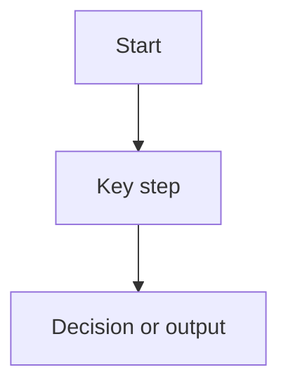

# <Feature or Architectural Topic>

## Purpose
Explain why this topic exists and what problem it solves.

## Status
- Classification: **<Current runtime | Current baseline + future evolution | Future direction>**
- Use one of these standard sentences:
  - `The Mermaid diagrams in this document describe the shipped runtime baseline.`
  - `The Mermaid diagrams in this document describe the current baseline and the future evolution that should build from it.`
  - `The Mermaid diagrams in this document describe the preferred future direction, not a shipped runtime path today.`

## Scope
List what is included in this document and what is intentionally out of scope.

## Context
Describe the current architecture or business need that makes this topic relevant.

## Flow
Use one short lead-in sentence immediately above the Mermaid block, for example:

- `This diagram shows the shipped runtime path for this area.`
- `Read this as current baseline + future evolution for this area.`
- `Future-only, not shipped today: this diagram shows the intended target shape.`

## Key Components / Classes
- `<class or config>`
- `<factory or runtime contract>`
- `<integration point>`

## Decisions
- decision 1
- decision 2

## Trade-off Snapshot

Use this compact shape so each architecture-sensitive feature captures the same decision evidence.

- Decision: `<what changed>`
- Benefit: `<user/operator/runtime gain>`
- Cost: `<memory/cpu/latency/complexity/config burden>`
- Risk: `<wrong-use or failure mode>`
- Use when: `<clear trigger>`
- Avoid when: `<clear anti-trigger>`
- Default: `<safe default and why>`
- Evidence: `<tests/log events/preserved bundle path>`

## Impact on Existing Architecture
Describe what areas of the system are affected.

## Testing / Validation Expectations
List the tests or validation needed for this topic.

## Future Extensions
List follow-on work that should build from this design.

