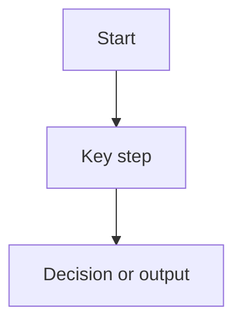

# <Feature or Architectural Topic>

## Purpose
Explain why this topic exists and what problem it solves.

## Scope
List what is included in this document and what is intentionally out of scope.

## Context
Describe the current architecture or business need that makes this topic relevant.

## Flow

## Key Components / Classes
- `<class or config>`
- `<factory or runtime contract>`
- `<integration point>`

## Decisions
- decision 1
- decision 2

## Tradeoffs
- benefit
- cost
- alternative considered

## Impact on Existing Architecture
Describe what areas of the system are affected.

## Testing / Validation Expectations
List the tests or validation needed for this topic.

## Future Extensions
List follow-on work that should build from this design.

