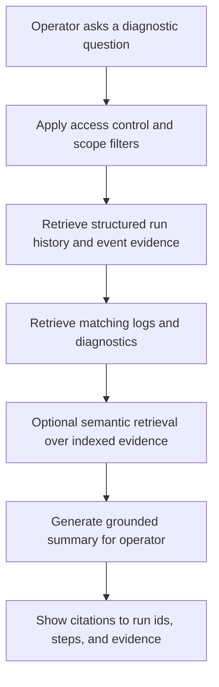

# AI-Assisted Operations Intelligence

## Purpose

This document preserves a future-state design direction for AI-assisted operational support in `spring-etl-engine`.

The intent is not to introduce AI into the current ETL-first phase. The intent is to record how AI could later help operators search job history, inspect retained logs, and understand repeated failures in a safe and evidence-grounded way.

## Scope

This document covers:

- operator-assist use cases for AI in ETL and integration operations
- the relationship between AI assistance and structured observability data
- future retrieval patterns for job history, events, and logs
- safety boundaries and governance expectations
- how this capability should remain subordinate to the core ETL runtime

This document does not define:

- a current implementation plan
- any model vendor selection
- prompt design details
- final vector database selection
- autonomous remediation or workflow execution

## Context

The product roadmap already leaves room for stronger observability, governance, and enterprise mediation capabilities in later phases.

In that future state, operators may need help answering questions such as:

- show similar failures for this scenario
- summarize why this run failed
- compare this failed run with the last successful run
- find repeated XML marshalling or SQL write issues
- highlight the likely step, connector, and exception family involved

These are good future capabilities, but they should only be introduced after the product already has:

- structured job and step history
- correlation-friendly logs and retained evidence
- searchable operational events
- redaction and access controls
- standard non-AI search and diagnostics workflows

## Flow

## Primary use cases

Future operator-assist capabilities may include:

- natural-language search over job history and diagnostics
- similarity search for repeated incidents
- summarization of failed job runs
- explanation of likely failure location by step and connector
- comparison of failed and successful runs
- surfacing recurring operational patterns over time

## Safety boundaries

This future capability should obey these boundaries:

- AI is operator-assist only
- AI should never silently alter job configuration or runtime behavior
- AI output should be grounded in retained operational evidence
- responses should cite the relevant run, step, or event context wherever possible
- access control and redaction should apply before retrieval or summarization
- sensitive values should not be exposed just because logs were searchable

## Key Components / Classes

This capability would later depend on architecture anchored around:

- `docs/architecture/job-history-and-operational-observability.md`
- `src/main/java/com/etl/config/BatchConfig.java`
- `src/main/java/com/etl/job/listener/JobCompletionNotificationListener.java`
- `src/main/java/com/etl/aspect/LoggingAspect.java`
- future operator dashboard APIs
- future search, indexing, and retrieval components

## Decisions

- AI assistance is a late-phase enhancement, not a current roadmap priority.
- AI should be layered on top of structured observability evidence rather than raw ungoverned logs alone.
- Hybrid retrieval is preferable to AI-only search when the capability is introduced.
- The operator remains the decision-maker; AI does not become an autonomous ETL controller.

## Tradeoffs

### Benefits
- shortens troubleshooting time for operators
- helps surface similar prior incidents and recurring patterns
- makes retained operational data more accessible to non-expert users
- strengthens the future enterprise operations experience

### Costs
- increases governance, retention, and access-control complexity
- creates risk if embeddings or summaries include sensitive data
- depends on strong observability maturity before it can be trusted

### Alternatives considered

#### Alternative: no AI assistance at all
Reasonable for smaller deployments, but less compelling for a product intended to mature into a broader enterprise integration platform.

#### Alternative: AI-first diagnostics without structured observability
Rejected because it would produce weak, difficult-to-trust operational guidance.

## Impact on Existing Architecture

This note should influence present design choices indirectly by encouraging:

- correlation-friendly runtime metadata
- clearer error categories
- stronger observability retention and redaction discipline
- operator-friendly diagnostics before AI is introduced

It should not pressure the current runtime to absorb AI-specific code or infrastructure prematurely.

## Testing / Validation Expectations

When this area is eventually implemented, future validation should include:

- retrieval accuracy for operator search scenarios
- grounding checks so summaries reference real retained evidence
- redaction and access-control tests
- auditability tests for who searched what and when
- operational comparison tests for similar-run detection
- fallback behavior when semantic search is unavailable or disabled

## Future Extensions

Likely follow-on design topics include:

- hybrid search architecture for job history, events, and logs
- evidence chunking and indexing strategy
- vector storage evaluation if semantic retrieval becomes justified
- operator dashboard UX for AI-assisted diagnostics
- governance rules for AI usage in enterprise operations

