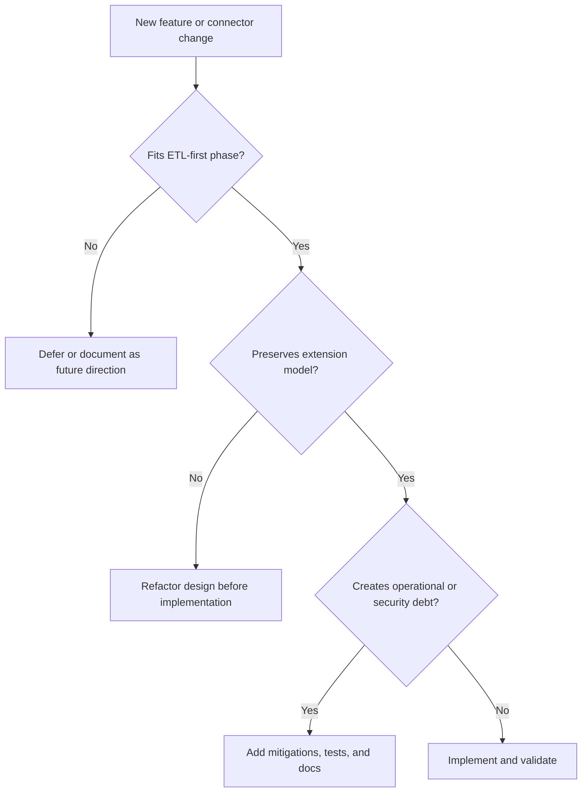

# Architectural Risks and Watchpoints

## Purpose

This document captures the main architectural risks that could derail the product roadmap if they are not actively watched.

It complements `docs/architecture/etl-product-evolution-roadmap.md` by focusing on the most likely failure modes during implementation, connector growth, and future platform evolution.

The goal is not to block delivery. The goal is to help future changes remain:

- aligned with the current ETL-first phase
- extensible for later enterprise evolution
- operationally reliable
- architecturally coherent

## Scope

This note covers the top architectural watchpoints for the current and near-future roadmap.

It includes:

- the risk itself
- why it matters
- early warning signs
- mitigation guidance
- which parts of the current architecture are most affected

It does not attempt to catalog every possible technical issue. It focuses on the few risks most likely to cause expensive rework later.

## Context

The product is currently in an ETL-first phase with these characteristics:

- connector-focused growth
- config-driven runtime behavior
- factory-based reader/processor/writer extension
- Spring Batch orchestration
- batch-oriented execution model

At the same time, the product direction leaves room for broader integration and mediation capabilities later.

That combination creates a healthy roadmap, but also creates a risk: current decisions may either overfit the present or prematurely overfit the future.

## Flow

## Watchpoint 1: Connector sprawl and architecture drift

### Why it matters
As more connectors are added, there is a risk that each one is implemented differently. If that happens, the product stops being a coherent configurable ETL platform and becomes a collection of one-off paths.

### Warning signs
- connector logic bypasses `DynamicReaderFactory`, `DynamicProcessorFactory`, or `DynamicWriterFactory`
- format-specific `if/else` logic spreads through unrelated classes
- similar config concerns are duplicated across many connectors
- `BatchConfig` accumulates connector-specific behavior instead of orchestration behavior

### Mitigation
- keep connector growth centered on config subtypes and factories
- centralize shared behavior into reusable abstractions
- require tests and architecture note updates for new connector types
- resist quick fixes that introduce special-case logic into core orchestration

### Main affected anchors
- `src/main/java/com/etl/reader/DynamicReaderFactory.java`
- `src/main/java/com/etl/processor/DynamicProcessorFactory.java`
- `src/main/java/com/etl/writer/DynamicWriterFactory.java`
- `src/main/java/com/etl/config/BatchConfig.java`

## Watchpoint 2: Batch-first assumptions becoming too rigid

### Why it matters
The current architecture is correctly batch-first, but future sources such as Kafka or richer orchestration patterns may not behave like bounded file or table inputs. If batch assumptions become universal, later extensions will be hard to introduce cleanly.

### Warning signs
- `getRecordCount()` is treated as mandatory for every source type
- chunk/tasklet becomes the only imagined execution model forever
- future unbounded or event-driven sources are forced into awkward file-style semantics
- orchestration logic assumes every flow cleanly starts and ends as one bounded job

### Mitigation
- keep current runtime batch-first, but do not design it as batch-only forever
- allow explicit execution overrides where justified
- document when a new source type does not fit normal record-count semantics
- keep future execution-model expansion visible in docs, not hidden in code assumptions

### Main affected anchors
- `src/main/java/com/etl/config/BatchConfig.java`
- `src/main/java/com/etl/config/source/SourceConfig.java`
- future execution policy config

## Watchpoint 3: Missing canonical model strategy

### Why it matters
As integrations grow, direct point-to-point mapping between partner formats and internal targets becomes hard to manage. Without at least a normalized internal model strategy, mappings can become duplicated and tightly coupled.

### Warning signs
- partner-specific classes or fields begin to leak into unrelated flows
- the same transformation rules appear repeatedly across connectors
- each new integration creates another direct format-to-format bridge with little reuse
- future routing or partner onboarding becomes harder because every mapping is bespoke

### Mitigation
- introduce normalized internal transformation boundaries gradually
- avoid unnecessary direct coupling between external partner formats and internal system contracts
- document where canonical or normalized models are intentionally deferred vs actively introduced
- prefer reuse-friendly transformation design when the same business semantics appear across flows

### Main affected anchors
- processor design and mapping rules
- generated model strategy
- future integration notes for Kafka/API/SFTP

## Watchpoint 4: Security treated too late or too locally

### Why it matters
The longer-term product value depends partly on becoming a safe integration boundary between enterprise systems and third parties. If security remains scattered, ad hoc, or connector-specific, the product will be harder to trust later.

### Warning signs
- credentials are repeated in many config objects with no consistent handling pattern
- transport/auth concerns mix with transformation logic
- logging exposes sensitive payload fields carelessly
- direct partner access assumptions appear in connector implementations
- auditability is weak or missing for configuration-driven behaviors

### Mitigation
- externalize secrets consistently
- separate transport/security concerns from business mapping concerns
- make logging and observability security-aware
- document security-sensitive design decisions early when they affect connector behavior
- add stronger controls gradually rather than bolting them on after broad connector growth

### Main affected anchors
- connection-related config models
- future API/Kafka/RDBMS/SFTP connector designs
- logging and configuration patterns

## Watchpoint 5: Observability and failure handling lagging behind product growth

### Why it matters
An integration product becomes operationally expensive if teams cannot easily answer:

- what came in
- what was transformed
- what was written
- what failed
- whether it can be retried or replayed safely

### Warning signs
- logs lack correlation or run identifiers
- connector failures are only visible as generic exceptions
- retry behavior is implicit or undocumented
- there is no clear distinction between validation failure, transport failure, and downstream write failure
- operational visibility grows more slowly than connector count

### Mitigation
- keep correlation-friendly logging and run context in place
- document retry/error expectations as connectors mature
- add tests for error paths, not only happy paths
- treat observability as a product capability, not only a developer convenience

### Main affected anchors
- batch execution flow
- future retry/replay design
- logging and failure-reporting strategy

## How to use this note

Use this note when:

- proposing a new source or target type
- modifying orchestration behavior
- discussing future Kafka/API/SFTP support
- evaluating whether a new abstraction is appropriate now or should be deferred
- reviewing pull requests that affect architecture-sensitive areas

## Suggested review questions

Before merging a significant change, ask:

- does this strengthen the current ETL-first phase or prematurely pull platform concerns into it?
- does it preserve factory-driven extensibility?
- does it keep core classes orchestration-focused instead of connector-fragmented?
- does it create hidden security or operational debt?
- if it changes long-term direction, have the docs or ADRs been updated?

## Related architecture notes

Read together with:

- `docs/architecture/etl-product-evolution-roadmap.md`
- `docs/architecture/overview.md`
- `docs/architecture/runtime-flow.md`
- `docs/architecture/extension-points.md`
- `docs/architecture/relational-db-support.md`

## Future Extensions

This note may later be expanded with:

- security-specific watchpoints
- streaming/runtime-specific watchpoints
- canonical-model-specific design constraints
- operational governance and replay watchpoints for later enterprise phases

