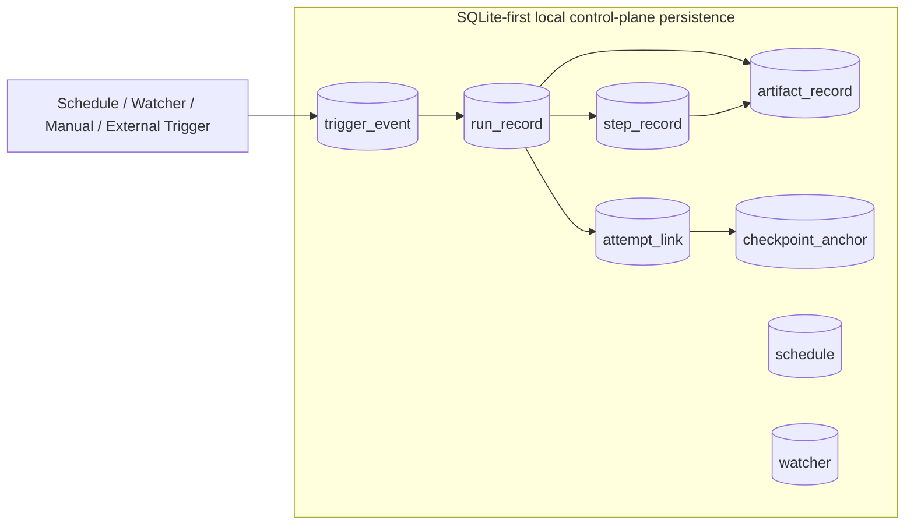
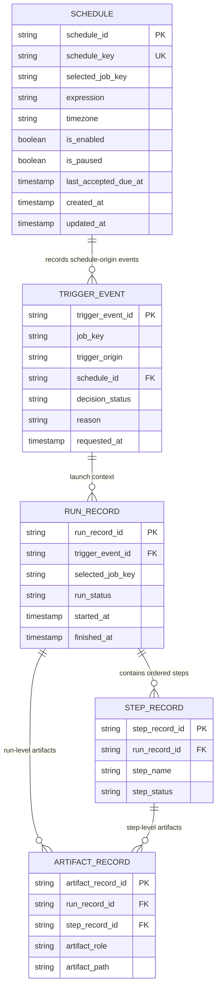

# Control-Plane Local Relational Schema

## Purpose

This document defines the first local relational schema direction for the future optional OneFlow control plane.

It exists to translate the conceptual retained operational data model into a practical SQLite-first persistence shape for developer-laptop and single-node use, while preserving later portability to stronger relational databases and keeping the ETL core independently runnable without any control-plane database.

## Status

- Classification: **Future direction**
- The Mermaid diagrams in this document describe the preferred future direction; trigger-event persistence, run-summary persistence, internal schedule/trigger/run surrogate-key foundations, and initial run-record linkage are now shipped behind the optional control-plane API when JDBC mode is enabled.
- The shipped `controlplane` profile now defaults to the shared SQLite file under `.etl-dev/etl-dev.db` so control-plane retained-history tables and Spring Batch metadata can coexist in one local developer/single-node database file, while stronger relational targets remain open for later deployment profiles.

## Scope

This document covers:

- a first relational table direction for the optional control-plane operational model
- how the main retained entities map into a local relational shape
- SQLite-first choices that help early local development
- portability guardrails for later PostgreSQL, SQL Server, or MySQL deployment targets
- the boundary rule that keeps control-plane persistence optional to the ETL worker

This document does **not** define:

- one final production schema
- vendor-specific DDL for every supported database
- one final migration tool, ORM, or repository implementation
- final restart/resume semantics per execution mode
- a requirement that direct ETL-core execution must persist history before it can run

## Context

[`control-plane-operational-data-model.md`](control-plane-operational-data-model.md) defines the conceptual retained entities for the future optional control plane:

- `Schedule`
- `Watcher`
- `TriggerEvent`
- `RunRecord`
- `StepRecord`
- `ArtifactRecord`
- `AttemptLink`
- `CheckpointAnchor`

That note intentionally stops before defining a relational shape.

The next useful design step is a first local relational direction that helps contributors implement scheduler, watcher, and retained-history work on a personal laptop without introducing infrastructure first.

That direction must still preserve the boundary frozen in [`ADR-0008`](../../adr/control-plane/0008-formalize-control-plane-and-etl-worker-boundary.md):

- the ETL core remains independently runnable
- control-plane persistence is optional
- external schedulers and orchestrators remain first-class launchers of the same selected-job contract
- SQLite is acceptable early, while stronger relational targets remain open later

## Flow

Future-only, not shipped today: this diagram shows the intended target shape.

Read this schema direction in three rules:

1. local control-plane persistence is useful, but optional
2. the first local relational shape should stay simple enough for SQLite
3. later PostgreSQL, SQL Server, or MySQL support should be enabled by disciplined portable modeling, not by a SQLite-only design

## Scheduler ER model artifact

This ER view is the lightweight scheduler-facing artifact for storage-alignment across backend, operator UI, and docs.

- It reflects what is shipped now in JDBC mode (`controlplane_schedule`, `controlplane_trigger_event`) plus the immediate retained-history direction.
- Update this section when scheduler entity boundaries or relationships change; avoid editing it for non-schema code-only refactors.
- First-slice S4 evolution may introduce internal numeric surrogate keys for relational efficiency, but should keep stable external schedule identity (`schedule_id`) to avoid breaking launch/audit contracts while migration is phased.
- The current linkage contract is intentionally additive: new `controlplane_run_record.trigger_event_id` writes are populated only from exact `controlplane_trigger_event.launched_run_id` matches, while a conservative single-candidate time-window fallback is limited to startup backfill for legacy mixed data.
- `controlplane_run_record.selected_job_key` is treated as an active relational key: new writes populate it from run context, legacy null/blank rows are backfilled at startup, and lookup-oriented indexes (`selected_job_key`, `run_status`, `started_at`, `trigger_event_id`) are part of the current local-read scaling baseline.
- Internal numeric surrogates now follow one phased pattern across retained scheduler history: active control-plane surrogate/linkage `*_pk` columns (`schedule_pk`, `trigger_event_pk`, `launched_run_pk`, `run_record_pk`) are now provisioned as `bigint` for relational joins and future foreign-key hardening. PK-constraint cutover is now active across schedule, trigger-event, and run-record tables (`schedule_pk`, `trigger_event_pk`, `run_record_pk` as relational primary keys) while external `*_id` fields remain stable unique operator/API identities.
- Current linkage resolution now prefers PK-based joins (`launched_run_pk` / `trigger_event_pk`) before legacy string-ID fallback (`launched_run_id` / `trigger_event_id`) so mixed historical data can migrate without changing external API identifiers.

## Key Components / Classes

Conceptual tables or aggregates for the first local relational direction:

- `schedule`
- `watcher`
- `trigger_event`
- `run_record`
- `step_record`
- `artifact_record`
- `attempt_link`
- `checkpoint_anchor`

Architecture anchors this schema direction must remain compatible with:

- [`control-plane-operational-data-model.md`](control-plane-operational-data-model.md)
- [`control-plane-worker-boundary.md`](control-plane-worker-boundary.md)
- [`job-history-and-operational-observability.md`](job-history-and-operational-observability.md)
- [`relational-db-support.md`](../etl-core/relational-db-support.md)
- [`ADR-0008`](../../adr/control-plane/0008-formalize-control-plane-and-etl-worker-boundary.md)

This SQLite-first local persistence direction is formalized as an accepted decision in [`ADR-0009`](../../adr/control-plane/0009-formalize-sqlite-first-local-control-plane-persistence.md).

## First table direction

The first local relational shape should prefer narrow, append-friendly, query-friendly tables with explicit foreign-key-style relationships where practical.

### 1. `schedule`

Represents one retained schedule definition.

Suggested column families:

- identity: `schedule_id`, `schedule_key`, `display_name`
- launch binding: `job_config_path`, `job_name`, `selected_job_key`
- control state: `is_enabled`, `is_paused`
- timing: `schedule_expression`, `timezone`, `start_window`, `end_window`
- policy references: `overlap_policy`, `missed_run_policy`
- audit metadata: `created_at`, `updated_at`, `owner`, `description`

### 2. `watcher`

Represents one retained file-watch definition.

Suggested column families:

- identity: `watcher_id`, `watcher_key`, `display_name`
- control state: `is_enabled`
- monitoring target: `watch_path`, `path_type`, `file_pattern`
- behavior: `stabilization_policy`, `dedupe_policy`, `poll_interval_ms`
- launch binding: `job_config_path`, `job_name`, `schedule_id` when watcher feeds a schedule-like trigger path
- audit metadata: `created_at`, `updated_at`, `owner`, `description`

### 3. `trigger_event`

Represents one normalized trigger decision or launch attempt.

Suggested column families:

- identity: `trigger_event_id`, `trigger_correlation_id`
- origin: `trigger_origin`, `schedule_id`, `watcher_id`, `external_origin_key`
- selected-job binding: `job_config_path`, `job_name`, `selected_job_key`
- decision: `decision_status`, `decision_reason`, `decision_message`
- request context: `requested_at`, `requested_by`, `external_request_id`
- operational context: `candidate_artifact_path`, `candidate_artifact_fingerprint`

### 4. `run_record`

Represents one retained run ledger entry.

Suggested column families:

- identity: `run_record_id`, `run_correlation_id`, `job_execution_id`
- linkage: `trigger_event_id`
- selected-job context: `job_config_path`, `job_name`, `selected_job_key`, `config_identity`
- outcome: `run_status`, `failure_category`, `failure_summary`
- timing: `started_at`, `finished_at`, `duration_ms`
- counts: `source_count`, `written_count`, `rejected_count`, `handoff_read_count`, `handoff_write_count`
- mode/context: `execution_mode`, `launch_channel`

### 5. `step_record`

Represents one retained step ledger entry under a run.

Suggested column families:

- identity: `step_record_id`, `step_execution_id`
- linkage: `run_record_id`
- step meaning: `step_name`, `step_order`, `source_name`, `target_name`
- outcome: `step_status`, `failure_category`, `failure_summary`
- timing: `started_at`, `finished_at`, `duration_ms`
- counts: `read_count`, `write_count`, `filter_count`, `skip_count`, `rollback_count`, `rejected_count`
- evidence references: `reject_output_path`, `archived_source_path`

### 6. `artifact_record`

Represents retained artifact lineage for a run or step.

Suggested column families:

- identity: `artifact_record_id`
- ownership: `run_record_id`, `step_record_id`
- artifact role: `artifact_role`, `artifact_type`
- location: `artifact_path`, `artifact_uri`
- integrity/summary: `record_count`, `checksum`, `size_bytes`
- timing: `created_at`, `published_at`
- notes: `artifact_status`, `artifact_summary`

### 7. `attempt_link`

Represents lineage between current and prior attempts.

Suggested column families:

- identity: `attempt_link_id`
- lineage: `current_run_record_id`, `prior_run_record_id`
- relationship: `attempt_relationship_type`
- context: `relationship_reason`, `linked_at`, `linked_by`

### 8. `checkpoint_anchor`

Represents a retained checkpoint or resume anchor.

Suggested column families:

- identity: `checkpoint_anchor_id`, `checkpoint_key`
- linkage: `run_record_id`, `step_record_id`, `attempt_link_id`
- checkpoint meaning: `checkpoint_type`, `checkpoint_status`
- state reference: `checkpoint_ref`, `checkpoint_summary`
- validity: `created_at`, `expires_at`, `compatibility_marker`

## SQLite-first modeling rules

For the first local control-plane implementation, prefer these SQLite-friendly rules:

- use simple scalar columns before JSON-heavy modeling becomes necessary
- prefer text-friendly identifiers such as UUID strings or stable keys over database-specific generated-key assumptions
- keep indexes focused on lookup and audit paths such as `trigger_origin`, `job_name`, `job_config_path`, `run_status`, and timestamp fields
- avoid relying on vendor-specific enum types; store portable text values with application-side validation
- avoid vendor-specific partial-index or computed-column assumptions in the first schema direction unless a portable fallback is clear
- treat large payloads such as raw logs or binary artifacts as external references rather than in-row blobs

SQLite is the first convenience target, not the permanent product-wide storage commitment.

For the shipped local control-plane profile today, SQLite should be treated as a single-node operational store: keep one control-plane JVM per SQLite file path, and move to a stronger relational target when multi-user or broader concurrent-control-plane access becomes a real requirement.

## Portability guardrails for PostgreSQL, SQL Server, and MySQL

To preserve later portability, the first schema direction should also follow these rules:

- avoid SQLite-only SQL features as a baseline dependency for the logical model
- normalize one-to-many relationships explicitly instead of hiding them inside vendor-specific document columns too early
- keep timestamp semantics explicit and UTC-oriented so later database differences do not distort operator timelines
- keep text column meanings stable so application-level enums or status values can map cleanly across vendors
- treat indexes, paging, retention cleanup, and concurrency handling as later vendor-tuned concerns rather than first-schema identity concerns
- preserve a clean separation between logical entity names and vendor-specific physical tuning decisions

The likely later direction is:

- SQLite for local development and single-node control-plane trials
- PostgreSQL as a strong default retained-history deployment target when multi-user control-plane history grows
- SQL Server as an enterprise-aligned option where deployment environments already standardize on it
- MySQL as an additional relational deployment option where teams prefer MySQL-aligned operations

## Decisions

- The first control-plane relational schema direction should be SQLite-first for local contributor and single-node use.
- The logical schema should remain portable enough that PostgreSQL, SQL Server, or MySQL can adopt the same core entity model later.
- The first schema should model retained history explicitly through relational tables rather than hiding most meaning inside opaque blobs.
- Artifact and checkpoint storage should be reference-oriented rather than large-payload-oriented in the first slice.
- The schema direction must remain optional from the ETL worker point of view; direct `etl.config.job` execution cannot depend on this database.
- Trigger-event persistence fallback must be explicit: switching `controlplane.triggers.persistence.mode` between `jdbc` and `memory` across restarts is treated as a continuity break unless intentionally acknowledged.
- Run-record linkage to trigger events must remain best-effort and non-blocking: unresolved links should stay nullable rather than blocking `RUN_SUMMARY` projection updates.

### Trigger-event fallback safety

- `jdbc` mode is durable and intended to preserve trigger history across restarts
- `memory` mode is ephemeral and intended for fallback/dev behavior
- mode switches are startup-guarded using a persisted marker path (`controlplane.triggers.persistence.mode-marker-path`)
- if previous mode and current mode differ, startup fails fast unless `controlplane.triggers.persistence.allow-mode-switch=true` is set intentionally
- this avoids silent trigger-history loss or duplicate operator interpretation during accidental mode flips

## Tradeoffs

### Benefits

- gives contributors a practical first persistence shape for scheduler and watcher work
- keeps laptop and single-node development simple through SQLite
- reduces the risk that each control-plane feature invents a different retained-history structure
- preserves a path to stronger relational databases later without a full conceptual redesign

### Costs

- a SQLite-friendly first shape may under-specify later concurrency or scale concerns
- some future production-specific optimizations will still need vendor-specific tuning
- first-schema simplicity may defer some richer query or retention features until later phases

### Alternatives considered

#### Alternative: wait for PostgreSQL, SQL Server, or MySQL before defining any schema direction
Rejected because that would slow local iteration and postpone useful architecture discipline for scheduler and watcher history.

#### Alternative: design the first schema specifically around one enterprise database
Rejected because early control-plane work should stay accessible on a personal laptop and avoid unnecessary infrastructure requirements.

#### Alternative: store most control-plane history in generic JSON blobs
Rejected because core trigger, run, step, and artifact relationships should remain queryable, auditable, and portable across relational targets.

## Impact on Existing Architecture

This note does not change the shipped ETL runtime path today.

It affects future work by:

- giving the optional control plane a first relational persistence direction
- clarifying how the conceptual operational model can become a concrete local schema
- preserving portability expectations before vendor-specific tuning is introduced
- reinforcing that retained control-plane persistence is additive rather than mandatory for ETL-core execution

## Testing / Validation Expectations

Future work that implements this schema direction should validate at least these points:

- ETL-core runs still launch and complete when no control-plane database exists
- SQLite-backed local control-plane persistence can record schedules, watchers, trigger events, runs, steps, and artifact references coherently
- retained counts and statuses align with the meanings already defined in runtime evidence docs
- the logical schema can be mapped to later PostgreSQL, SQL Server, or MySQL targets without redefining the core entity relationships
- schema choices do not force external schedulers or orchestrators into a OneFlow-native-only launch identity

## Future Extensions

Follow-on work that should build from this schema direction includes:

- a first migration set for SQLite-backed local control-plane persistence
- a repository or service layer for writing `trigger_event`, `run_record`, and `step_record` history
- retention and cleanup rules for retained control-plane history
- vendor-tuned indexing and concurrency guidance for PostgreSQL, SQL Server, or MySQL deployments
- deeper restartability and checkpoint semantics once execution-mode-specific rules are defined

