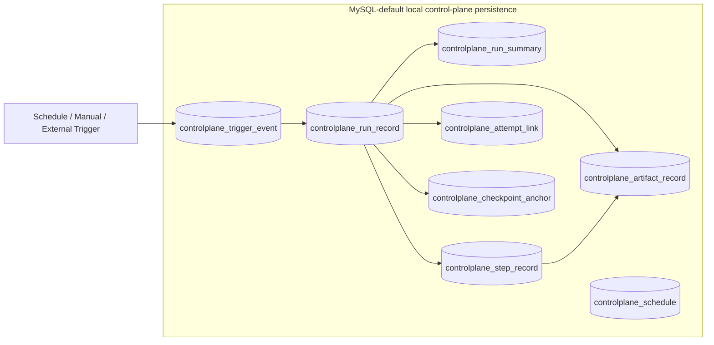
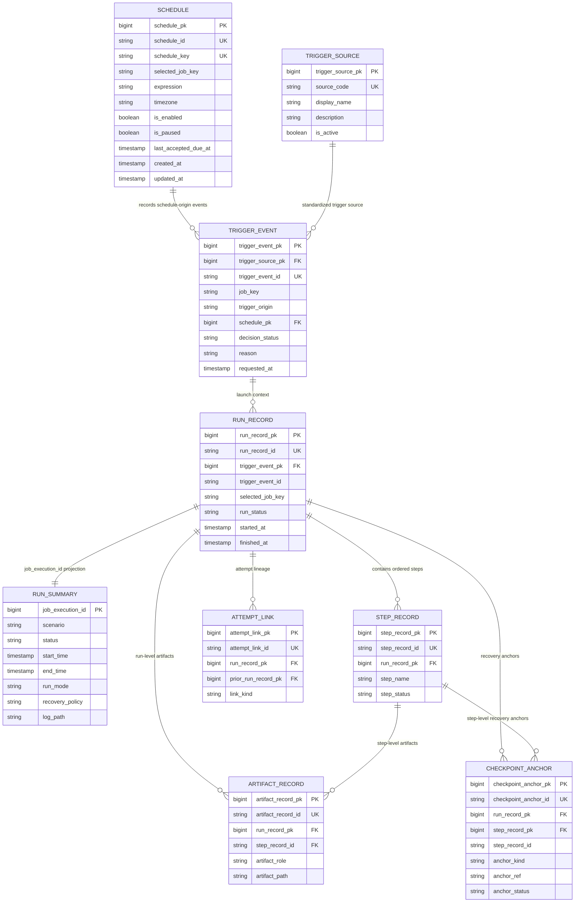

# Control-Plane Local Relational Schema

## Purpose

This document defines the active local relational schema direction for the optional OneFlow control plane.

It translates the conceptual retained operational data model into a practical MySQL-default persistence shape for developer and CI use, while preserving portability to stronger relational databases and keeping the ETL core independently runnable without any control-plane database.

## Status

- Classification: **Shipped baseline + future direction**
- The ER section below is refreshed to match the shipped JDBC schema used by the optional control-plane API when JDBC mode is enabled.
- Sections outside the ER artifact may still include forward-looking design guidance for later extensions.
- The shipped `controlplane` profile now defaults to MySQL datasource properties (env-overridable), and worker launches in this profile are aligned to the same MySQL URL/credentials so trigger, run, and batch metadata stay linkable in one relational database.
- The repo-owned MySQL bootstrap path now provisions both retained `controlplane_*` tables and Spring Batch `BATCH_*` metadata tables into one selected database so control-plane step/artifact projections can read worker batch metadata without cross-database assumptions.
- SQLite compatibility paths remain available as bridge logic for legacy local data and migration recovery, while active control-plane startup defaults and CI direction target MySQL first.
- Persisted `attempt_link` and `checkpoint_anchor` records are currently advisory recovery lineage only; they support operator evidence and correlation while F1 still keeps resume execution unsupported. They also do not change the current D3 rerun boundary: the shipped relational target baseline is not treated as idempotent by default, so retained checkpoint lineage must not be read as safe database resume capability.

## Scope

This document covers:

- a first relational table direction for the optional control-plane operational model
- how the main retained entities map into a local relational shape
- MySQL-default choices for local developer and CI control-plane persistence
- portability guardrails for later PostgreSQL, SQL Server, or MySQL deployment targets
- the boundary rule that keeps control-plane persistence optional to the ETL worker

This document does **not** define:

- one final production schema
- vendor-specific DDL for every supported database
- one final migration tool, ORM, or repository implementation
- final restart/resume semantics per execution mode
- a requirement that direct ETL-core execution must persist history before it can run

## Context

[`control-plane-operational-data-model.md`](control-plane-operational-data-model.md) defines the conceptual retained entities for the future optional control plane:

- `Schedule`
- `Watcher`
- `TriggerEvent`
- `RunRecord`
- `StepRecord`
- `ArtifactRecord`
- `AttemptLink`
- `CheckpointAnchor`

That note intentionally stops before defining a relational shape.

The next useful design step is a first local relational direction that helps contributors implement scheduler, watcher, and retained-history work on a personal laptop without introducing infrastructure first.

That direction must still preserve the boundary frozen in [`ADR-0008`](../../adr/control-plane/0008-formalize-control-plane-and-etl-worker-boundary.md):

- the ETL core remains independently runnable
- control-plane persistence is optional
- external schedulers and orchestrators remain first-class launchers of the same selected-job contract
- MySQL is the default active control-plane relational lane, while SQL Server and other relational targets remain open for later extension

## Flow

This diagram reflects the shipped retained-history flow for JDBC mode plus near-term extension seams.

```mermaid
flowchart LR
    TriggerSources[Schedule / Manual / External Trigger] --> TriggerEventTable[(controlplane_trigger_event)]
    TriggerEventTable --> RunRecordTable[(controlplane_run_record)]
    RunRecordTable --> RunSummaryTable[(controlplane_run_summary)]
    RunRecordTable --> StepRecordTable[(controlplane_step_record)]
    RunRecordTable --> ArtifactRecordTable[(controlplane_artifact_record)]
    StepRecordTable --> ArtifactRecordTable
    RunRecordTable --> AttemptLinkTable[(controlplane_attempt_link)]
    RunRecordTable --> CheckpointAnchorTable[(controlplane_checkpoint_anchor)]

    subgraph LocalFirst[MySQL-default local control-plane persistence]
        ScheduleTable[(controlplane_schedule)]
        TriggerEventTable
        RunRecordTable
        RunSummaryTable
        StepRecordTable
        ArtifactRecordTable
        AttemptLinkTable
        CheckpointAnchorTable
    end
```

Read this schema direction in three rules:

1. local control-plane persistence is useful, but optional
2. the shipped MySQL-default relational shape is the baseline for active control-plane history
3. SQL Server and later vendor targets should be enabled by disciplined portable modeling, not by one vendor-only design

## Scheduler ER model artifact

This ER view is the lightweight scheduler-facing artifact for storage-alignment across backend, operator UI, and docs.

- It reflects what is shipped now in JDBC mode (`controlplane_schedule`, `controlplane_trigger_event`, `controlplane_run_summary`, `controlplane_run_record`, `controlplane_step_record`, `controlplane_artifact_record`, `controlplane_attempt_link`, `controlplane_checkpoint_anchor`).
- Trigger origins are now standardized through a master catalog table (`controlplane_trigger_source`) with stable `source_code` values used by UI filters and trigger-event linkage.
- Update this section when scheduler entity boundaries or relationships change; avoid editing it for non-schema code-only refactors.
- Internal numeric surrogate keys are now active for relational efficiency (`schedule_pk`, `trigger_event_pk`, `run_record_pk`) while stable external identities (`schedule_id`, `trigger_event_id`, `run_record_id`) remain unique operator/API-facing keys.
- Trigger-event schedule linkage is now hard-aligned to `controlplane_trigger_event.schedule_pk`; the legacy `controlplane_trigger_event.schedule_id` bridge column is no longer part of the active schema contract.
- Trigger-source categorization now lives on `controlplane_trigger_event.trigger_source_pk`; when EVENT-style sources need per-origin detail, the active schema carries that through `external_origin_key` instead of dedicated per-source columns.
- The current linkage contract is intentionally additive: linkage still prefers exact `controlplane_trigger_event.launched_run_pk|launched_run_id` matches first, then applies a deterministic nearest-eligible time-window fallback during run upsert and startup backfill when exact launch linkage is unavailable.
- Upsert-time linkage now treats stale run-record trigger associations as replaceable evidence when a newer eligible trigger is resolved for the same `job_execution_id`; startup backfill still keeps conservative recovery behavior for legacy rows.
- `controlplane_run_record.selected_job_key` is treated as an active relational key: new writes populate it from run context, legacy null/blank rows are backfilled at startup, and lookup-oriented indexes (`selected_job_key`, `run_status`, `started_at`, `trigger_event_id`) are part of the current local-read scaling baseline.
- Internal numeric surrogates now follow one phased pattern across retained scheduler history: active control-plane surrogate/linkage `*_pk` columns (`schedule_pk`, `trigger_event_pk`, `launched_run_pk`, `run_record_pk`) are now provisioned as `bigint` for relational joins and future foreign-key hardening. PK-constraint cutover is now active across schedule, trigger-event, and run-record tables (`schedule_pk`, `trigger_event_pk`, `run_record_pk` as relational primary keys) while external `*_id` fields remain stable unique operator/API identities.
- Current linkage resolution now prefers PK-based joins (`launched_run_pk` / `trigger_event_pk`) before legacy string-ID fallback (`launched_run_id` / `trigger_event_id`) so mixed historical data can migrate without changing external API identifiers.
- Child retained-history tables now depend on `controlplane_run_record.run_record_pk` for relational linkage (`controlplane_step_record.run_record_pk`, `controlplane_artifact_record.run_record_pk`, `controlplane_attempt_link.run_record_pk|prior_run_record_pk`, `controlplane_checkpoint_anchor.run_record_pk`) while `run_record_id` remains a projected operator/API-facing identity from the parent run row.
- `controlplane_checkpoint_anchor.step_record_pk` is the active step-level relational linkage key; `step_record_id` remains a projected compatibility identity for operator/API readability.
- Artifact ownership should be explicit and non-ambiguous: one `artifact_record` row is either run-level (`run_record_pk` set, `step_record_id` null) or step-level (`step_record_id` set with consistent `run_record_pk` lineage), never an unowned or contradictory combination.
- Current non-SQLite portability is partial-but-testable: normal registry startup and update/insert write paths are now exercised without SQLite-only SQL, and active child retained-history writes now assume the PK-only linkage contract rather than backfilling legacy child `run_record_id` columns at runtime.

```mermaid
erDiagram
    SCHEDULE {
        bigint schedule_pk PK
        string schedule_id UK
        string schedule_key UK
        string selected_job_key
        string expression
        string timezone
        boolean is_enabled
        boolean is_paused
        timestamp last_accepted_due_at
        timestamp created_at
        timestamp updated_at
    }

    TRIGGER_SOURCE {
        bigint trigger_source_pk PK
        string source_code UK
        string display_name
        string description
        boolean is_active
    }

    TRIGGER_EVENT {
        bigint trigger_event_pk PK
        bigint trigger_source_pk FK
        string trigger_event_id UK
        string job_key
        string trigger_origin
        bigint schedule_pk FK
        string decision_status
        string reason
        timestamp requested_at
    }

    RUN_RECORD {
        bigint run_record_pk PK
        string run_record_id UK
        bigint trigger_event_pk FK
        string trigger_event_id
        string selected_job_key
        string run_status
        timestamp started_at
        timestamp finished_at
    }

    RUN_SUMMARY {
        bigint job_execution_id PK
        string scenario
        string status
        timestamp start_time
        timestamp end_time
        string run_mode
        string recovery_policy
        string log_path
    }

    STEP_RECORD {
        bigint step_record_pk PK
        string step_record_id UK
        bigint run_record_pk FK
        string step_name
        string step_status
    }

    ARTIFACT_RECORD {
        bigint artifact_record_pk PK
        string artifact_record_id UK
        bigint run_record_pk FK
        string step_record_id FK
        string artifact_role
        string artifact_path
    }

    ATTEMPT_LINK {
        bigint attempt_link_pk PK
        string attempt_link_id UK
        bigint run_record_pk FK
        bigint prior_run_record_pk FK
        string link_kind
    }

    CHECKPOINT_ANCHOR {
        bigint checkpoint_anchor_pk PK
        string checkpoint_anchor_id UK
        bigint run_record_pk FK
        bigint step_record_pk FK
        string step_record_id
        string anchor_kind
        string anchor_ref
        string anchor_status
    }

    SCHEDULE ||--o{ TRIGGER_EVENT : "records schedule-origin events"
    TRIGGER_SOURCE ||--o{ TRIGGER_EVENT : "standardized trigger source"
    TRIGGER_EVENT ||--o{ RUN_RECORD : "launch context"
    RUN_RECORD ||--|| RUN_SUMMARY : "job_execution_id projection"
    RUN_RECORD ||--o{ STEP_RECORD : "contains ordered steps"
    RUN_RECORD ||--o{ ARTIFACT_RECORD : "run-level artifacts"
    STEP_RECORD ||--o{ ARTIFACT_RECORD : "step-level artifacts"
    RUN_RECORD ||--o{ ATTEMPT_LINK : "attempt lineage"
    RUN_RECORD ||--o{ CHECKPOINT_ANCHOR : "recovery anchors"
    STEP_RECORD ||--o{ CHECKPOINT_ANCHOR : "step-level recovery anchors"
```

## Key Components / Classes

Conceptual tables or aggregates for the first local relational direction:

- `schedule`
- `watcher`
- `trigger_event`
- `run_record`
- `step_record`
- `artifact_record`
- `attempt_link`
- `checkpoint_anchor`

Architecture anchors this schema direction must remain compatible with:

- [`control-plane-operational-data-model.md`](control-plane-operational-data-model.md)
- [`control-plane-worker-boundary.md`](control-plane-worker-boundary.md)
- [`job-history-and-operational-observability.md`](job-history-and-operational-observability.md)
- [`relational-db-support.md`](../etl-core/relational-db-support.md)
- [`ADR-0008`](../../adr/control-plane/0008-formalize-control-plane-and-etl-worker-boundary.md)

The earlier SQLite-first local persistence direction remains documented in [`ADR-0009`](../../adr/control-plane/0009-formalize-sqlite-first-local-control-plane-persistence.md) as historical context.

## First table direction

The first local relational shape should prefer narrow, append-friendly, query-friendly tables with explicit foreign-key-style relationships where practical.

### 1. `schedule`

Represents one retained schedule definition.

Suggested column families:

- identity: `schedule_id`, `schedule_key`, `display_name`
- launch binding: `job_config_path`, `job_name`, `selected_job_key`
- control state: `is_enabled`, `is_paused`
- timing: `schedule_expression`, `timezone`, `start_window`, `end_window`
- policy references: `overlap_policy`, `missed_run_policy`
- audit metadata: `created_at`, `updated_at`, `owner`, `description`

### 2. `watcher`

Represents one retained file-watch definition.

Suggested column families:

- identity: `watcher_id`, `watcher_key`, `display_name`
- control state: `is_enabled`
- monitoring target: `watch_path`, `path_type`, `file_pattern`
- behavior: `stabilization_policy`, `dedupe_policy`, `poll_interval_ms`
- launch binding: `job_config_path`, `job_name`, `schedule_id` when watcher feeds a schedule-like trigger path
- audit metadata: `created_at`, `updated_at`, `owner`, `description`

### 3. `trigger_event`

Represents one normalized trigger decision or launch attempt.

Suggested column families:

- identity: `trigger_event_id`, `trigger_correlation_id`
- origin: `trigger_origin`, `schedule_pk`, `external_origin_key`
- selected-job binding: `job_config_path`, `job_name`, `selected_job_key`
- decision: `decision_status`, `decision_reason`, `decision_message`
- request context: `requested_at`, `requested_by`, `external_request_id`
- operational context: `candidate_artifact_path`, `candidate_artifact_fingerprint`

### 4. `run_record`

Represents one retained run ledger entry.

Suggested column families:

- identity: `run_record_pk`, `run_record_id`, `run_correlation_id`, `job_execution_id`
- linkage: `trigger_event_id`
- selected-job context: `job_config_path`, `job_name`, `selected_job_key`, `config_identity`
- outcome: `run_status`, `failure_category`, `failure_summary`
- timing: `started_at`, `finished_at`, `duration_ms`
- counts: `source_count`, `written_count`, `rejected_count`, `handoff_read_count`, `handoff_write_count`
- mode/context: `execution_mode`, `launch_channel`

### 5. `step_record`

Represents one retained step ledger entry under a run.

Suggested column families:

- identity: `step_record_id`, `step_execution_id`
- linkage: `run_record_pk`
- step meaning: `step_name`, `step_order`, `source_name`, `target_name`
- outcome: `step_status`, `failure_category`, `failure_summary`
- timing: `started_at`, `finished_at`, `duration_ms`
- counts: `read_count`, `write_count`, `filter_count`, `skip_count`, `rollback_count`, `rejected_count`
- evidence references: `reject_output_path`, `archived_source_path`

### 6. `artifact_record`

Represents retained artifact lineage for a run or step.

Suggested column families:

- identity: `artifact_record_id`
- ownership: `run_record_pk`, `step_record_id`
- artifact role: `artifact_role`, `artifact_type`
- location: `artifact_path`, `artifact_uri`
- integrity/summary: `record_count`, `checksum`, `size_bytes`
- timing: `created_at`, `published_at`
- notes: `artifact_status`, `artifact_summary`

Ownership invariant for future implementation:

- enforce one clear owner per row: run-level artifact or step-level artifact
- when `step_record_id` is populated, its parent run identity must match `run_record_pk`
- avoid nullable combinations that allow ambiguous ownership

### 7. `attempt_link`

Represents lineage between current and prior attempts.

Suggested column families:

- identity: `attempt_link_id`
- lineage: `run_record_pk`, `prior_run_record_pk`
- relationship: `attempt_relationship_type`
- context: `relationship_reason`, `linked_at`, `linked_by`

### 8. `checkpoint_anchor`

Represents a retained checkpoint or resume anchor.

Suggested column families:

- identity: `checkpoint_anchor_id`, `checkpoint_key`
- linkage: `run_record_pk`, `step_record_pk`, `step_record_id` (compatibility projection), `attempt_link_id`
- checkpoint meaning: `checkpoint_type`, `checkpoint_status`
- state reference: `checkpoint_ref`, `checkpoint_summary`
- validity: `created_at`, `expires_at`, `compatibility_marker`

## MySQL-default modeling rules

For the active control-plane implementation, prefer these MySQL-default rules:

- use simple scalar columns before JSON-heavy modeling becomes necessary
- prefer stable text identifiers (`*_id`) for API-facing identities and bigint surrogate keys (`*_pk`) for relational joins
- keep indexes focused on lookup and audit paths such as `trigger_origin`, `selected_job_key`, `run_status`, and timestamp fields
- avoid relying on vendor-only features in shared read/write contracts unless an explicit vendor-specific script path exists
- treat large payloads such as raw logs or binary artifacts as external references rather than in-row blobs

SQLite compatibility remains bridge-only and should not be treated as the active default persistence lane.

## ID and FK policy (active + planned)

The active direction is now explicit:

- string `*_id` columns remain stable operator/API-facing identities
- bigint `*_pk` columns are the relational join and FK contract
- new FK additions should target parent `*_pk` columns, not parent `*_id` unique keys

Current shipped examples:

- `controlplane_step_record.run_record_pk -> controlplane_run_record.run_record_pk`
- `controlplane_artifact_record.run_record_pk -> controlplane_run_record.run_record_pk`
- `controlplane_attempt_link.run_record_pk|prior_run_record_pk -> controlplane_run_record.run_record_pk`
- `controlplane_checkpoint_anchor.run_record_pk -> controlplane_run_record.run_record_pk`
- `controlplane_checkpoint_anchor.step_record_pk -> controlplane_step_record.step_record_pk`

Planned compatibility pattern for legacy string-linkage tables:

1. add nullable `*_pk` linkage column
2. backfill `*_pk` from existing `*_id` linkage
3. dual-read and dual-write during compatibility window
4. switch primary relational joins/indexes to `*_pk`
5. keep string `*_id` as external identity projection

## Portability guardrails for PostgreSQL, SQL Server, and MySQL

To preserve later portability, the first schema direction should also follow these rules:

- avoid SQLite-only SQL features as a baseline dependency for the logical model
- normalize one-to-many relationships explicitly instead of hiding them inside vendor-specific document columns too early
- keep timestamp semantics explicit and UTC-oriented so later database differences do not distort operator timelines
- keep text column meanings stable so application-level enums or status values can map cleanly across vendors
- treat indexes, paging, retention cleanup, and concurrency handling as later vendor-tuned concerns rather than first-schema identity concerns
- preserve a clean separation between logical entity names and vendor-specific physical tuning decisions

The likely near-term direction is:

- MySQL as the default local/CI control-plane retained-history target
- SQL Server as an enterprise-aligned option where deployment environments already standardize on it
- PostgreSQL or Oracle as later extension targets when needed

## Decisions

- The active control-plane relational schema direction is MySQL-default for local contributor and CI use.
- The logical schema should remain portable enough that PostgreSQL, SQL Server, or MySQL can adopt the same core entity model later.
- The first schema should model retained history explicitly through relational tables rather than hiding most meaning inside opaque blobs.
- Artifact and checkpoint storage should be reference-oriented rather than large-payload-oriented in the first slice.
- The schema direction must remain optional from the ETL worker point of view; direct `etl.config.job` execution cannot depend on this database.
- Trigger-event persistence fallback must be explicit: switching `controlplane.triggers.persistence.mode` between `jdbc` and `memory` across restarts is treated as a continuity break unless intentionally acknowledged.
- Run-record linkage to trigger events must remain best-effort and non-blocking: unresolved links should stay nullable rather than blocking `RUN_SUMMARY` projection updates.

### Trigger-event fallback safety

- `jdbc` mode is durable and intended to preserve trigger history across restarts
- `memory` mode is ephemeral and intended for fallback/dev behavior
- mode switches are startup-guarded using a persisted marker path (`controlplane.triggers.persistence.mode-marker-path`)
- if previous mode and current mode differ, startup fails fast unless `controlplane.triggers.persistence.allow-mode-switch=true` is set intentionally
- this avoids silent trigger-history loss or duplicate operator interpretation during accidental mode flips

## Tradeoffs

### Benefits

- gives contributors a practical first persistence shape for scheduler and watcher work
- keeps local developer and CI workflows aligned to one relational default (MySQL)
- reduces the risk that each control-plane feature invents a different retained-history structure
- preserves a path to stronger relational databases later without a full conceptual redesign

### Costs

- a MySQL-default active shape still requires explicit SQL Server parity validation and script governance
- some future production-specific optimizations will still need vendor-specific tuning
- first-schema simplicity may defer some richer query or retention features until later phases

### Alternatives considered

#### Alternative: wait for PostgreSQL, SQL Server, or MySQL before defining any schema direction
Rejected because that would slow local iteration and postpone useful architecture discipline for scheduler and watcher history.

#### Alternative: keep SQLite as the active default and defer MySQL-first alignment
Rejected because current developer and CI environments are now standardized on MySQL for control-plane persistence.

#### Alternative: store most control-plane history in generic JSON blobs
Rejected because core trigger, run, step, and artifact relationships should remain queryable, auditable, and portable across relational targets.

## Impact on Existing Architecture

This note does not change the shipped ETL runtime path today.

It affects future work by:

- giving the optional control plane a first relational persistence direction
- clarifying how the conceptual operational model can become a concrete local schema
- preserving portability expectations before vendor-specific tuning is introduced
- reinforcing that retained control-plane persistence is additive rather than mandatory for ETL-core execution

## Testing / Validation Expectations

Future work that implements this schema direction should validate at least these points:

- ETL-core runs still launch and complete when no control-plane database exists
- MySQL-backed local/CI control-plane persistence can record schedules, watchers, trigger events, runs, steps, and artifact references coherently
- MySQL-backed local/CI control-plane persistence should prove that `BATCH_*` metadata and `controlplane_*` retained-history rows land in the same selected database for trigger-to-run correlation
- retained counts and statuses align with the meanings already defined in runtime evidence docs
- the logical schema can be mapped to later PostgreSQL, SQL Server, or MySQL targets without redefining the core entity relationships
- schema choices do not force external schedulers or orchestrators into a OneFlow-native-only launch identity

## Future Extensions

Follow-on work that should build from this schema direction includes:

- a first vendor-script baseline for MySQL and SQL Server with property-driven selection
- a repository or service layer for writing `trigger_event`, `run_record`, and `step_record` history
- retention and cleanup rules for retained control-plane history
- vendor-tuned indexing and concurrency guidance for PostgreSQL, SQL Server, or MySQL deployments
- deeper restartability and checkpoint semantics once execution-mode-specific rules are defined

