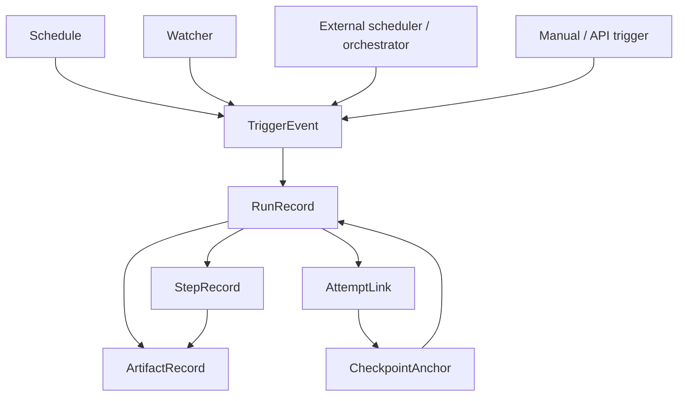

# Control-Plane Operational Data Model

## Purpose

This document defines the conceptual retained operational data model for the future optional OneFlow control plane.

It exists to give scheduler, watcher, trigger history, run history, artifact lineage, and recovery-oriented operator workflows one shared model without turning persisted control-plane data into a prerequisite for normal ETL-core execution.

## Status

- Classification: **Future direction**
- The Mermaid diagrams in this document describe the preferred future direction, not a shipped runtime path today.

## Scope

This document covers:

- the main conceptual entities for optional control-plane history and traceability
- how schedule, watcher, trigger, run, step, artifact, and attempt records relate to one another
- the interoperability rule that native and external trigger sources fit the same retained model
- the guardrails that keep this model optional from the ETL worker point of view
- the local-first persistence stance for early control-plane slices

This document does **not** define:

- one final relational schema, DDL, or migration tool
- one final storage engine beyond the current local-first direction
- final restart/resume semantics per execution mode
- one final UI or API contract
- replacement of runtime logs as the current evidence source

## Context

The current shipped runtime already emits meaningful operational evidence through scenario-aware logs, machine-readable lifecycle events, run summaries, step evidence, reject paths, and archive paths.

Future control-plane work adds additional needs around that evidence:

- schedule definitions that can be enabled, disabled, paused, or audited
- watcher definitions that detect and classify file-trigger candidates
- trigger-event history that explains why a run was requested, skipped, blocked, or launched
- retained run and step history suitable for operator search and later UI drill-down
- artifact lineage that ties ingress, handoff, published output, reject output, and archived input together
- recovery-oriented lineage such as prior attempts and checkpoint anchors

Those needs should build on the same selected-job runtime boundary defined in [`control-plane-worker-boundary.md`](control-plane-worker-boundary.md) and frozen in [`ADR-0008`](../../adr/control-plane/0008-formalize-control-plane-and-etl-worker-boundary.md).

The first SQLite-first local persistence direction for that optional retained model is formalized separately in [`ADR-0009`](../../adr/control-plane/0009-formalize-sqlite-first-local-control-plane-persistence.md).

The retained model therefore belongs to the optional control plane, not to the mandatory ETL worker runtime.

## Flow

Future-only, not shipped today: this diagram shows the intended target shape.

Read this model in four layers:

1. `Schedule`, `Watcher`, external orchestrators, and manual launches are all trigger sources
2. `TriggerEvent` records the normalized operational decision or launch attempt
3. `RunRecord`, `StepRecord`, and `ArtifactRecord` retain the operational history of the selected ETL run
4. `AttemptLink` and `CheckpointAnchor` preserve recovery lineage without claiming full restart semantics yet

## Key Components / Classes

Conceptual retained entities for the optional control plane:

- `Schedule` - one retained scheduling definition that points to the selected-job launch contract
- `Watcher` - one retained file-watch definition, including enablement and match context
- `TriggerEvent` - one normalized retained trigger decision or launch attempt
- `RunRecord` - one retained run-level operational record for a selected job/scenario launch
- `StepRecord` - one retained step-level operational record under a retained run
- `ArtifactRecord` - one retained artifact or evidence reference tied to a run or step
- `AttemptLink` - one retained relationship between current and prior attempts or reruns
- `CheckpointAnchor` - one retained recovery anchor or checkpoint reference for later mode-specific restart work

Runtime and architecture anchors this model must remain compatible with:

- `src/main/java/com/etl/runner/EtlJobRunner.java`
- `src/main/java/com/etl/config/ConfigLoader.java`
- `src/main/java/com/etl/config/BatchConfig.java`
- `src/main/java/com/etl/job/listener/JobCompletionNotificationListener.java`
- `src/main/java/com/etl/job/listener/StepLoggingContextListener.java`
- [`job-history-and-operational-observability.md`](job-history-and-operational-observability.md)
- [`runtime-flow.md`](../etl-core/runtime-flow.md)
- [`control-plane-worker-boundary.md`](control-plane-worker-boundary.md)

For the first SQLite-first local relational shape that can persist these entities while preserving later portability to stronger relational databases, continue in [`control-plane-local-relational-schema.md`](control-plane-local-relational-schema.md).

## Conceptual entity meanings

### 1. Schedule

`Schedule` represents one retained time-based or policy-based trigger definition.

It should preserve concepts such as:

- schedule identity
- selected-job reference or registry identity
- enabled / disabled / paused state
- timezone or schedule window metadata where relevant
- overlap and missed-run policy references when later defined
- ownership or descriptive metadata for operators

A schedule points to the same selected-job launch contract used by direct ETL-core execution. It does not invent a separate runtime model.

### 2. Watcher

`Watcher` represents one retained file-monitoring definition under the optional control plane.

It should preserve concepts such as:

- watcher identity
- enabled / disabled state
- monitored location or source identity
- match rules or file-pattern context
- stabilization / debounce policy references
- downstream selected-job or schedule linkage where relevant

A watcher is a trigger source, not an alternate execution engine.

### 3. TriggerEvent

`TriggerEvent` is the normalized retained history record for why the control plane evaluated, requested, launched, skipped, blocked, or suppressed a run.

It should preserve concepts such as:

- trigger origin (`schedule`, `watcher`, `manual`, `externalOrchestrator`)
- trigger-source identity when present
- selected-job identity
- decision status such as requested, launched, skipped, blocked, rejected, or duplicate-suppressed
- decision timestamp and correlation identifiers
- explanation fields suitable for operator review

This is the unifying entity that lets native and external triggers participate in one retained audit story.

### 4. RunRecord

`RunRecord` is the retained run ledger entry for one selected-job execution outcome or launch attempt.

It should preserve concepts such as:

- scenario or selected-job identity
- run identifier and Spring Batch job-execution linkage where available
- trigger-event linkage
- execution mode
- overall status
- start / finish timestamps and duration
- operator-oriented run totals such as source, written, rejected, and handoff diagnostics
- config identity, selected bundle identity, or version markers where available
- top-level failure summary and error-category references when relevant

`RunRecord` should remain query-friendly for operators without replacing the raw runtime logs that still hold the richer event stream.

### 5. StepRecord

`StepRecord` is the retained step ledger entry under a retained run.

It should preserve concepts such as:

- step name and step order
- source and target identity for the step
- step status
- timestamps and duration
- read, write, filter, skip, rollback, reject, and handoff-related counts where relevant
- top failure category or summary
- links to step-specific artifacts or evidence references

This retains enough meaning for UI drill-down, support workflows, and history search without forcing operators to reconstruct every run only from text logs.

### 6. ArtifactRecord

`ArtifactRecord` represents one retained operational artifact or evidence reference tied to a run or step.

It may represent things such as:

- ingress input artifact
- intermediate handoff artifact
- final published output artifact
- reject output artifact
- archived source artifact
- future transfer or transport evidence where relevant

It should preserve concepts such as:

- artifact role or type
- owning run or step
- path, URI, or storage reference
- publication or creation timestamps where relevant
- summary metadata such as record count, checksum, or size when available later

The purpose is lineage and operator traceability, not binary artifact storage inside the retained model itself.

### 7. AttemptLink

`AttemptLink` represents retained lineage between attempts, reruns, retries, resumes, or operator-driven rerun chains.

It should preserve concepts such as:

- current run id
- prior run id
- relationship type such as rerun-from-start, resume-attempt, retry-attempt, or replay-attempt
- operator or system reason where relevant

This creates durable lineage before the product commits to one final restartability behavior for every execution mode.

### 8. CheckpointAnchor

`CheckpointAnchor` represents a retained reference to any future restart or resume anchor that later execution-mode-specific features may use.

It should preserve concepts such as:

- owning run or attempt relationship
- step or stage reference when relevant
- checkpoint identity or token
- resumable-state summary where relevant
- validity or compatibility markers if later required

This note keeps `CheckpointAnchor` conceptual on purpose. It is an anchor for future restartability design, not a claim that restart/resume is already solved generically.

Current shipped API semantics stay aligned to that boundary: recovery lineage may be exposed for operator diagnosis, but checkpoint-resume execution is still unsupported and reported as advisory (`resumeSupported=false`). Future scheduler/control-plane recovery workflows remain downstream of Epic F rerun-boundary classifications and must not imply that relational or mixed-handoff targets are already resumable or idempotent.

## Decisions

- The retained operational data model belongs to the optional control plane, not the mandatory ETL worker.
- Native scheduler, watcher, manual, and external-orchestrator launches should all normalize into the same `TriggerEvent -> RunRecord` lineage.
- `RunRecord` and `StepRecord` should preserve operator-meaningful retained history without replacing the richer runtime log stream.
- Artifact lineage should be explicit enough to trace ingress, handoff, final output, reject output, and archived-source evidence where the runtime exposes them.
- Attempt and checkpoint lineage should be retained early as anchors even before full restart semantics are finalized.
- Early implementations may use lightweight relational persistence such as SQLite for local or single-node control-plane work, while stronger relational targets remain open for later deployment phases.
- No part of this retained model should become a prerequisite for direct `etl.config.job` execution.

## Tradeoffs

### Benefits

- gives later scheduler, watcher, UI, audit, and recovery work one shared conceptual model
- prevents feature-local storage models from drifting apart
- keeps native and external trigger history inside one comparable retained lineage
- makes operator drill-down and audit planning easier before full implementation starts
- preserves optionality of the control plane while still planning for richer retained history

### Costs

- adds architectural concepts before a final schema or product surface is chosen
- requires discipline so conceptual entities are not mistaken for a locked final table design
- retained history correlation across logs, batch metadata, and later control-plane storage will need careful implementation

### Alternatives considered

#### Alternative: wait for implementation and let each control-plane feature store its own state
Rejected because that would likely scatter schedule, watcher, trigger, and run history into incompatible feature-local models.

#### Alternative: make Spring Batch metadata alone the full retained operational model
Rejected because the product needs trigger-source, watcher, artifact-lineage, and operator-facing audit concepts that extend beyond raw batch metadata.

#### Alternative: define full restart/resume semantics first and only then design retained history
Rejected because attempt and checkpoint lineage can be useful earlier as anchors even before full restart semantics are finalized.

## Impact on Existing Architecture

This note does not change the shipped ETL runtime path today.

It shapes future work by:

- giving optional control-plane persistence one architecture baseline
- clarifying how retained history should relate to existing runtime logs and evidence
- helping future UI and API work project from one retained lineage model
- preserving the boundary that keeps direct worker execution valid without control-plane persistence

## Testing / Validation Expectations

Future work that builds on this model should validate at least these points:

- direct ETL-core execution still works when no control-plane database exists
- native and external trigger sources can both be represented in the retained lineage without changing the selected-job launch contract
- retained run and step history remains consistent with shipped runtime evidence fields and operator rollup meanings
- artifact references are explicit enough to support operator traceability and audit workflows
- attempt and checkpoint lineage does not over-promise restart semantics beyond the supported execution mode
- related backlog, architecture, and ADR documents stay aligned when the model evolves materially

## Future Extensions

Follow-on work that should build from this model includes:

- a first persisted relational schema for local control-plane history
- SQLite-first local schema and portability guidance for later PostgreSQL or SQL Server targets
- schedule enable/disable, pause/resume, overlap, and missed-run policy implementation
- watcher stabilization, dedupe, and trigger-suppression rules
- operator API and UI drill-down views over retained runs, steps, and artifacts
- run-attempt lineage and recovery workflows
- stronger governance, retention, and audit rules for retained operational history

