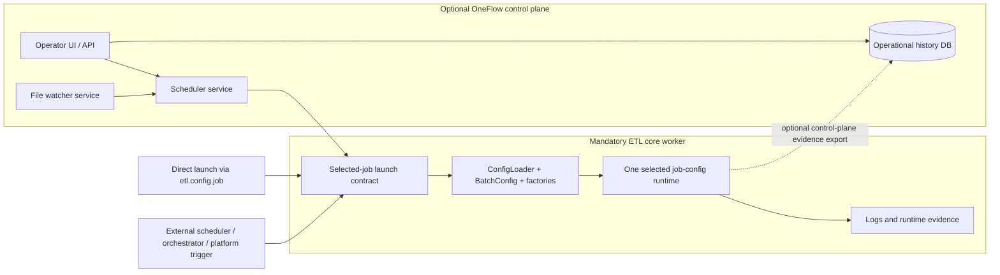

# Control Plane and Worker Boundary

## Purpose

This document defines the boundary between the independently runnable `spring-etl-engine` ETL worker runtime and the future optional OneFlow control-plane capabilities that may grow around it.

It exists to keep scheduling, file watching, persisted operational history, and future operator UI work aligned with the shipped explicit selected-job runtime instead of accidentally creating a second execution contract.

## Status

- Classification: **Future direction**
- The Mermaid diagrams in this document describe the preferred future direction, not a shipped runtime path today.

## Scope

This document covers:

- what remains mandatory versus optional in the OneFlow product layering
- the launch boundary that both native and external trigger systems must target
- the deployability and interoperability rules for future scheduler, watcher, persistence, and UI capabilities
- the technology stance for the first control-plane slices
- the guardrail that transformation capability remains a first-class roadmap track

This document does **not** define:

- one final scheduler implementation
- detailed control-plane API or UI screen contracts
- restartability semantics in detail
- one final relational schema for retained operational history

## Context

The shipped runtime already has a strong execution boundary:

1. select one `etl.config.job`
2. resolve one `job-config.yaml`
3. load the referenced source, target, and processor YAMLs
4. execute the explicit ordered `steps` for that selected run

That boundary is described in [`runtime-flow.md`](../etl-core/runtime-flow.md) and strengthened in [`scenario-driven-runtime-direction.md`](../etl-core/scenario-driven-runtime-direction.md).

The future product direction adds legitimate operator needs around that runtime, including:

- time-based schedules
- file-watcher triggers
- persisted trigger and run history
- operator-facing dashboards and control surfaces
- later recovery and restartability workflows

Those capabilities are valuable, but they must stay layered around the ETL core instead of turning the ETL core into a scheduler-dependent runtime.

## Flow

Future-only, not shipped today: this diagram shows the intended target shape.

Read this target shape in three rules:

1. the ETL core worker remains the only mandatory runtime component
2. the OneFlow control plane is optional and may be absent entirely
3. native and external trigger systems must both resolve to the same selected-job launch contract

## Key Components / Classes

Current runtime anchors that define the worker side of the boundary:

- `src/main/java/com/etl/ETLEngineApplication.java`
- `src/main/java/com/etl/runner/EtlJobRunner.java`
- `src/main/java/com/etl/config/ConfigLoader.java`
- `src/main/java/com/etl/config/BatchConfig.java`
- `src/main/java/com/etl/common/util/GeneratedModelClassResolver.java`
- `src/main/java/com/etl/reader/DynamicReaderFactory.java`
- `src/main/java/com/etl/processor/DynamicProcessorFactory.java`
- `src/main/java/com/etl/writer/DynamicWriterFactory.java`

Related architecture notes that constrain the boundary:

- [`runtime-flow.md`](../etl-core/runtime-flow.md)
- [`scenario-driven-runtime-direction.md`](../etl-core/scenario-driven-runtime-direction.md)
- [`etl-product-evolution-roadmap.md`](../foundations/etl-product-evolution-roadmap.md)
- [`control-plane/scheduler-architecture-direction.md`](scheduler-architecture-direction.md)
- [`operator-ui/operator-ui-architecture-direction.md`](../operator-ui/operator-ui-architecture-direction.md)
- [`transformation-capability-roadmap.md`](../etl-core/transformation-capability-roadmap.md)
- [`job-history-and-operational-observability.md`](job-history-and-operational-observability.md)
- [`control-plane-operational-data-model.md`](control-plane-operational-data-model.md)

This boundary is formalized as an accepted decision in [`ADR-0008`](../../adr/0008-formalize-control-plane-and-etl-worker-boundary.md).

## Decisions

- The ETL core worker is the only mandatory product component. A team must be able to run OneFlow with no built-in scheduler, watcher, persistence service, or UI present.
- The stable interoperability boundary remains the explicit selected-job contract rooted in `etl.config.job` and `job-config.yaml`.
- A future OneFlow-native scheduler is one supported launcher of that contract, not the only supported launcher.
- External enterprise schedulers, orchestrators, workload platforms, and deployment-native trigger systems are first-class integration choices as long as they launch the same worker boundary.
- File watching belongs to the optional trigger-control layer, not to an alternate execution runtime. A watcher may detect and classify candidate files, but the actual run must still resolve through the same selected-job launch contract.
- Persisted operational history is an optional control-plane capability. It should enrich scheduling, watcher evidence, and operator workflows without becoming a hard prerequisite for core ETL execution.
- The first control-plane implementation should stay Java-first and close to the existing stack. Lightweight relational persistence such as SQLite is acceptable for early local or single-node control-plane work, with stronger relational deployment targets added later.
- Transformation capability remains a first-class roadmap track alongside control-plane maturity. Scheduler or UI work must not displace shared transformation growth.

## Tradeoffs

### Benefits

- keeps the core runtime simple, directly runnable, and easy to integrate into existing enterprise scheduling estates
- prevents a second orchestration contract from drifting away from `job-config.yaml`
- allows adopters to choose OneFlow-native scheduling later without making it a prerequisite for current ETL value
- keeps evidence, scheduling, watcher controls, and future UI work compatible with the same runtime boundary

### Costs

- native control-plane features cannot assume exclusive ownership of job launching
- control-plane persistence and evidence correlation must be designed to work with both native and external triggers
- documentation and future APIs must stay disciplined about the worker boundary to avoid accidental coupling

### Alternatives considered

#### Alternative: make the OneFlow scheduler mandatory for all launches
Rejected because it would break the current independently runnable ETL core model and reduce interoperability with enterprise schedulers already used by adopters.

#### Alternative: embed watcher and operator controls directly into the worker runtime
Rejected because it would blur the line between trigger governance and ETL execution, and would make optional operational capabilities harder to deploy, disable, or replace.

## Impact on Existing Architecture

This note does not change the shipped ETL runtime path today.

It does change how future work should be shaped:

- scheduler, watcher, and UI features should be designed as optional layers around the ETL worker
- control-plane persistence should be treated as operational metadata storage, not as a mandatory dependency for launching core ETL runs
- future launch APIs, CLIs, or services should resolve to the same selected-job contract already used by direct execution
- external orchestration support should remain documented and tested as a supported path, not a compatibility afterthought
- transformation roadmap work should continue in parallel rather than being deferred behind control-plane delivery

## Testing / Validation Expectations

Changes that build on this boundary should validate at least these points:

- direct worker execution through `etl.config.job` still works when no control-plane services are present
- native scheduler-triggered runs and external-orchestrator-triggered runs both identify the same selected job boundary in evidence
- file-watcher-triggered runs record watcher and trigger origin without bypassing worker launch validation
- control-plane persistence, when present, can be absent or disabled without breaking the mandatory ETL worker runtime
- related architecture and product docs stay aligned when this boundary meaning changes

## Future Extensions

Follow-on work that should build from this boundary includes:

- schedule model and trigger contract definition
- file-watcher trigger management and stabilization rules
- persisted run ledger and trigger audit history
- conceptual retained operational data model for schedules, watchers, triggers, runs, steps, artifacts, and recovery anchors
- scheduler-specific backend design notes that preserve the selected-job launch contract
- operator APIs and integrated UI views over jobs, schedules, watchers, and evidence
- dedicated operator UI notes for monitoring, schedule management, admin, and job authoring
- restartability and recovery workflows built on retained operational evidence
- deployment guidance for native control plane versus external scheduler integration
- continued transformation maturity through shared processor/source extension seams

