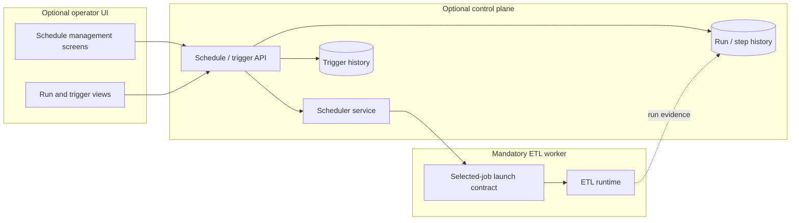

# Scheduler Architecture Direction

## Purpose

This document defines the preferred future direction for time-based scheduling under the optional OneFlow control plane.

It exists to clarify that scheduling is a control-plane capability that launches the same selected-job worker contract already used by direct execution, rather than inventing a second runtime model.

## Status

- Classification: **Future direction**
- The Mermaid diagrams in this document describe the preferred future direction, not a shipped runtime path today.

## Contract freeze checkpoint (S1)

Current S1 planning freezes the launch boundary for parallel scheduler and operator-UI work:

- all launchers (native scheduler, external orchestrator, operator ad hoc trigger) target the same selected-job boundary
- run evidence includes trigger origin, trigger identity (`scheduleId` and/or external trigger reference), and trigger decision/event id when available
- retry/restart ownership remains on ETL runtime contracts and is not redefined by schedule configuration
- native scheduling remains optional and does not replace external-orchestrator launch paths

This checkpoint intentionally freezes boundary semantics only. It does not imply S2/S3/S4 feature completion.

## Scope

This document covers:

- where the scheduler sits in the product layering
- how schedule definitions should bind to one selected job bundle
- the relationship between scheduler backend services and operator UI screens
- the minimal scheduler MVP versus later governance features
- guardrails around retained history, overlap, and restart semantics

This document does **not** define:

- one final cron library or scheduling engine
- one final relational schema by itself
- detailed overlap or missed-run semantics beyond the boundary rules
- final watcher behavior
- final restart or replay workflows

## Context

The current runtime already has a strong execution boundary:

1. select one `etl.config.job`
2. resolve one `job-config.yaml`
3. load the referenced source, target, and processor YAMLs
4. execute the explicit ordered steps for that selected run

The scheduler must target that same boundary.

A scheduler therefore belongs in the optional control-plane layer, alongside retained history and trigger audit, while the browser UI remains a client of that layer rather than the home of scheduling logic itself.

## Control-plane view

Read this view in four rules:

1. the UI manages schedules, but does not perform scheduling itself
2. the scheduler is a backend service in the optional control plane
3. every scheduler launch resolves to the same selected-job worker boundary
4. trigger audit and retained run history enrich operations, but must not become mandatory for direct worker execution

## Schedule contract direction

A first schedule definition should eventually preserve at least:

- schedule identity
- selected job bundle identity or `job-config.yaml` path
- enabled / disabled state
- timezone-aware trigger expression where needed
- trigger origin metadata
- ownership / descriptive metadata for operators

That definition should point to one selected runnable bundle. It should not define a second hidden orchestration graph.

## MVP versus later governance

### Recommended MVP

The first scheduler slice should focus on:

- explicit schedule definitions for existing job bundles
- manual trigger-now support through the same backend surface
- basic next-run visibility
- trigger-origin recording and schedule-to-run traceability

Current dedup guardrail for concurrent pollers:

- schedule ticks claim a persisted `lastAcceptedDueAt` watermark atomically per schedule
- when multiple control-plane instances evaluate the same due instant within milliseconds, only one claimant should advance that watermark
- the losing claimant must suppress duplicate trigger recording for that same due instant
- this preserves exactly-once trigger-event semantics for each `(scheduleId, dueInstant)` pair

### Later scheduler governance

After the core contract is frozen, grow into:

- pause / resume controls
- overlap policies
- missed-run handling
- richer trigger audit trail
- watcher-fed trigger integration
- operator approval or environment-specific trigger controls where justified

## Dependency guardrails

Scheduler implementation should stay aligned with these already-documented prerequisites:

- `S1` defines schedule identity and trigger contract
- `S3` defines overlap policy, missed-run handling, and basic trigger audit
- `S4` defines the retained operational data model
- `F1` defines restart semantics per execution mode

This matters because a scheduler can easily over-promise operator behavior before those semantics are explicit.

## Non-negotiable rules

Treat the following as non-negotiable unless a future ADR changes direction:

- the scheduler is optional from the worker point of view
- external schedulers and orchestrators remain first-class launchers of the same worker contract
- schedule definitions must point to one selected job bundle, not a second orchestration DSL
- retained scheduler history augments runtime evidence rather than replacing it
- scheduler work should not force the ETL worker to become a web application or a permanently running daemon

## Suggested first API surface

A practical first scheduler/control-plane API could expose:

- list schedules
- create schedule for an existing job bundle
- enable or disable schedule
- trigger now
- view recent trigger events
- view runs launched by a schedule

Those APIs can support UI screens later without making the UI itself the architectural center.

## Related documents

- [`control-plane-worker-boundary.md`](control-plane-worker-boundary.md)
- [`control-plane-operational-data-model.md`](control-plane-operational-data-model.md)
- [`control-plane-local-relational-schema.md`](control-plane-local-relational-schema.md)
- [`../operator-ui/operator-ui-architecture-direction.md`](../operator-ui/operator-ui-architecture-direction.md)
- [`../../product/backlog-items/scheduler/S1-schedule-model-and-trigger-contract.md`](../../product/backlog-items/scheduler/S1-schedule-model-and-trigger-contract.md)
- [`../../product/backlog-items/scheduler/S3-overlap-policy-missed-run-handling-and-trigger-audit-trail.md`](../../product/backlog-items/scheduler/S3-overlap-policy-missed-run-handling-and-trigger-audit-trail.md)
- [`../../product/backlog-items/scheduler/S4-control-plane-operational-data-model.md`](../../product/backlog-items/scheduler/S4-control-plane-operational-data-model.md)
- [`../../product/backlog-items/etl-core/F1-restart-semantics-per-execution-mode.md`](../../product/backlog-items/etl-core/F1-restart-semantics-per-execution-mode.md)

