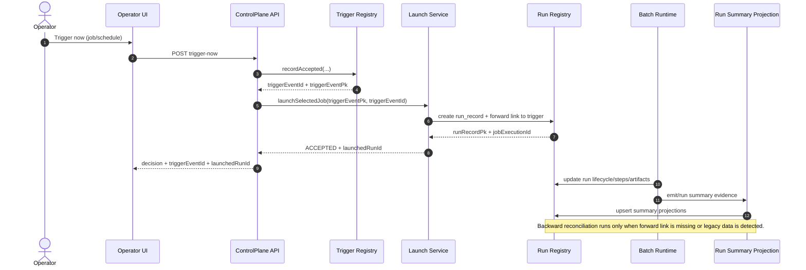
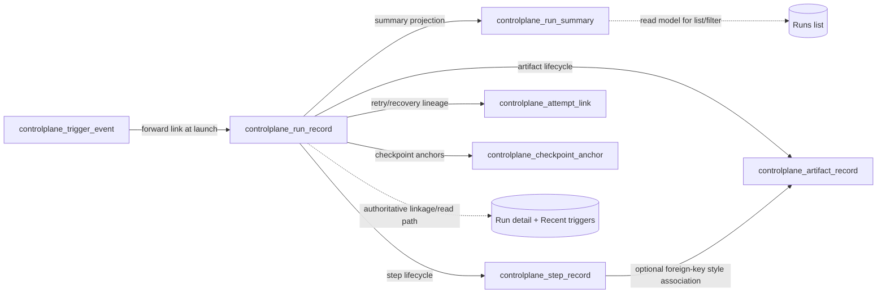

# Trigger, execution, and persistence consistency plan

**Status:** Current baseline + approved implementation direction  
**Audience:** control-plane backend and operator UI maintainers  
**Scope:** trigger acceptance, run launch/linking, run projections, UI consistency behavior

## Why this note exists

The current shipped control-plane path is functionally correct but briefly inconsistent under load:

- Recent trigger rows can appear before full run-detail projection catches up.
- Runs list and run detail can disagree for a short window during async reindex.
- Backfill/reconciliation is still doing correctness work that should be primary-link work.

This note defines the review baseline and the target design before implementation.

## Approved implementation direction (current)

The control-plane path should converge on the following operational model:

1. **Forward link first**: trigger acceptance and run identity linkage are written deterministically on the launch path.
2. **Immediate run/step persistence**: run lifecycle and step snapshots are written directly from runtime lifecycle callbacks.
3. **Projection as enrichment**: log-based projection remains best-effort enrichment/recovery, not primary identity correctness.
4. **Incremental checkpoint sync**: log parsing advances from persisted checkpoints instead of full rescans during normal refresh.

Current implementation note:

- `RunSummaryReadModelService` now records per-log replay progress through `RunSummaryRegistry`.
- `JdbcRunSummaryRegistry` persists that progress in `controlplane_log_checkpoint` keyed by normalized absolute `log_path`.
- Full replay is still available for forced refresh and recovery paths, but normal refresh can resume from the stored byte offset.

This direction keeps identity correctness on authoritative tables while making read-model refresh cheaper and less disruptive.

### Incremental checkpoint scope

- Checkpoints are tracked **per log file** (for example `logs/<yyyy-MM-dd>/<scenario>.log`), not per job key.
- One checkpoint row records where parsing stopped for that file and resumes from that exact position.
- In a multi-job environment where jobs write to different files, each file advances independently.
- On restart, the sync loop resumes from the last committed checkpoint for each file.

## Current baseline (shipped)

1. Trigger is recorded in `controlplane_trigger_event`.
2. Launch is requested and a run eventually appears through runtime/log evidence.
3. `RunSummaryReadModelService` refreshes a read model asynchronously (`run-summary-reindex`).
4. `JdbcRunSummaryRegistry` performs best-effort trigger/run linkage and reconciliation.
5. UI eventually converges after refresh/reindex, but short-lived cross-page mismatch is possible.

### Current backfill mechanics (shipped)

The active linkage path is not fully forward-linked yet.

1. `JdbcTriggerEventRegistry.recordAcceptedInternal(...)` inserts `controlplane_trigger_event` with `launched_run_pk` and `launched_run_id` initially blank.
2. The worker runs and emits Spring Batch metadata plus structured scenario logs.
3. `RunSummaryReadModelService.collectRunSummaries(...)` parses `RUN_SUMMARY` evidence and calls `JdbcRunSummaryRegistry.upsert(...)`.
4. `JdbcRunSummaryRegistry.upsertRunRecord(...)` resolves a candidate trigger event for the run and upserts `controlplane_run_record`.
5. `backfillLaunchedRunLink(...)` then updates `controlplane_trigger_event.launched_run_pk` and `controlplane_trigger_event.launched_run_id` when they are still missing.
6. At startup, `backfillRunRecordTriggerEventLinkage()` repairs older rows whose `controlplane_run_record.trigger_event_id` is still blank.

The current trigger-to-run matcher uses:

- the selected job/scenario key,
- the run `started_at` timestamp,
- a lookback window,
- a smaller lookahead window,
- existing `launched_run_*` fields if they are already present.

That makes the current bridge practical, but also means it is still heuristic-based instead of deterministic at launch time.

## Target design direction

Adopt **forward linking as the primary path** and keep **backward reconciliation as fallback only**:

- Primary correctness event: launch-time link write between trigger event and run record.
- Projection/reindex becomes enrichment and recovery, not primary correctness.
- Operator UI uses explicit freshness semantics (`pending` vs `linked/confirmed`) instead of implicit assumptions.

## End-to-end sequence (target)

## Table-level data flow

## Consistency contract to review

### A. Primary source of truth

- Trigger-to-run identity is authoritative in `controlplane_run_record` (`trigger_event_pk` / `trigger_event_id`).
- `controlplane_trigger_event.launched_run_*` is treated as optional convenience/cache data, not identity authority.
- Run summary/projection layers must not invent or override linkage that conflicts with `controlplane_run_record`.

### B. UI contract

- `ACCEPTED` does not always mean fully projected; UI should support a short `projection_pending` state.
- Clicking `launchedRunId` must never resolve to a different run identity.

### C. Fallback contract

- Reconciliation/backfill is for missing links, restarts, and older rows.
- Reconciliation must be monotonic: never overwrite a valid forward link with an inferred alternative.

## Forward-linking strategy

At launch acceptance boundary:

1. Persist trigger event row (`trigger_event_pk`, `trigger_event_id`).
2. Create/update run record with `trigger_event_pk` and `trigger_event_id`.
3. Return response containing `triggerEventId` and `launchedRunId` from the same linked write scope.
4. Optionally update `controlplane_trigger_event.launched_run_*` only when required for compatibility/read-performance and only when missing.

Design intent: reduce cross-table eventual consistency to projection freshness only.

## Minimum authoritative model and DML goal

### Minimum authoritative tables

- `controlplane_schedule`
- `controlplane_trigger_event`
- `controlplane_run_record`
- `controlplane_step_record`

### Derived/optional tables

- `controlplane_run_summary`
- `controlplane_artifact_record`
- `controlplane_attempt_link`
- `controlplane_checkpoint_anchor`
- `controlplane_log_checkpoint` (incremental log-sync resume state)

### `controlplane_log_checkpoint` purpose

`controlplane_log_checkpoint` stores incremental read state so normal refreshes parse appended evidence only.

Suggested shape:

- `log_path` (unique file identity)
- `last_offset_bytes` (resume position)
- `file_size_at_checkpoint`
- `file_mtime_at_checkpoint`
- `last_processed_job_execution_id` (optional observability)
- `updated_at`

Checkpoint update rule:

1. parse appended lines,
2. apply idempotent upserts,
3. then commit the checkpoint.

If a crash occurs before step 3, replay from the previous checkpoint is expected and safe.

The current service keeps an in-process fallback cache as a compatibility path for non-JDBC registries, but durable restart-safe behavior comes from the persisted checkpoint row.

### DML minimization policy

- Prefer one authoritative write per fact domain (trigger, run, step) over mirrored writes.
- Avoid back-to-back updates when forward link already exists in `controlplane_run_record`.
- Keep reverse-link updates (`trigger_event.launched_run_*`) compatibility-only and idempotent.
- Treat backfill as migration/repair mode, not normal correctness mode.
- Skip no-op updates where projected values are unchanged.
- Prefer monotonic updates (never downgrade terminal run state from later evidence).

## Backward reconciliation fallback

Fallback executes when one of the following is true:

- legacy row without launch fields,
- startup migration/backfill path,
- operational repair after partial failure.

Rules:

- Prefer exact key matches (`trigger_event_pk`, `trigger_event_id`) over time-window heuristics.
- Time-window matching is last resort and must not override existing deterministic links.
- If deterministic forward link already exists, skip reverse-link repair updates that only duplicate that fact.

## Known current failure mode: historical step evidence can remain attached

The current baseline has a proven risk when historical evidence is replayed during reindex or startup backfill.

Example pattern observed during review:

- `controlplane_trigger_event` correctly linked a trigger event to one `run_record_pk` and one `job_execution_id`.
- `controlplane_run_record` correctly represented the newer execution instance.
- `controlplane_step_record` contained one current step row for that execution and one older step row from a different date under the same `run_record_pk`.
- `batch_step_execution` only contained the current Spring Batch step row, which means the older step row was stale retained evidence, not current batch metadata.

This indicates the current baseline can retain or reattach older step evidence under the same control-plane run identity.

### Why this happens

- `job_execution_id` is currently used as the technical join key across Spring Batch metadata, log evidence, and run-summary projection.
- Step rows are upserted under the resolved `run_record_pk` for that `job_execution_id`.
- Older structured-log evidence can be replayed during backfill/reindex.
- Duplicate step-name groups are only logged as warnings today; stale step rows are not pruned or quarantined automatically.

### Design consequence

Forward-linking alone improves trigger-to-run identity correctness, but the implementation also needs execution-instance-safe evidence reconciliation so stale step/artifact evidence cannot remain attached after a newer execution is confirmed.

This work should be planned together with forward-linking, not deferred until after it.

## Identity model to preserve and clarify

### `run_record` is the product-facing durable run identity

`controlplane_run_record` is the control-plane run object owned by this product. It is the correct long-term place for:

- trigger linkage,
- selected job identity,
- recovery lineage,
- operator-facing run references.

### `job_execution_id` remains a technical execution reference

`job_execution_id` comes from Spring Batch `JobExecution.getId()` and is still needed for:

- joining to Spring Batch metadata such as `batch_step_execution`,
- correlating structured logs,
- deep troubleshooting against batch internals.

### Recommended UI policy

- Use `run_record_id` as the primary operator-facing identifier once it becomes independently meaningful.
- Keep `job_execution_id` available as a secondary technical field for diagnostics and deep support work.
- Avoid making Spring Batch identifiers the main human-facing run label when a control-plane run identity is available.

## Phased implementation plan

### Phase 1: Stabilize correctness without redesign

- Add explicit freshness status fields for trigger/run read responses.
- Ensure run-detail reads can request fresh projection when opened from recent trigger links.
- Add UI `projection_pending` indicator in trigger/runs detail surfaces.
- Add evidence-integrity checks so older step/artifact rows can be detected and isolated instead of silently coexisting under the same run record.
- Start the operator-facing identifier shift toward `run_record_id` while keeping `job_execution_id` visible as a diagnostic field.
- Add no-op guards so reverse-link writes are skipped when forward link is already authoritative.

### Phase 2: Forward-link first

- Make launch path write trigger and run linkage as one logical unit.
- Restrict reconciliation paths from mutating already-linked rows.
- Add guardrails for duplicate/legacy linkage conflict handling.
- Tighten step/artifact reconciliation so only evidence for the confirmed execution instance remains attached to the resolved `run_record_pk`.

### Phase 3: Projection hardening

- Add projection version/watermark metadata.
- Enforce monotonic read behavior for recent trigger -> run detail navigation.
- Keep asynchronous projection for throughput while preserving identity correctness.
- Replace normal-path full scans with incremental checkpoint-based parsing; reserve full scan for startup recovery/repair only.

## Observability additions

Track and review continuously:

- trigger-to-run-link latency (p50/p95/p99),
- accepted-without-linked-run count,
- reconciliation-repaired-link count,
- mismatch incidents (trigger points to run X but detail initially serves Y),
- projection freshness lag at read time.

## Review checklist

- [ ] Sequence and table lineage match shipped runtime constraints.
- [ ] Forward-linking write boundary is clearly defined and implementable.
- [ ] Reconciliation fallback cannot regress deterministic links.
- [ ] UI pending-state semantics are explicit and operator-friendly.
- [ ] Observability metrics are enough to prove consistency progress.

## Acceptance criteria for implementation start

1. For a new trigger acceptance, `trigger_event` and `run_record` linkage is deterministic before UI success response is considered complete.
2. Clicking `launchedRunId` from recent trigger events never resolves to a different `jobExecutionId`.
3. Eventual projection lag may delay non-identity fields, but not identity/link correctness.
4. Recovery/backfill path remains available for legacy rows and partial-failure repair.
5. Historical step or artifact evidence must not remain attached to a newer execution instance once the authoritative run identity has been confirmed.
6. No back-to-back reverse-link DML is executed when `controlplane_run_record` already carries the deterministic trigger link.

