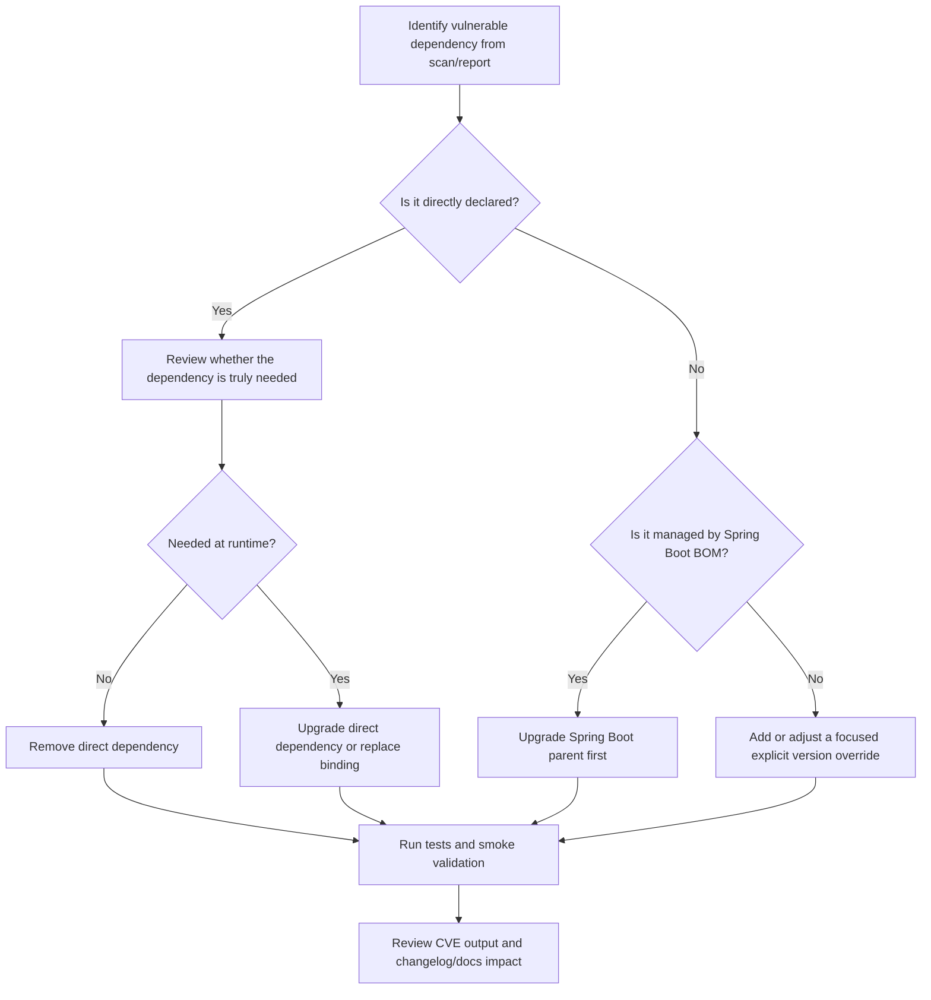

# Dependency upgrade strategy

## Purpose

This note captures the preferred dependency-upgrade workflow for `spring-etl-engine`, especially for patch-line security remediation such as `1.7.1`.

The goal is to keep upgrades predictable, minimize unnecessary overrides, and avoid accidental runtime conflicts.

## Current guidance

- Prefer upgrading the Spring Boot parent first when the issue is in the managed web/runtime stack.
- Prefer removing redundant direct dependencies over overriding them when the runtime does not need them.
- Prefer removing an unused starter entirely when the shipped runtime contract does not need that stack.
- Add an explicit version override only when the managed version is still vulnerable or unavailable.
- Keep the shipped runtime aligned with the active logging/config/runtime contracts already documented in this repository.

## Upgrade order

## Practical checklist

### 1. Classify the dependency

For every flagged library, determine which bucket it belongs to:

- **Direct dependency**: explicitly declared in `pom.xml`
- **Boot-managed dependency**: version comes from `spring-boot-starter-parent`
- **Transitive dependency**: pulled in by another dependency
- **Unused/redundant dependency**: declared directly but not part of the active runtime contract

### 2. Prefer the smallest safe change

Use this priority order:

1. **Remove unused direct dependency**
2. **Upgrade Spring Boot parent**
3. **Add one focused version override**
4. **Refactor code/config only if the dependency major version requires it**

### 3. Watch for logging-stack conflicts

This repository ships `logback-spring.xml`, so Logback is the active logging contract.

That means:

- avoid mixing Logback and Log4j runtime bindings unless there is a deliberate migration
- avoid adding direct logging artifacts that duplicate Spring Boot starter logging
- if a logging CVE appears for an unused runtime binding, removal is usually safer than override

## Patch-line strategy for `1.7.1`

The current patch-line approach is:

- move the Spring Boot parent to a newer patched coordinate
- remove the unused servlet/web starter so the ETL runtime stays non-web and no embedded Tomcat override is needed on the shipped path
- remove direct Log4j runtime dependencies because the application uses Logback
- remove redundant direct YAML and test-library declarations when Spring Boot / Jackson already provide the active path
- avoid broad extra overrides until a scan proves they are necessary

## Validation workflow

After each dependency change:

1. Run the Maven test baseline
2. Run the repository verification script
3. Run the PR security workflow checks or their local equivalent
4. Review whether the preserved smoke scenarios still match expected outcomes
5. Re-check the dependency scan after the dependency graph is stable

## Release hygiene

For patch releases:

- keep `CHANGELOG.md` aligned with the dependency/security remediation work
- mention whether the change is a direct upgrade, an override, or a dependency removal
- document temporary risk acceptances explicitly when a vulnerability cannot yet be remediated safely

## Decision rule

If a CVE can be resolved by removing an unnecessary dependency or by taking a Spring Boot patch release, prefer that over stacking multiple manual jar overrides.

