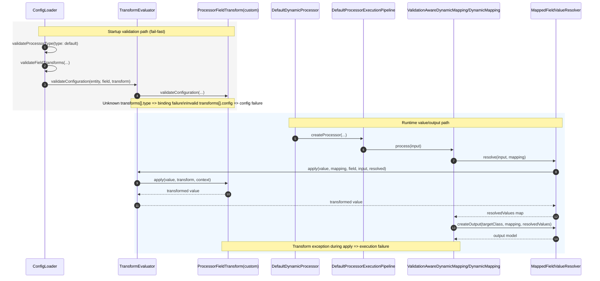

# Customer-owned processor transform seam

## Purpose

Define a future-direction architecture contract for customer-owned processor transforms that extend the active default processor path without introducing alternate processor types or a second runtime engine.

## Status

- Classification: **Future direction**
- Backlog anchor: [`T16 - Customer-owned processor transform extension seam`](../../product/backlog-items/etl-core/T16-customer-owned-processor-transform-extension-seam.md)

## Runtime intent

Custom processor transformations should remain on the existing transform seam:

1. read runtime input record
2. apply ordered `transforms[]` (built-in + customer-owned)
3. evaluate processor `rules[]`
4. write accepted output

This keeps the shipped transform-before-validation contract unchanged.

## T16 Architecture Invariants

Use these as locked review criteria for T16 design and implementation PRs.

1. **One processor path only**: selected-job runtime remains `type: default`; no alternate processor type is introduced.
2. **One transform envelope**: transform declarations use one common shape (`type` + optional provider-owned `config`).
3. **One binding key**: runtime dispatch for customer transforms is driven only by `transforms[].type`.
4. **Transform ownership boundary**: transforms rewrite values; acceptance/rejection remains on processor rules.
5. **Ordered determinism**: custom transforms run in authored order inside existing `transforms[]` sequencing.
6. **Backward compatibility first**: jobs without custom transforms keep current behavior and evidence.
7. **Fail-fast startup contract**: unknown transform type or invalid transform config fails startup before run.
8. **Shared taxonomy alignment**: transform failures map to Epic D categories (`config`, `binding`, `execution`).
9. **No scope leak**: source-native adaptation (`T9`), record-level stage (`T10`), and cross-record semantics (`T11`) stay out of T16 phase-1.

## Common transform declaration shape (phase-1)

Future contract shape (illustrative only):

```yaml
transforms:
  - type: replaceNull
    config:
      replacement: A
  - type: partnerStatusTranslate
    config:
      mappings:
        PENDING: Pending
        FAILED: Error
      fallbackValue: Unknown
```

Intent:

- `type` identifies the transform implementation
- `config` carries provider-owned options without forcing new core fields per transform family

### Implementation snapshot (phase-1 slice)

- `ProcessorConfig.FieldTransform` now accepts optional `config` as an additive provider-owned object.
- Built-in transforms remain backward compatible; current shipped built-ins are `valueMap`, `expression`, `conditional`, and `zoneConvert` (`zoneConvert` uses the shared `config` envelope).
- One shipped showcase provider now demonstrates custom-transform extensibility through `ProcessorExtensionProvider` + ServiceLoader (`partnerStatusTranslate`).
- Runtime processor type remains locked to `type: default`; this slice does not introduce alternate processor types.

## Class-level seam anchors

Use existing seams as the architecture center:

- `src/main/java/com/etl/processor/transform/ProcessorFieldTransform.java`
- `src/main/java/com/etl/processor/transform/TransformEvaluator.java`
- `src/main/java/com/etl/processor/transform/ProcessorTransformContext.java`
- `src/main/java/com/etl/processor/spi/ProcessorExtensionProvider.java`
- `src/main/java/com/etl/config/ConfigLoader.java` (startup validation path)

## Call flow (validation and runtime)



## Failure-category mapping

Map custom-transform failure paths into the same vocabulary direction used by Epic D:

- `config`: malformed transform declaration or invalid transform `config` values
- `binding`: unknown transform `type` or conflicting/ambiguous provider registration
- `execution`: runtime exception thrown by transform implementation

Evidence should include at minimum: transform `type`, source/target mapping identity, and failure category.

## Design boundaries for phase-1

Keep T16 first slice narrow:

- yes: field-scoped custom transform extensibility through existing transform SPI
- yes: provider-owned config payload under one common envelope
- no: custom-step/job-level side effects (belongs to `A7`)
- no: source-structure adaptation before records (belongs to `T9`)
- no: multi-field record transform stage (belongs to `T10`)
- no: cross-record/window logic (belongs to `T11`)

## Test matrix (first focused slice)

| Area | Scenario | Expected result | Category |
|---|---|---|---|
| compatibility | mapping uses only shipped transforms (`valueMap`, `expression`, `conditional`) | unchanged startup and runtime behavior | compatibility |
| config | custom transform entry missing `type` | startup fails fast | config |
| binding | unknown custom transform `type` | startup fails fast with binding category context | binding |
| config | known custom transform with invalid provider config | startup fails fast with config category context | config |
| execution | custom transform throws during apply | step fails with execution category context | execution |
| ordering | chain of built-in + custom transforms | authored order is preserved | runtime |

## Related docs

- [`Extension points`](extension-points.md)
- [`Default processor config`](../../config/processor/default-processor.md)
- [`Transformation capability roadmap`](transformation-capability-roadmap.md)
- [`T16 backlog item`](../../product/backlog-items/etl-core/T16-customer-owned-processor-transform-extension-seam.md)
- [`Epic D - Error taxonomy and failure categorization`](../../product/epics/etl-core/epic-d-error-taxonomy-and-failure-categorization.md)


