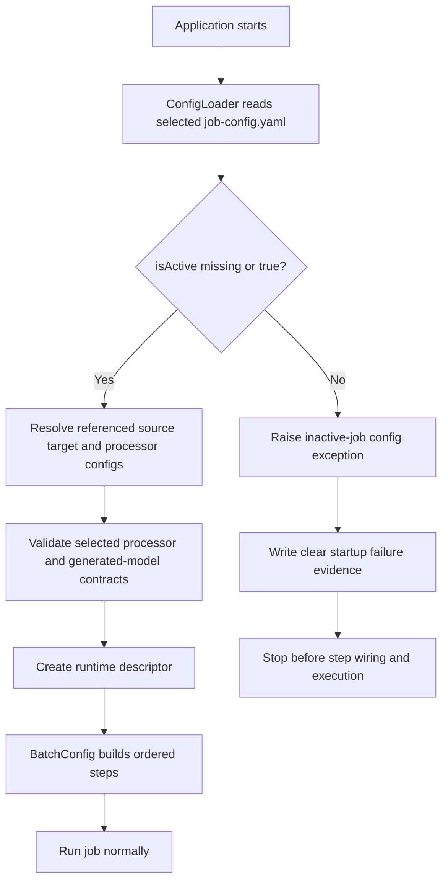

# Job-Level Activation and Startup Guardrails

## Purpose

This note captures the shipped first slice of a small but important runtime guardrail: allow one selected `job-config.yaml` to be marked inactive and fail startup before the job is wired.

It preserves the architecture rationale for the shipped job enable/disable behavior without weakening the current strict explicit-job runtime model.

## Status

- Classification: **Current runtime**
- The Mermaid diagrams in this document now describe the shipped first-slice runtime guardrail.

## Scope

This document covers:

- an optional job-level activation flag on `job-config.yaml`
- fail-fast startup behavior for an inactive selected job
- where that validation should happen in the current runtime
- expected operator-facing error and observability behavior
- the minimum documentation and regression coverage expected when this ships

This document does not cover:

- step-level activation flags such as `steps[].isActive`
- scheduler pause/resume controls
- forcing an inactive job to run via override properties
- job discovery, multi-job registries, or folder scanning

## Context

The current shipped runtime intentionally selects one explicit job per run through `etl.config.job -> job-config.yaml`.

That selected file is the runtime entry point for:

- resolving `sourceConfigPath`, `targetConfigPath`, and `processorConfigPath`
- defining the ordered `steps[]` contract consumed by `BatchConfig`
- shaping the selected run descriptor and observability identity

`ConfigLoader` is intentionally strict. It fails fast when the selected job is missing, when referenced config paths are invalid, or when certain selected configuration problems can already be diagnosed at startup.

Today, there is no first-class contract for saying that a known job bundle exists but is intentionally disabled. That leaves an avoidable operational gap:

- operators can still point `etl.config.job` at a bundle that should not run
- startup continues deeper into config resolution than necessary
- the product does not have a clear, job-aware configuration error for inactive jobs

The first version of this feature should stay small and preserve the existing explicit-job model: if the selected job is inactive, startup should stop early instead of trying to partially wire or silently skip execution.

## Flow

This diagram shows the shipped first-slice guardrail shape.



## Shipped contract

The shipped first contract is an optional top-level field on `job-config.yaml`:

```yaml
name: customer-load
isActive: false
sourceConfigPath: source-config.yaml
targetConfigPath: target-config.yaml
processorConfigPath: processor-config.yaml
steps:
  - name: load-customers
    source: CustomerCsv
    target: CustomerTable
```

### Contract rules

- `isActive` is optional
- omitted `isActive` means `true`
- `isActive: true` behaves exactly like today
- `isActive: false` blocks startup for the selected job
- there is no alternate job selection and no silent skip
- demo fallback behavior is unchanged and remains a separate concern

## Validation point

The shipped enforcement point is `ConfigLoader`, immediately after parsing the selected `job-config.yaml` and before referenced config paths are resolved.

That placement is preferred because:

- it fits the repo's strict explicit-job startup model
- it stops work before source/target/processor config resolution
- it prevents inactive jobs from reaching `BatchConfig`
- it avoids scattering activation checks across readers, writers, processors, or listeners

`BatchConfig` should remain focused on assembling the explicit ordered steps for an already-accepted selected job, not on deciding whether a job is allowed to start.

## Key Components / Classes

- `src/main/java/com/etl/config/job/JobConfig.java` - home of optional `isActive`
- `src/main/java/com/etl/config/ConfigLoader.java` - fail-fast guardrail location
- `src/main/java/com/etl/config/BatchConfig.java` - should remain untouched by ensuring inactive jobs never reach step assembly
- `src/main/java/com/etl/config/exception/ConfigException.java` - likely base category for an inactive-job startup failure
- `docs/config/job-config.md` - contract documentation that must stay aligned with the field and default behavior
- `docs/adr/etl-core/0004-use-explicit-job-config-for-business-scenario-selection.md` - architectural baseline this future guardrail should extend, not weaken

## Decisions

- keep the first version job-level only
- use `isActive` as the field name for clarity and future compatibility with possible step-level naming
- default missing `isActive` to `true` for backward compatibility
- treat an inactive selected job as a startup configuration failure, not as a skipped run
- stop before referenced config resolution, generated-model validation, descriptor creation, and step wiring
- emit a clear operator-facing error that includes job/scenario identity and the resolved job-config path

## Tradeoffs

- **Benefit:** simple, explicit contract for operators and private/public job bundles
- **Benefit:** preserves the current one-selected-job runtime model without adding discovery or scheduler semantics
- **Benefit:** keeps `BatchConfig` and the runtime factories free from activation branching
- **Cost:** does not solve finer-grained needs such as per-step activation in the first slice
- **Cost:** adds one more top-level `job-config.yaml` field that docs and examples must explain clearly
- **Alternative considered:** checking inactivity later during job wiring, which was rejected because it delays failure and mixes policy with assembly

## Impact on Existing Architecture

This shipped change is additive to the current runtime contract.

It should:

- extend `job-config.yaml` without breaking existing preserved bundles or private bundles
- reinforce `ConfigLoader` as the strict startup boundary for explicit job selection
- leave `BatchConfig` focused on explicit ordered step assembly for active jobs only
- fit the existing observability model where startup failures are distinct from normal run execution evidence

This should not introduce scenario or job auto-discovery, nor should it change the current rule that one run executes one selected job.

## Observability expectations

An inactive selected job should be visible as a startup-time configuration stop.

Expected behavior:

- one clear startup error log line or structured failure event
- message includes selected job/scenario name where available
- message includes the resolved `job-config.yaml` path
- no misleading normal execution evidence such as `RUN_EVENT`, `MAIN_FLOW_PLAN`, `SUBFLOW_PLAN`, `STEP_EVENT`, or `RUN_SUMMARY`

That keeps the evidence model honest: the job did not run; it was blocked before runtime execution began.

## Testing / Validation Expectations

The shipped implementation now includes the following minimum validation expectations:

- `ConfigLoader` test coverage for omitted `isActive`
- `ConfigLoader` test coverage for `isActive: true`
- `ConfigLoader` test coverage for `isActive: false`
- assertion that inactive jobs fail before downstream config resolution or step assembly proceeds
- operator-readable failure text that includes the selected job identity and resolved `job-config.yaml` path
- matching updates to `docs/config/job-config.md`, `README.md`, and this runtime architecture note

The repository verification workflow should still pass after the implementation and documentation updates are applied.

## Future Extensions

Possible later work that should build from this note rather than complicating the first slice:

- optional `steps[].isActive` with explicit step filtering semantics
- collection-level or environment-level activation policy for private bundles
- richer startup failure categorization in structured observability events
- UI or operator-surface representation of disabled jobs once the product grows beyond explicit command-driven runs


