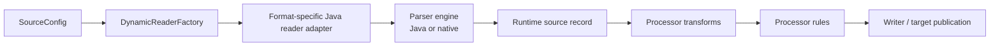
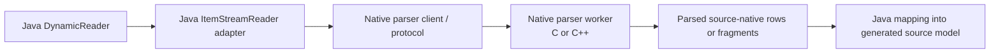

# Native Parser Adoptability

## Purpose

This note defines how `spring-etl-engine` may adopt a future native parser implementation, including C or C++, without breaking the current Java/Spring Batch runtime boundary.

Use it when evaluating parser-performance work, non-Java parser engines, or proposals to embed parser logic outside the current Java reader implementations.

## Status

- Classification: **Future direction**
- This note preserves an adoption rule, not a shipped runtime capability.

## Core decision summary

OneFlow may adopt future native parser engines, but they must stay **behind the existing Java reader seam**.

That means the stable runtime-facing contract remains:

- `DynamicReaderFactory`
- `DynamicReader`
- Spring Batch `ItemReader` / `ItemStreamReader`
- generated runtime source record emission
- Java-owned processor / writer / orchestration behavior

Native code may help parse source-native structure. It must not become the runtime design center or a second ETL core.

## Why this note exists

A future C/C++ parser can sound attractive for throughput, advanced tokenization, or specialized source handling. Without a clear adoption rule, that pressure can accidentally push parser technology into areas that already belong to the ETL core, such as transforms, validation rules, orchestration, and write policy.

This note keeps the boundary explicit before native parser work is started.

## Stable seam to preserve

The current runtime should continue to read conceptually as:

Read that diagram with one strict rule:

- native parsing may replace the parser-engine box
- native parsing must not replace the Java reader adapter, runtime source record contract, or downstream ETL-core behavior

## Current code anchors

- `src/main/java/com/etl/reader/DynamicReader.java`
- `src/main/java/com/etl/reader/DynamicReaderFactory.java`
- `src/main/java/com/etl/reader/impl/CsvDynamicReader.java`
- `src/main/java/com/etl/reader/impl/XmlDynamicReader.java`
- `src/main/java/com/etl/reader/impl/RuntimeCategorizingItemStreamReader.java`
- `src/main/java/com/etl/common/util/GeneratedModelClassResolver.java`

## Ownership rules for future native parsers

### Native parser may own

- tokenization and fragment detection
- low-level source-native structure interpretation
- malformed-record or malformed-fragment detection at parse time
- performance-sensitive parsing internals
- opaque native checkpoint tokens when restart support is needed

### Native parser must not own

- processor transforms or business normalization
- processor-rule accept/reject decisions
- duplicate handling or winner-selection policy
- target publication logic
- step orchestration
- generated Java package/class naming rules
- operator-facing runtime error categorization as the primary public contract

## Preferred integration shape

### Preferred: out-of-process sidecar or worker

The preferred future design is a Java reader adapter that talks to a native parser running out of process.

The first concrete protocol target for that direction should be the narrow CSV-first shape documented in [`CSV native parser sidecar protocol`](csv-native-parser-sidecar-protocol.md).

The Java-side lifecycle and generated-model handoff contract for that direction is documented in [`Java native parser reader adapter contract`](java-native-parser-reader-adapter-contract.md).

Recommended shape:

Why this is preferred:

- preserves the current Java/Spring Batch runtime contract
- isolates native crashes from the main JVM where possible
- keeps parser logic easier to version and replace
- supports future multi-language parser implementations without changing the ETL-core design
- makes it harder for parser code to absorb processor or orchestration concerns by accident

### Allowed later, but not preferred first: in-process JNI/JNA bridge

An in-process native parser may be acceptable later when there is a strong proven need, such as parser-native throughput pressure that cannot be met cleanly with the existing Java readers.

If this path is ever used, keep the same rule:

- Java still owns `ItemReader` / `ItemStreamReader`
- Java still owns `ExecutionContext` participation and runtime error wrapping
- native code still owns source-native parsing only

## Java-side responsibilities that must stay stable

Even with native parsing, Java should continue to own:

- `SourceConfig` interpretation
- Spring Batch reader lifecycle: `open`, `read`, `update`, `close`
- mapping parsed values into the generated source record model
- runtime error wrapping and category alignment
- interaction with processor, writer, listeners, and orchestration

## Restartability guidance

If a future native parser participates in restartable execution, prefer this rule:

- the native engine may produce an opaque checkpoint token
- the Java adapter stores that token in Spring Batch `ExecutionContext`
- the ETL core should not need to understand native parser internals such as raw pointer state or engine-specific buffer layouts

This keeps restartability integrated with Spring Batch without coupling the runtime to native implementation details.

## Config-shape guidance

Do not pass the full OneFlow runtime object graph into native code.

Instead, pass a narrow parser contract that contains only source-native needs such as:

### CSV-like formats

- file path
- delimiter
- quote/escape settings
- header behavior
- column order or expected field list
- parser strictness flags

### XML-like formats

- file path
- root element
- record element
- parser-native namespace or fragment options
- schema path only when schema participation is genuinely parser-native

## Decision test for future proposals

A future native parser proposal is architecturally valid only if all of the following remain true:

1. the returned runtime seam is still a Java `ItemReader` or `ItemStreamReader`
2. the parser stops at source-native parsing and runtime-record emission
3. processor, validation-rule, orchestration, and writer behavior remain outside native code
4. generated-model resolution and job-scoped naming remain Java-owned
5. OneFlow can still support a Java parser implementation for the same source family without redesigning the runtime

## What to avoid

Reject designs where native parser work becomes the home for:

- conditional field rewrites
- business default values
- duplicate resolution
- target-specific routing
- scenario-level orchestration
- parser-specific launch contracts that bypass the selected-job runtime

## Related docs

- [`oneflow-file-parser-capabilities.md`](oneflow-file-parser-capabilities.md)
- [`csv-native-parser-sidecar-protocol.md`](csv-native-parser-sidecar-protocol.md)
- [`java-native-parser-reader-adapter-contract.md`](java-native-parser-reader-adapter-contract.md)
- [`extension-points.md`](extension-points.md)
- [`runtime-flow.md`](runtime-flow.md)

## Bottom line

OneFlow should stay open to future C/C++ parser adoption, but only as a **replaceable parser-engine implementation behind the existing Java reader boundary**.

The runtime contract must still read as:

**validate source -> parse source-native structure -> emit runtime record -> transform -> validate/reject -> write**

not as a native-parser-centered ETL engine.
