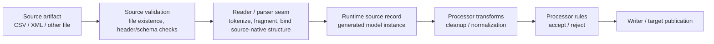

# OneFlow File Parser Capabilities and Boundaries

## Purpose

This note defines what a **file parser** should mean in `spring-etl-engine`, what capabilities the shipped runtime already owns at the parser layer, and which behaviors must stay outside that layer so parsing does not become tightly coupled to ETL-core business activities.

Use it when discussing parser growth, new source-native parsing options, or format-specific reader behavior.

## Status

- Classification: **Current baseline + future evolution**
- The Mermaid diagram below shows the intended parser boundary on top of the shipped runtime baseline.

## Current planning stance

- the active parser-planning track is intentionally frozen around **CSV and XML source-native maturity**
- before widening parser scope further, OneFlow should first prove the existing Java runtime on a few preserved real-file scenarios such as `xml-to-csv-events`, `xml-to-json-events`, `csv-to-sqlserver`, and the explicit multi-step nested XML roundtrip bundles
- parser growth should focus on realistic CSV/XML scenarios first, using preserved scenario proof and verification evidence before widening parser-family scope
- a general **JSON source parser** remains a future candidate only after the CSV/XML parser baseline is stronger and a concrete preserved source contract exists
- future non-Java parser engines remain admissible only behind the existing Java reader seam; see [`Native parser adoptability`](native-parser-adoptability.md)

## Core boundary rule

OneFlow file parsers must stay responsible for **source-native structure and token interpretation only**.

They must **not** become the home for:

- source-to-target mapping decisions
- business-value normalization that applies after a normal runtime record exists
- accept/reject business rules
- duplicate winner-selection logic
- enrichment, joins, or default-value business filling
- job orchestration or downstream target-writing policy

The parser seam exists to turn a source artifact into a valid runtime record boundary, not to become a second ETL core.

## Why this note exists

Without an explicit parser boundary, three different concerns easily get mixed together:

1. **source-native parsing** - delimiters, quoted tokens, XML record fragments, schema/file checks
2. **runtime record shaping** - generated source model creation and field binding
3. **ETL-core behavior** - transforms, processor rules, duplicate logic, orchestration, and write policy

OneFlow already has separate seams for those downstream concerns. Preserving that separation keeps parser growth safe, testable, and format-focused.

## Current runtime boundary

Read that flow with one strict rule:

- everything up to **runtime source record** is parser- or source-validation-owned
- everything after **runtime source record** is ETL-core processing/writing behavior

## Current code anchors

### Parser / reader seam
- `src/main/java/com/etl/reader/DynamicReaderFactory.java`
- `src/main/java/com/etl/reader/impl/CsvDynamicReader.java`
- `src/main/java/com/etl/reader/impl/XmlDynamicReader.java`
- `src/main/java/com/etl/reader/impl/RuntimeCategorizingItemStreamReader.java`

### Source-validation seam
- `src/main/java/com/etl/config/source/validation/SourceValidationService.java`
- `src/main/java/com/etl/config/source/validation/CsvSourceValidator.java`
- `src/main/java/com/etl/config/source/validation/XmlSourceValidator.java`

### ETL-core seams that must stay separate from parsing
- processor transforms: `src/main/java/com/etl/processor/impl/DefaultDynamicProcessor.java` and config under `processor-config.yaml`
- processor-rule validation: `src/main/java/com/etl/processor/validation/ValidationRuleEvaluator.java`
- orchestration: `src/main/java/com/etl/config/BatchConfig.java`
- runtime model contract: `src/main/java/com/etl/common/util/GeneratedModelClassResolver.java`

## Shipped parser capability baseline

### CSV source

Today the shipped CSV parser layer owns:

- delimiter selection
- optional quote-character handling
- header skipping as a source-reader concern
- configured field order/token binding into the generated source model
- strict file-reader setup and categorized reader failure wrapping

Today the shipped CSV source-validation layer owns:

- file existence/readability checks
- optional exact header matching
- optional empty-file/data-row checks
- optional file-name-pattern checks
- reject-file-on-validation-failure behavior

### XML source

Today the shipped XML parser layer owns:

- root-element and record-element interpretation
- source-file parsing into repeating runtime records
- flattening strategy entry selection such as `DirectXml`, `NestedXml`, and `JobSpecificXml`
- use of model-definition structure for nested XML flattening contracts

Today the shipped XML source-validation layer owns:

- file-level XML validation
- optional XSD/schema validation before normal reading begins
- whole-file reject behavior when configured

### Relational source

Relational reads are part of the reader extension model, but they are **not file-parser capabilities** in the same sense as CSV or XML.

The relational reader interprets query/table results, not file-native tokens or fragments. Keep that distinction clear in future discussions.

### JSON source

A general JSON source parser is **not** part of the shipped source baseline today.

The product already supports JSON target writing, but JSON should not be described as a shipped first-class source parser until a real JSON source contract exists on the active path.

## Ownership rules

### What belongs in the parser / source-reader seam

Parser-native responsibilities include:

- token boundaries such as CSV delimiter/quote handling
- fragment boundaries such as XML root/record interpretation
- source-native structure-to-record conversion
- field/token order needed to build the runtime source model
- malformed file / malformed fragment detection at read time
- source-format-specific low-level strictness

### What belongs in source validation

Source validation includes:

- source artifact existence/readability
- file-name patterns
- header/schema/root-level contract checks
- whole-file rejection before normal processing starts
- source-native constraints that must be verified before a runtime record exists

### What belongs in processor transforms

Processor transforms include:

- trimming and case normalization after record creation
- coded-value normalization such as `USA -> US`
- expression-derived fields
- default-value filling that is not source-native parsing
- other business/value rewriting once a normal runtime record exists

### What belongs in processor rules

Processor rules include:

- accept/reject decisions
- required-field business validation
- time-format acceptance rules on mapped values
- duplicate handling and winner selection
- runtime-loaded reference-set membership validation

### What belongs in orchestration and write behavior

Outside parser ownership entirely:

- step order
- chunk vs tasklet selection
- target publication strategy
- archive-on-success of already processed source files
- downstream reject artifact layout

## Design decisions preserved here

### 1. Parser capability must stay source-native

If a behavior depends on raw headers, raw tokens, XML namespaces, fragment boundaries, or pre-record source structure, it may belong at the parser or source-validation layer.

If it depends on business meaning after a runtime record exists, it belongs downstream.

### 2. Parser growth must not invent a second transform engine

OneFlow already has processor transforms and processor rules as the ETL-core home for normalization and accept/reject behavior. Parser growth must not duplicate those seams.

### 3. File-level validation stays adjacent to parsing, not to business mapping

Header checks, schema checks, and source-artifact rejection belong with source validation because they happen before normal record processing exists.

### 4. Reader factories remain the extension seam, not the design center

`DynamicReaderFactory` stays the active dispatch seam for selecting a source-format reader. Keep parser growth behind reader implementations and validators rather than scattering format-specific conditionals across orchestration code.

## Current capability matrix

| Capability area | CSV | XML | Relational | Parser boundary decision |
|---|---|---|---|---|
| token / fragment interpretation | Shipped | Shipped | N/A (result-set reader) | parser-owned |
| file existence/readability checks | Shipped | Shipped | N/A | source-validation-owned |
| header / root / schema checks | Shipped header checks | Shipped root/XSD checks | N/A | source-validation-owned |
| source-native flattening / fragmentation | Minimal flat row tokenization | Shipped through XML strategies | N/A | parser-owned |
| business normalization after record creation | Deferred to processor | Deferred to processor | Deferred to processor | not parser-owned |
| accept/reject rule outcomes | Processor rules | Processor rules | Processor rules | not parser-owned |
| duplicate resolution | Processor rules | Processor rules today, source-native XML duplicate identity deferred | Processor rules | not parser-owned |
| archive / reject artifact policy | Shared runtime support | Shared runtime support | N/A | not parser-owned |

## Extension guidance

When adding parser capability, use this decision test:

1. **Does the behavior depend on source-native tokens or structure before a runtime record exists?**
   - if yes, parser or source-validation may own it
2. **Does the behavior rewrite or judge business values after a runtime record exists?**
   - if yes, move it to processor transforms or processor rules
3. **Does the behavior control step execution or publication policy?**
   - if yes, it belongs in orchestration/runtime support, not parsing

### Good future parser expansions

Potential future parser-native growth:

- richer CSV token strictness such as alternate quote/escape semantics
- XML namespace-aware parsing only when a real preserved scenario requires it
- source-native malformed-record categorization where the format can support it cleanly
- future JSON source parsing when a real source contract is introduced

### Bad future parser expansions

Avoid these as parser features:

- country-code normalization
- business default values such as audit timestamps
- duplicate keep-first / winner-selection policy
- conditional mapping rules
- enrichment lookups
- target-specific routing decisions

## Impact on current docs

Use the surrounding docs like this:

- [`runtime-flow.md`](runtime-flow.md) - end-to-end execution order
- [`extension-points.md`](extension-points.md) - where reader/validator/processor/writer seams live
- [`file-ingestion-hardening.md`](file-ingestion-hardening.md) - validation, reject, archive, and hardening direction
- [`native-parser-adoptability.md`](native-parser-adoptability.md) - future boundary for adopting C/C++ or other native parser engines without replacing the Java reader/runtime seam
- [`csv-native-parser-sidecar-protocol.md`](csv-native-parser-sidecar-protocol.md) - first concrete CSV-first sidecar protocol sketch for future native parser adoption while preserving the Java reader seam
- [`java-native-parser-reader-adapter-contract.md`](java-native-parser-reader-adapter-contract.md) - Java-side `DynamicReader` / `ItemStreamReader` contract for future sidecar-backed native parsers, including lifecycle, checkpoint, and generated-model handoff rules
- [`transformation-capability-roadmap.md`](transformation-capability-roadmap.md) - what must stay in processor-side transformation instead of migrating into parsing
- [`../config/source/csv-source.md`](../../config/source/csv-source.md) and [`../config/source/xml-source.md`](../../config/source/xml-source.md) - field-level source config contracts

## Bottom line

OneFlow should continue to strengthen file parsing, but only as a **source-native interpretation seam**.

The parser may grow deeper in CSV, XML, or future JSON support, but it must remain decoupled from ETL-core business activities. The runtime should still read as:

**validate source -> parse source-native structure -> emit runtime record -> transform -> validate/reject -> write**

not as a parser-centered ETL engine.

