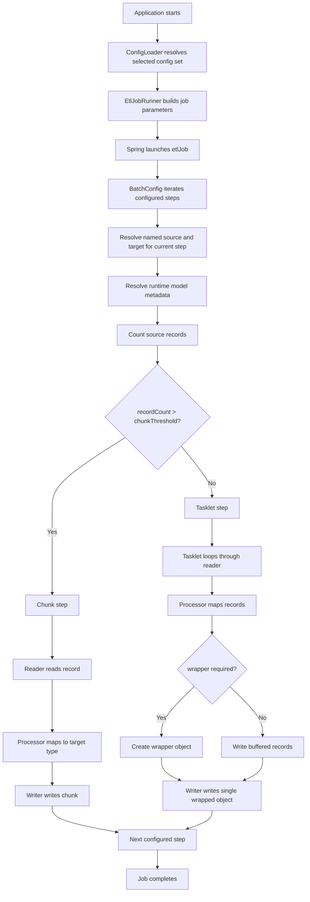
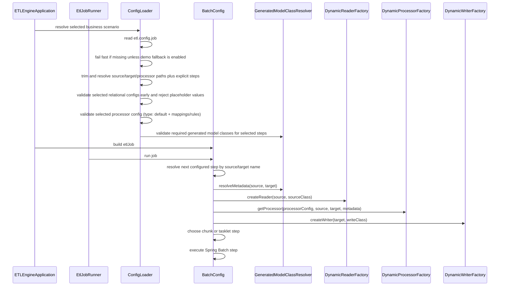
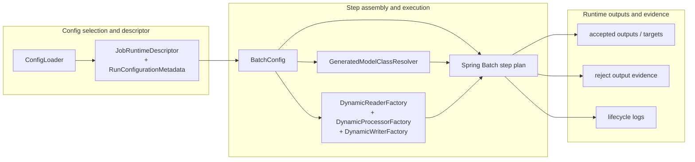
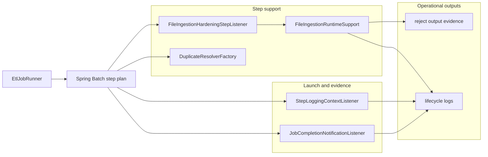
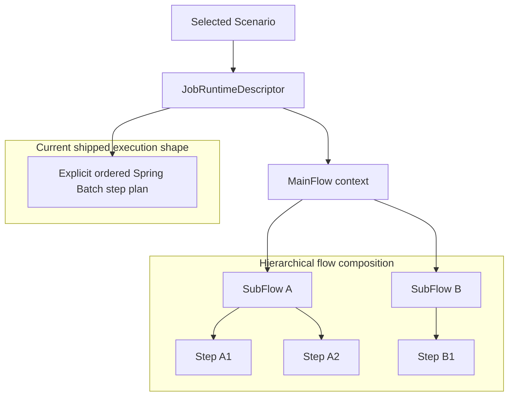
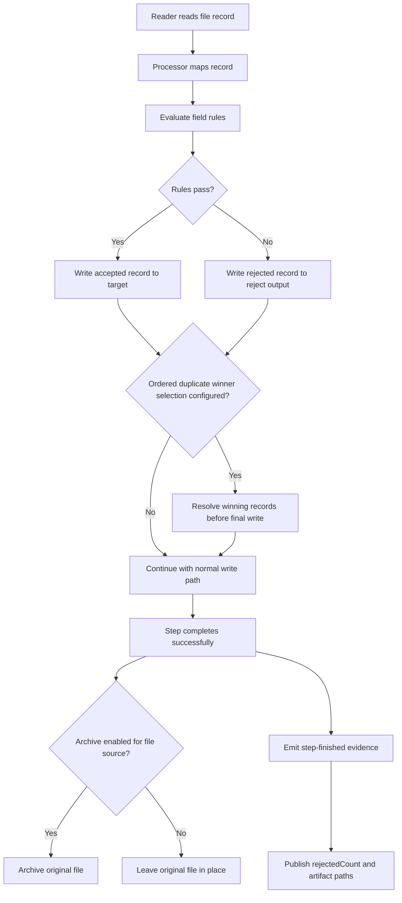

# Runtime Flow

## Purpose

This page explains how one ETL run currently executes from startup to output.

For a format-specific operational deep dive, continue in [`csv-to-xml-runtime-flow.md`](csv-to-xml-runtime-flow.md) when you want the shipped `CSV -> XML` runtime path explained end to end with preserved scenario anchors, flow diagrams, publication behavior, and operator-facing evidence.

For the target next-direction runtime contract, where one selected scenario becomes the only normal execution boundary and model generation/resolution becomes scenario-scoped, continue in [`scenario-driven-runtime-direction.md`](scenario-driven-runtime-direction.md).

For a consolidated decision matrix of shipped fallback/default behavior (startup entry selection, compatibility aliases, chunk/tasklet defaults, and duplicate resolver auto-selection), continue in [`oneflow-runtime-fallback-reference.md`](oneflow-runtime-fallback-reference.md).

For repository-provided preserved bundles, the explicit runtime `etl.config.job` entry path and the build-time generation entry point resolve against the checked-in `config-jobs/...` bundle tree, while legacy `config-scenarios/...` job-config paths remain temporarily available as deprecated backward-compatibility aliases at that entry boundary only.

## Status

- Classification: **Current runtime**
- The Mermaid diagrams in this document describe the shipped runtime baseline.

## Animated walkthrough

For a lightweight pictorial companion to this page, open the standalone HTML walkthrough: [`runtime-flow-walkthrough.html`](runtime-flow-walkthrough.html).

Use that page when you want the product flow to be revealed step by step, including the shipped `MainFlow -> SubFlow -> Step` hierarchy evidence synthesized from the current flat `job-config.yaml` step list and layered on top of the current runtime baseline, instead of reading the full architecture note first. It now also mirrors the verified evidence split between startup-time `STEP_PLAN` / `STEP_READY` assembly logs and scenario-scoped lifecycle logs such as `RUN_EVENT`, `MAIN_FLOW_PLAN`, `SUBFLOW_PLAN`, `STEP_EVENT`, `SUBFLOW_SUMMARY`, and `RUN_SUMMARY`.

## End-to-end flow

This diagram shows the shipped runtime path for one ETL run from startup to completion.

## Sequence view

This diagram shows the shipped runtime interactions between startup, config resolution, and batch step assembly.

## Runtime assembly component view

This diagram shows the core shipped runtime assembly path for one selected scenario run.

Read this component view in four layers:

1. `ConfigLoader` selects the effective scenario/config set for the run.
2. `JobRuntimeDescriptor` and `RunConfigurationMetadata` project that selected run into one self-explanatory runtime contract.
3. `BatchConfig` consumes that contract, resolves models plus reader/processor/writer services, and builds executable Spring Batch steps.
4. the step plan produces accepted output, reject output, and lifecycle evidence for the run.

In the shipped runtime, the hierarchy descriptor remains an observability and evidence projection over the explicit ordered step plan. It does not yet introduce separate hierarchical scheduling beyond the existing flat Spring Batch step execution order.

That boundary is also the required interoperability point for future optional control-plane work. Any later built-in scheduler, watcher, or external orchestrator should launch this same selected-job runtime rather than introducing a second execution contract. For the dedicated boundary note that defines that optional-layer rule, continue in [`control-plane-worker-boundary.md`](../control-plane/control-plane-worker-boundary.md).

## Runtime support and evidence detail

This smaller view shows the secondary runtime pieces that support launch, step hardening, duplicate handling, and lifecycle evidence around the core assembly path.

Use this support view when you need the extra detail that the top-level assembly diagram intentionally leaves out:

- `EtlJobRunner` launches the selected run and seeds job parameters / MDC context
- listeners emit run-level, subflow-level, and step-level evidence
- startup-time step-planning evidence is emitted before the scenario-specific log key is established, so `STEP_PLAN` and `STEP_READY` route through the default `startup/startup` log path
- once `EtlJobRunner` and the listeners seed the scenario MDC values, scenario-scoped lifecycle evidence routes to the selected scenario log file
- `FileIngestionRuntimeSupport` and `DuplicateResolverFactory` enrich the active step path with hardening behavior that does not change the core flat execution shape

## Development persistence baseline

For local ETL development under the default `dev` profile:

- Spring Batch metadata uses a persistent local SQLite file (`.etl-dev/etl-dev.db`) with the shipped Batch SQLite schema script.
- The optional `controlplane` profile now points to that same `.etl-dev/etl-dev.db` file so local retained-history control-plane tables and Spring Batch metadata can be inspected together.
- Because that shared SQLite file is intentionally persistent, the dev profile now tolerates already-existing Batch metadata tables during startup schema initialization instead of treating them as a fatal bootstrap error.
- Ordered duplicate winner selection remains intentionally H2-backed through `EmbeddedDbDuplicateResolver` as a separate step-local engine path.
- This split keeps duplicate-resolution behavior stable while aligning the primary Batch metadata path with SQLite-first local persistence.

## Verified log split

The shipped runtime currently splits machine-readable evidence into two operational log paths.

### Startup log

`logback-spring.xml` uses `scenarioLogKey=startup/startup` as the default file route until scenario-specific MDC values are populated. Because `BatchConfig` emits step-planning evidence while the runtime is still assembling the executable plan, these events land in `logs/startup/startup.log`:

- `STEP_PLAN`
- `STEP_READY`

This is why the planning view is visible in the startup log even though the selected scenario has already been resolved in memory.

### Scenario log

Once `EtlJobRunner` seeds the scenario logging context and the job/step listeners are active, the rest of the run evidence routes to the selected scenario file under `logs/<yyyy-MM-dd>/<scenario>.log`. The verified current set is:

- `RUN_EVENT`
- `MAIN_FLOW_PLAN`
- `SUBFLOW_PLAN`
- `STEP_EVENT`
- `SUBFLOW_SUMMARY`
- `RUN_SUMMARY`

The current observed scenario-log order for a successful run is:

1. `RUN_EVENT event=run_requested`
2. `RUN_EVENT event=job_started`
3. `MAIN_FLOW_PLAN`
4. one or more `SUBFLOW_PLAN`
5. `STEP_EVENT event=step_started` / `STEP_EVENT event=step_finished` pairs during execution
6. `RUN_SUMMARY`
7. one or more `SUBFLOW_SUMMARY`
8. `RUN_EVENT event=run_finished`

Treat that as the verified current baseline from the shipped runtime and sample run evidence, not as a broader compatibility guarantee for every future logging refinement.

For the current shipped `SUBFLOW_SUMMARY`, observed status is derived from executed step results plus descriptor control metadata:

- `FAILED` when any executed step in the subflow fails, stops, or ends unknown
- `COMPLETED` when every step in the subflow completed successfully
- `RUNNING` while a step in the subflow has started and the job is still active
- `BLOCKED` when upstream subflow or link control rules say the subflow must not start
- `READY` when upstream dependencies are satisfied but the subflow has not started yet

For the current shipped `RUN_SUMMARY`, multi-step jobs now use operator-oriented rollup semantics rather than raw sum-of-step writes:

- `sourceCount` = records read from external/configured ingress steps
- `writtenCount` = records written to final scenario outputs
- `rejectedCount` = summed rejected records across executed steps
- `handoffReadCount` / `handoffWriteCount` = intermediate step-to-step movement kept as diagnostics, not treated as final published output

The active per-step processing order remains:

`read -> transforms -> processor rules -> write`

When the active file-ingestion path enables reject handling or archive-on-success, step-finished evidence may also include `rejectOutputPath` and `archivedSourcePath` in addition to the core read/write/reject counts.

This split matches the current bridge architecture: startup-time assembly evidence is separated from scenario-scoped runtime and hierarchy evidence, while both still describe the same selected run.

## Flow composition view

This diagram shows the bridge composition model that the product emits today: one selected scenario resolves into a `MainFlow`, that `MainFlow` exposes ordered `SubFlow` phases, and those phases still compile into one explicit flat execution plan underneath.

Read this composition view in three layers:

1. one selected scenario resolves into one self-describing `JobRuntimeDescriptor`
2. that descriptor projects a synthesized `MainFlow -> SubFlow -> Step` hierarchy for meaning, control intent, and evidence
3. the current shipped runtime still compiles that hierarchy into one explicit ordered Spring Batch step plan

This split is intentional:

- the **runtime assembly view** explains how the current engine is wired
- the **flow composition view** explains the architecture style and evidence model

Today, `JobRuntimeDescriptorAssembler` synthesizes `MainFlow`, `SubFlow`, and step-link metadata from the flat `job-config.yaml` `steps` list, while `BatchConfig` still executes the resolved steps sequentially as one explicit Spring Batch plan. Lifecycle evidence such as `RUN_EVENT`, `MAIN_FLOW_PLAN`, `SUBFLOW_PLAN`, `STEP_EVENT`, `SUBFLOW_SUMMARY`, and `RUN_SUMMARY` is emitted around that bridge model, while `STEP_PLAN` and `STEP_READY` remain startup-time assembly evidence. The hierarchy is not yet a separate hierarchical scheduler.

For the target direction where scenario descriptors and step links become the stronger long-term runtime contract, continue in [`scenario-driven-runtime-direction.md`](scenario-driven-runtime-direction.md).

## Important runtime decisions

### F1 restart semantics baseline

The current F1 baseline keeps restart behavior explicit and conservative for shipped execution modes:

| Execution mode (`runMode`) | Current recovery policy (`recoveryPolicy`) | Shipped behavior |
| --- | --- | --- |
| `explicit-job` | `rerun-from-start` | Full selected-job rerun from the beginning of the ordered step plan |
| `demo-fallback` | `rerun-from-start` | Full rerun from start for local/demo compatibility runs |

Current guardrails:

- `runMode` and `recoveryPolicy` are treated as explicit runtime evidence, not hidden defaults
- checkpoint/resume semantics are intentionally deferred to follow-on F1 slices, and `resume-from-checkpoint` currently fails fast as unsupported
- scheduler overlap/run-state governance should not imply restart/resume behavior that F1 has not explicitly shipped

### 1. Config resolution
`ConfigLoader` resolves configuration in this order:

1. if `etl.config.job` is set, treat it as the selected business-scenario/job config and use its explicit `sourceConfigPath`, `targetConfigPath`, `processorConfigPath`, and `steps`
2. if `etl.config.job` is missing and `etl.config.allow-demo-fallback=false`, fail startup immediately
3. if `etl.config.allow-demo-fallback=true`, use `etl.config.source`, `etl.config.target`, and `etl.config.processor` for local/demo runs
4. in demo fallback mode only, continue into bundled classpath YAML when the configured direct files are missing

`ConfigLoader` does not auto-discover scenario folders. Exactly one config set is selected for a run.

For explicit job-config startup, the selected `job-config.yaml` may now also declare `isActive: false`. When it does, `ConfigLoader` fails fast before referenced source/target/processor YAMLs are resolved or steps are wired.

When explicit `job-config.yaml` loading rebases the selected source, target, and processor YAMLs:

- `job-config.yaml` references still resolve from the selected job-config folder
- most nested file paths inside the selected YAMLs still resolve from that YAML file's folder so scenario-local assets such as `input/...`, `definitions/...`, and relative reject/archive folders remain bundle-local
- preserved repo-root compatibility paths that begin with `src/` or `target/` stay anchored to the working directory so baseline demo inputs and shared `target/` outputs continue to land in the same repository locations

When the selected source or target uses relational configuration, `ConfigLoader` now validates those chosen configs before job execution starts on the explicit `etl.config.job` path. Placeholder values such as `<SQLSERVER_HOST>` are rejected early with scenario-aware error messages instead of surfacing later as JDBC runtime failures.

For explicit `etl.config.job` runs, `ConfigLoader` also validates the selected processor config before it checks generated-model class availability for the selected steps. That ordering keeps malformed processor mappings or rule settings from being masked by unrelated missing generated classes and produces scenario-aware configuration failures earlier in startup.

This startup validation now enforces the post-cutover processor contract: selected-job processor configs must declare `type: default`. Blank or legacy/custom processor types fail fast during config load before step assembly reaches runtime processor creation.

Demo fallback still validates the selected processor config, but it does not run the same selected-source and selected-target preflight validation path used by explicit-job startup.

### 2. Model resolution
`GeneratedModelClassResolver` translates config into concrete runtime class names and wrapper metadata.

For XML sources, explicit startup always requires the generated record class. `XmlDynamicReader` then follows one of two flattening shapes beyond the shared `DirectXml` record-fragment reader: `NestedXml` keeps the active runtime path on `recordElement` fragment streaming and flattens from the generated record model, while `JobSpecificXml` switches to a root-wrapper path that unmarshals the generated XML root before invoking the selected custom strategy. Because of that split, non-`NestedXml` XML sources still require the generated root class during startup validation, while `NestedXml` validation skips that root-class requirement.

### 3. Step strategy
`BatchConfig` walks the explicit step list from `job-config.yaml`. For each step, it resolves the named source and target, verifies that a matching processor mapping exists, emits machine-readable step-planning logs such as `STEP_PLAN` and `STEP_READY`, projects synthesized hierarchy metadata into the step execution context for later `STEP_EVENT` evidence, and then calls `getRecordCount()` on the selected source to compare it to `etl.chunk.threshold`.

Because those planning emits happen during runtime assembly, before the scenario-specific log key is attached to the active file route, they currently appear in `logs/startup/startup.log` rather than the scenario log. The subsequent step-started and step-finished `STEP_EVENT` entries appear in the scenario log after the listener layer restores scenario-scoped MDC values.

This explicit ordered step list is the current shipped composition model for a scenario. A selected scenario may therefore already represent multiple individual flows executed in sequence, and together those steps form the full end-to-end run. Future richer chaining, handoff, or graph-style step relationships should still remain inside one selected scenario contract rather than introducing a separate runtime boundary.

The same rule applies if runs are triggered by something outside the ETL core: native scheduler/control-plane features and third-party orchestrators should both target this explicit selected-scenario path.

- large source => chunk step
- small source => tasklet step

### 4. XML wrapper handling
For XML targets, processing and writing may use different model classes:

- processing class = record element type
- write class = wrapper/root element type

That contract is centralized in `GeneratedModelClassResolver`.

### 5. File-ingestion hardening on the active runtime path
The current runtime now implements a first file-ingestion hardening slice on the normal step path, with the strongest preserved proof scenario still centered on CSV file ingestion.

- source validation can fail startup early for selected file/relational source issues before job execution begins on the explicit-job startup path
- processor-side field rules can reject records through `onFailure=rejectRecord` when `rejectHandling.enabled=true`
- rejected records are written to a configured reject CSV with optional `_rejectField`, `_rejectRule`, and `_rejectMessage` columns
- duplicate handling now supports both keep-first/reject-later behavior and ordered winner selection
- when ordered duplicate winner selection is configured, `BatchConfig` overrides chunk mode to tasklet mode so it can resolve winners before final write
- successful file-source steps such as CSV and XML can archive the processed input file and expose `archivedSourcePath` in step-finished evidence when archive-on-success is enabled for that source config
- staged CSV/XML/JSON file targets currently write to sibling `.part` artifacts first and publish the configured final output only after the writer stream closes cleanly and the enclosing step completes successfully
- step-finished logs now include `rejectedCount`, `rejectOutputPath`, and `archivedSourcePath`

`FileIngestionRuntimeSupport` owns the reject/archive step state itself. `FileIngestionHardeningStepListener` initializes and completes that state around each step, while `StepLoggingContextListener` publishes the resulting counters and artifact paths from the step execution context.

## Why this matters for future features

This flow shows where future enhancements should plug in:

- relational readers/writers already enter through the same factories, and future relational expansion should continue through those seams
- stored procedures may fit as reader, writer, or tasklet-style step operations
- multi-job orchestration will likely require a higher-level flow model than the current selected job-config plus explicit step list

This page intentionally stays focused on the shipped runtime baseline. The preferred next architecture direction for strict scenario-driven execution is documented separately in [`scenario-driven-runtime-direction.md`](scenario-driven-runtime-direction.md).

For a flow-level operational manual of the shipped CSV source to XML target path, including flat XML, nested XML, reject/archive behavior on the shared CSV ingestion path, and staged XML publication, see [`csv-to-xml-runtime-flow.md`](csv-to-xml-runtime-flow.md).

## Current file-ingestion hardening path

The first file-ingestion hardening slice is now implemented without replacing the explicit step model.

This diagram shows the shipped file-ingestion hardening path on the active runtime.

This shipped first slice is described in [`file-ingestion-hardening.md`](file-ingestion-hardening.md), which also preserves the broader deferred follow-on direction beyond the current CSV-focused implementation.

