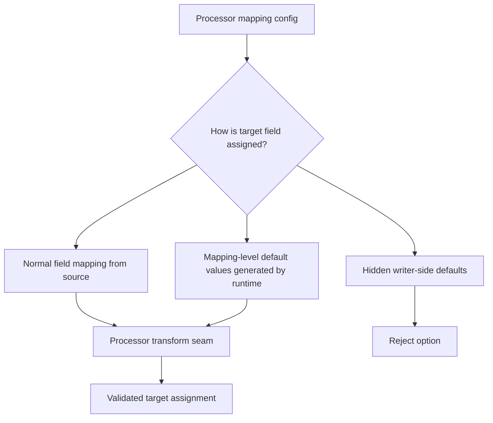

# T6 Shared Default-Value Mapping Syntax Comparison

## Purpose

This note compares the main config-shape options for `T6` so the team can choose a clear default-value contract before implementation starts.

The goal is to support common audit and operational field defaults such as `createdUser`, `updatedUser`, `createdDate`, and `updatedDate` without forcing every job bundle to repeat the same field-by-field expression logic, especially when audit date/date-time values should come from one shared runtime system-date/date-time provider.

## Status

- Classification: **Future direction**
- The Mermaid diagrams in this document describe the preferred future direction, not a shipped runtime path today.

## Current baseline

Today the active processor seam already supports:

- direct `from -> to` field mapping
- ordered `transforms[]`
- built-in `valueMap`
- built-in `expression`

That baseline is useful, but it does not yet provide one explicit product contract for shared audit/default filling.

## Decision goal

Choose a syntax that keeps defaulted target fields:

- explicit in config
- easy for non-Java config authors to read
- aligned with the active processor transform seam
- validated early when assignment is ambiguous

## Future direction flow

Future-only, not shipped today: this diagram shows the intended target shape.



## Options compared

### Option 1 ΓÇö keep everything inside `fields[]`

Illustrative direction:

```yaml
fields:
  - to: createdUser
    transforms:
      - type: expression
        expression: "#jobName"
  - to: createdDate
    transforms:
      - type: expression
        expression: "#currentTimestamp"
```

#### Benefits

- reuses the existing `fields[]` plus `transforms[]` structure
- stays close to the shipped processor seam
- may require less new config model surface

#### Costs

- mixes source-derived mapping and runtime-generated defaults in the same list
- makes simple audit defaults look more technical than they really are
- encourages repetitive expressions for common values such as job name and current timestamp
- makes ambiguity harder to explain when a field could be both mapped and defaulted

### Option 2 ΓÇö add mapping-level `defaultValues[]`

Illustrative direction:

```yaml
fields:
  - from: orderId
    to: orderId
  - from: amount
    to: amount
defaultValues:
  - to: createdUser
    valueFrom: jobName
  - to: createdDate
    valueFrom: currentTimestamp
  - to: sourceSystem
    valueFrom: constant
    value: TVL
  - to: loadBatchLabel
    valueFrom: expression
    expression: "#jobName + '-' + #stepName"
```

#### Benefits

- separates source-derived mapping from runtime-generated values cleanly
- reads closer to business intent for audit and operational fields
- gives the product a natural home for standard tokens such as job name, current date/current timestamp, and constant values, with date/time tokens backed by one shared runtime provider path
- makes startup validation clearer because one field should come from only one assignment path

#### Costs

- introduces an additive config surface that must be validated and documented
- still needs a clear rule for how expression-based defaults access runtime metadata
- requires deliberate compatibility handling if future authors try to mix `defaultValues[]` with equivalent `fields[]` assignments

### Option 3 ΓÇö hidden writer-side defaults

Examples would be target-specific auto-filling in relational or file writers without explicit processor config.

#### Why this should be rejected

- it hides behavior from config authors and operators
- it makes target behavior diverge by connector type
- it weakens fail-fast validation because assignment is no longer fully visible in mapping config
- it conflicts with the repoΓÇÖs preference for explicit config contracts over spread-out implicit behavior

## Recommended direction

Prefer **Option 2 ΓÇö mapping-level `defaultValues[]`**.

Why this is the strongest fit for the current repo direction:

- it preserves the active processor seam instead of inventing writer magic
- it keeps normal `fields[]` mapping focused on source data
- it gives a clean product-level place for standard placeholders such as job name, constants, and current timestamp
- it makes the future contract easier to explain in docs and examples

Implementation should still resolve through the same processor-side flow, not through a separate hidden writer-default path.

## Guardrails for the future contract

- a target field must be assigned by only one path: `fields[]` or `defaultValues[]`
- common runtime values should use short standardized tokens instead of repeated custom expressions
- `currentDate` / `currentTimestamp` style tokens should resolve through one shared runtime date/time provider rather than through per-job custom clock logic
- richer formulas may still use `expression`, but only when the standard tokens are not enough
- startup validation should fail fast for unknown `valueFrom` tokens, ambiguous double assignment, and incompatible combinations
- the product must define what ΓÇ£current timestampΓÇ¥ means before implementation claims a standard audit default

## Open questions

- should `currentTimestamp` mean application-runtime generated current time, target-database generated time, or a selectable mode?
- should one shared date/time provider expose both `currentDate` and `currentTimestamp`, and what timezone/format policy should it enforce by default?
- which runtime metadata tokens are first-class in the initial slice: `jobName`, `stepName`, `runCorrelationId`, others?
- should rendered timestamp formatting be global-only at first, or overridable per field later?
- should `defaultValues[]` remain mapping-local only, or can a later phase add reusable shared default profiles?

## Related docs

- [`T6 backlog item`](../../product/backlog-items/T6-shared-default-value-and-placeholder-mapping.md)
- [`Transformation capability roadmap`](transformation-capability-roadmap.md)
- [`Default processor reference`](../../config/processor/default-processor.md)
- [`Product backlog`](../../product/product-backlog.md)


