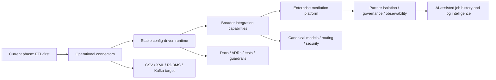

# ETL Product Evolution Roadmap

## Purpose

This document captures the intended product direction for `spring-etl-engine` so future design and implementation decisions can be evaluated in the right context.

## Status

- Classification: **Current baseline + future evolution**
- The Mermaid diagrams in this document describe the current baseline and the future evolution that should build from it.

Use this note to answer three questions before starting or expanding a feature: what phase of product maturity are we in, does this feature belong in that phase, and are we introducing too much platform complexity too early. It is a direction-and-phases guide, not the execution backlog and not a connector-specific implementation spec.

The product is currently in an ETL-first phase. The near-term goal is to make each supported source and target type operational, reliable, and consistent while becoming the default internal runtime for repeatable file-based integration scenarios. The longer-term goal is to evolve the product toward an enterprise integration foundation and, later, a secure enterprise integration mediation platform.

The preferred next runtime contract for that evolution is documented in [`scenario-driven-runtime-direction.md`](../etl-core/scenario-driven-runtime-direction.md): one selected scenario should remain the only normal execution boundary, while scale policy, UI views, and richer transformation growth stay layered on top of that contract rather than creating a second runtime model.

This note exists to prevent two common problems:

- over-engineering the current phase with future-platform abstractions too early
- making short-term connector decisions that block future enterprise evolution

## Scope

This document covers:

- the current product phase and its priorities
- the future direction toward enterprise integration mediation
- architecture guardrails for current decisions
- a phased roadmap for future capability growth
- a checklist for evaluating future changes against this direction

This document does not define implementation details for any one connector or protocol. Those should be captured in focused design notes such as:

- `docs/architecture/relational-db-support.md`
- `docs/architecture/sftp-transport-capability.md`
- future Kafka/API notes

## Context

The current architecture is a config-driven ETL engine with:

- polymorphic source and target configurations
- dynamic reader, processor, and writer factories
- Spring Batch-based execution
- generated model contracts
- batch-oriented runtime flow

Today, the product is primarily focused on:

- adding source and target types
- making each connector path operational
- standardizing repeated file-ingestion and file-delivery concerns that are often reimplemented in one-off ETL code
- ensuring transformations are reliable, configurable, and able to mature beyond simple field mapping
- keeping the architecture extensible while avoiding unnecessary complexity

The broader product vision is larger than ETL alone. Over time, the product may evolve from a config-driven ETL product into an enterprise integration foundation and then a controlled integration abstraction layer between enterprise systems and external third parties.

## Platform layering direction

The intended product layering is:

1. **OneFlow ETL core** ΓÇö the independently runnable Java/Spring Batch execution engine that already runs one selected `job-config.yaml`
2. **optional control plane** ΓÇö a future scheduler/watcher/history layer that launches and observes the same explicit-job runtime without becoming a second orchestration contract
3. **integrated operator UI** ΓÇö a future dashboard and control surface over jobs, schedules, watchers, run history, evidence, and recovery workflows

The control plane is important future roadmap work, but it should remain optional from the ETL core point of view. The core runtime must stay directly runnable even when no scheduler, watcher, persistence service, or UI is present.

That optionality also means external enterprise schedulers, workload orchestrators, and platform-native triggers should remain first-class integration choices. A OneFlow-native scheduler should be one supported launcher of the ETL core contract, not the only supported launcher.

For the dedicated boundary note that defines how optional control-plane layers must relate to the worker runtime, continue in [`control-plane-worker-boundary.md`](../control-plane/control-plane-worker-boundary.md).

For the first architecture notes that split future scheduler/backend concerns from future operator-facing UI concerns, continue in [`control-plane/scheduler-architecture-direction.md`](../control-plane/scheduler-architecture-direction.md) and [`operator-ui/operator-ui-architecture-direction.md`](../operator-ui/operator-ui-architecture-direction.md).

## Technology stance for that layering

- stay Java-first for the ETL core and the first scheduler/control-plane/backend slices
- prefer Spring-based implementation for the optional control plane so configuration, runtime metadata, and operational APIs stay close to the current stack
- allow lightweight local relational persistence such as SQLite for early developer-laptop control-plane work
- move to stronger relational deployment targets later when retained OneFlow operational data, control-plane concurrency, and UI-backed history become broader operational requirements
- keep transformation capability as a first-class roadmap track alongside control-plane maturity rather than letting scheduling/operations work dominate product identity
- preserve a stable explicit-job launch contract so native and external orchestration can target the same ETL runtime boundary

## Flow

Read this as current baseline + future evolution for the product roadmap.

## Current phase: ETL-first product

The current phase should optimize for:

- connector completeness
- correctness
- configuration clarity
- testability
- operational reliability
- extension-friendly design

### What belongs in the current phase

- CSV/XML source and target maturity
- CSV/XML parser maturity on the source-native path, with broader parser-family expansion intentionally deferred
- RDBMS source and target support
- Kafka as target
- validation improvements
- reusable file-in/file-out handling patterns such as transfer, staging, duplicate policies, rejected-record output, and archive behavior
- staged inbound/outbound file transport patterns such as SFTP pull to local staging and controlled outbound file handoff
- stronger transformation capability beyond direct field mapping, introduced in measured steps
- execution-mode controls where justified
- stable reader/processor/writer extension patterns
- stronger tests and documentation

### What should not dominate the current phase

- full enterprise middleware orchestration
- broad policy/routing engines
- multi-tenant integration administration
- full streaming runtime redesign
- partner onboarding workflows and control planes

These are valid future directions, but they should not disrupt the current connector-operational roadmap.

## Future direction: enterprise integration mediation

The longer-term direction is for the product to act as a medium/catalyst between enterprise systems and third parties.

That future direction includes capabilities such as:

- protocol and transport abstraction
- canonicalization between external and internal formats
- richer transformation behavior including rule-based, enrichment-oriented, and governed transformation flows
- secure connector isolation
- controlled exposure of enterprise systems
- routing and orchestration across multiple external parties
- replay, retry, and audit visibility
- stronger operational governance

In that future state, the product becomes more than an ETL tool. It becomes an integration layer that protects core systems from direct and fragmented integration responsibilities.

## Roadmap phases

## Phase 1: Operational ETL foundation

Focus on making the core product reliable and extensible.

### Priorities
- source/target connectors work consistently
- config model stays coherent
- factories remain the primary extension point
- tests and architecture docs grow with the product
- batch execution remains the main runtime mode
- the product becomes the default internal runtime for repeatable file-based integration scenarios before chasing broad connector breadth

### Typical features in this phase
- CSV, XML, relational support
- Kafka as target
- explicit CSV/XML parser maturity through source-native reader/validator growth and preserved-scenario proof, while JSON source parsing remains intentionally later
- improved validation and execution configuration
- stronger structural transformation, explicit mapping behavior, and transformation-safe orchestration
- first file-ingestion hardening slices such as field-level validation rules, rejected-record output, and processed-file archiving proven through preserved realistic file scenarios
- repeatable handling of common file-flow concerns such as transfer, staging, duplicate behavior, reject output, operator-visible outcomes, and first inbound SFTP acquisition slices that land files into controlled local staging
- better observability of batch flows
- scenario/job-run oriented logging and diagnostic evidence

## Phase 2: Integration maturity

Expand beyond connector completeness into stronger integration capability.

### Priorities
- canonical model discussions begin
- reusable connection and partner configuration patterns emerge
- richer target behaviors and orchestration rules are introduced
- security and audit capabilities become more explicit

### Typical features in this phase
- API connectors and broader native SFTP capability beyond the first staged inbound slice
- micro-batch Kafka source
- richer database write semantics
- expression-based mapping, then conditional transformations, with broader validation, rejected-record/quarantine behavior, and lookup/enrichment patterns after the first file-based validation slice is stable
- routing and transformation enhancements
- first optional control-plane capabilities such as scheduling, file watching, persisted operational history, and operator APIs built on explicit run-state, audit, and operator visibility, while preserving external-scheduler interoperability through the same selected-job boundary

## Phase 3: Enterprise mediation platform

Move from ETL-first execution toward broader enterprise integration mediation.

### Priorities
- secure boundary between core systems and third parties
- stronger governance, audit, and replay controls
- partner-specific isolation and routing
- separate deployable partner-facing transport/security workers where operationally justified
- possibly both batch and streaming execution modes
- operator-ready observability that supports retained evidence and later AI assistance

### Typical features in this phase
- continuous streaming runtime
- partner/channel policies
- dead-letter and replay support
- security administration and credential governance
- governed transformation definitions, reusable transformation capability, and stronger lineage visibility
- broader northbound/southbound integration design
- AI-assisted search and summarization for job history, run diagnostics, and operational logs
- enterprise-grade scheduling/orchestration controls such as missed-run handling, schedule auditability, and stronger operator-driven trigger policies

### Prerequisites before AI-assisted operations intelligence
- structured job and step history with stable correlation identifiers
- searchable operational events and retained logs with clear error taxonomy
- log redaction, retention controls, and role-based access protections
- operator-facing dashboards and non-AI search/filter workflows already in place
- AI kept as an operator-assist capability, not an autonomous execution or remediation mechanism

## Key Components / Classes

Current architecture anchors that should remain important during roadmap evolution:

- `src/main/java/com/etl/config/ConfigLoader.java`
- `src/main/java/com/etl/config/BatchConfig.java`
- `src/main/java/com/etl/reader/DynamicReaderFactory.java`
- `src/main/java/com/etl/processor/DynamicProcessorFactory.java`
- `src/main/java/com/etl/writer/DynamicWriterFactory.java`
- `src/main/java/com/etl/common/util/GeneratedModelClassResolver.java`

Future phases may add new runtime families or orchestration layers, but they should grow from these extension points rather than bypass them casually.

## Decisions

- The current product phase is ETL-first, not full enterprise middleware yet.
- New features should strengthen the connector/runtime foundation first.
- Future enterprise mediation capabilities are in scope for the product direction, but should be introduced deliberately in later phases.
- Current design decisions should remain future-safe without prematurely forcing middleware-scale abstractions.
- Scheduler/control-plane capability remains part of the main product roadmap at this stage, but it should evolve as an optional operational layer around the ETL core rather than as a prerequisite for normal core execution.
- External scheduler/orchestrator integration should remain a first-class supported deployment pattern wherever teams do not want the native scheduler layer.

## Tradeoffs

### Benefits
- keeps the near-term roadmap practical and deliverable
- avoids overbuilding before connectors are operational
- still preserves long-term product ambition
- makes future architecture decisions easier to validate retrospectively

### Costs
- some future capabilities will be intentionally deferred
- current architecture may need later expansion for streaming, routing, and security controls
- some ΓÇ£nice future abstractionsΓÇ¥ should be resisted in the present phase

### Alternatives considered

#### Alternative: build full enterprise mediation platform immediately
Rejected for now because it would likely overload the current phase and slow connector maturity.

#### Alternative: treat the product only as a narrow ETL utility forever
Rejected because the longer-term enterprise integration value is meaningful and should remain visible in architecture planning.

## Architecture guardrails for current decisions

When making current-phase design decisions:

- prefer extension through config subtypes and factories
- keep runtime behavior explicit and testable
- avoid connector-specific shortcuts that leak across the architecture
- avoid introducing broad platform abstractions before there is a real operational need
- document future-facing decisions if they materially affect roadmap direction
- keep batch-first assumptions unless a change explicitly requires a new execution model
- defer AI log intelligence until observability, audit, replay, and security controls are already mature
- prefer structured run metadata and searchable events first so any future semantic search is grounded in evidence

## Impact on Existing Architecture

This roadmap note does not change runtime code directly, but it affects how future changes should be judged.

In particular, it should influence decisions around:

- whether a feature belongs in the current ETL phase or a later platform phase
- whether a design is appropriately scoped for the current product maturity
- whether a new abstraction is justified now or should be deferred
- whether a connector proposal remains aligned with the config-driven extension model

## Testing / Validation Expectations

Future changes should be validated against both technical quality and roadmap fit.

### Technical validation
- tests for new connector/runtime behavior
- config binding tests
- factory routing tests
- integration tests where appropriate
- documentation updates for architecture-impacting changes

### Roadmap-fit validation
When proposing a new feature, ask:

- Does this primarily strengthen connector operability in the ETL-first phase?
- Does it preserve the current architectureΓÇÖs extension model?
- Is it introducing future platform complexity too early?
- If it is future-facing, does it still avoid blocking current delivery?

## Retrospective evaluation checklist

When reviewing a future design or implementation, use this checklist:

- Is this change aligned with the current ETL-first phase, or is it pulling platform concerns in too early?
- Does the change improve operational connector capability or reliability?
- Does it preserve factory-driven extensibility?
- Does it leave room for future enterprise mediation without forcing it now?
- Does it increase coupling between enterprise systems and partner-specific logic unnecessarily?
- If the change reflects a real shift in product direction, has a design note or ADR been updated?

## Related architecture notes

This roadmap should be read together with:

- `docs/architecture/overview.md`
- `docs/architecture/runtime-flow.md`
- `docs/architecture/control-plane-worker-boundary.md`
- `docs/architecture/control-plane/scheduler-architecture-direction.md`
- `docs/architecture/operator-ui/operator-ui-architecture-direction.md`
- `docs/architecture/extension-points.md`
- `docs/architecture/relational-db-support.md`
- `docs/architecture/transformation-capability-roadmap.md`

## Future Extensions

Likely future notes that should build from this roadmap include:

- Kafka target support
- Kafka source and streaming support
- enterprise mediation architecture
- canonical model strategy
- security boundary and partner isolation
- orchestration and retry/replay model
- job history and operational observability architecture
- AI-assisted log search and diagnostics for operators
- scenario and job-run logging strategy
- transformation capability maturity across mapping, rules, enrichment, and governed enterprise behavior

