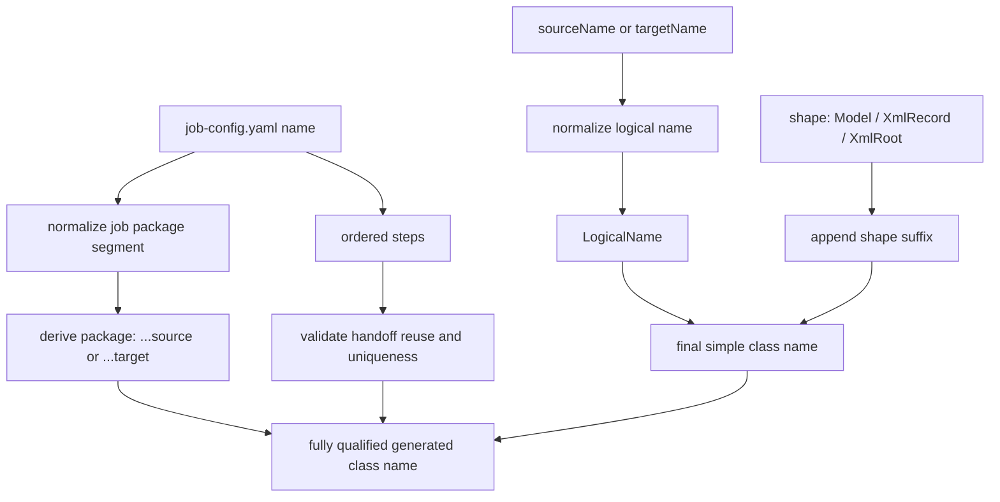

# Generated model naming standard and package-free config direction

- Status: Shipped selected-job naming/package baseline; follow-on internal bridge cleanup tracked separately
- Last updated: 2026-05-15

## Purpose

This note records the shipped selected-job naming/package contract and the follow-on direction for retiring any remaining internal compatibility bridge.

The goal is to make generated model identity deterministic from the selected job bundle and logical config names, not from Java-specific YAML fields.

The active runtime and build-time explicit-job path already derives source and target packages internally, requires a non-blank `job-config.yaml -> name` instead of falling back to the folder name, fails fast if authored `packageName` is present, and uses the shared `XmlRecord` / `XmlRoot` class-shape contract on the active path.

Remaining internal cleanup now belongs to the follow-on bridge-retirement item rather than blocking the shipped A4 contract, for example:

- config objects still temporarily cache resolved package identity internally
- direct-config/demo fallback still injects legacy package defaults so preserved demo behavior keeps working
- the standalone XML model-definition spike loader still derives a fallback package from the definition path
- broader future class-naming cleanup outside the shipped selected-job path can continue independently of the now-complete product contract

## Why this needs a standard first

Today the runtime and build-time generation path already derive packages for explicit `job-config.yaml` runs:

- source default package: `com.etl.generated.job.<normalized-job-name>.source`
- target default package: `com.etl.generated.job.<normalized-job-name>.target`

That is a useful bridge, but the current generated-model contract still has two important limitations:

1. the field still exists in config classes even though the active explicit-job path rejects it
2. generated class simple names still come from `sourceName`, `targetName`, `rootElement`, and `recordElement` directly, so the naming contract is still too implicit across runtime, generation, and docs

One developer-local TVL-style private-job example under `private-jobs/<collection>/xml-nested-to-csv-tag-validation/` shows the gap clearly:

- `TagValidationSource` is the ingress XML source
- `TagValidationCsvIntermediate` is written by one step and then read by the next step
- `TagValidationDb` is the final target

That job is already expressing a useful business/runtime pattern, but the model naming contract is still too Java-centered and too dependent on handwritten package values.

## Design goals

The next generated-model standard should guarantee all of the following:

1. config authors do not need to know or author Java package names
2. generated classes are clearly identifiable through generated package path plus a standardized generated comment
3. generated class names stay simple and deterministic, while package path carries source vs target identity
4. processor, reader, writer, and build-time generation paths can locate the same classes from one centralized naming policy
5. XML element names remain business/XML contract fields and are no longer overloaded as Java type names
6. the selected `job-config.yaml` remains the single identity anchor for one run

## Proposed standard

### 1. `job-config.yaml -> name` becomes the required naming anchor

For explicit job mode, the selected `job-config.yaml` `name` should become effectively required for the generated-model contract.

Current shipped baseline:

- explicit runtime and build-time generation now fail fast if `job-config.yaml -> name` is blank
- selected-job `source-config.yaml`, `target-config.yaml`, and runtime-owned XML `modelDefinitionPath` YAML now omit authored `packageName`
- the legacy standalone XML model-definition spike path now derives a deterministic fallback package from the definition file path when `packageName` is omitted, instead of treating handwritten package values as part of the preferred contract

Shipped direction:

- new or updated explicit job bundles **must** provide a non-blank `name`
- folder-name fallback is no longer used on the active explicit-job runtime/build-time naming path

This keeps generated packages and class lookup deterministic across runtime and build-time paths.

### 2. `packageName` should disappear from authored source/target YAML

The target contract is:

- `source-config.yaml` and `target-config.yaml` should no longer require or encourage `packageName`
- the runtime and generation code should derive packages internally from the selected job name and config side
- processor mapping should continue to use logical config names only

Preferred derived package formula:

- source-side configs: `com.etl.generated.job.<normalized-job-name>.source`
- target-side configs: `com.etl.generated.job.<normalized-job-name>.target`

Keep package derivation separate from runtime role classification. `source` and `target` stay as the stable package buckets because they align with the current config model and avoid source/target class collisions for intermediate handoffs.

### 3. Runtime role stays a flow concept, not a class-name marker

Besides config side, every generated model may still participate in a **flow role** derived from the selected job steps:

- **Source** — an ingress source that is read but was not produced by an earlier step in the same selected job
- **Intermediate** — a handoff artifact that is written by one step and later read by another step in the same selected job
- **Target** — a final target written by the selected job and not read again later in the same selected job

Canonical technical role names should still be:

- `Source`
- `Intermediate`
- `Target`

`stage` may still be used in product-facing discussion, but the technical runtime vocabulary should standardize on `Intermediate`.

That role is still useful for runtime reasoning, validation, and documentation of multi-step handoffs, but it should **not** be encoded into the generated class simple name.

### 4. Intermediate handoffs use logical-name reuse across steps

The handoff rule should stay explicit and easy to reason about:

- if a step writes target `X`
- and a later step reads source `X`
- then `X` is an **Intermediate** runtime artifact

That means multi-step bundles should reuse the same logical name when a downstream source consumes the same business artifact produced by an upstream target.

It also means the selected job should treat logical source/target names as one shared uniqueness space instead of two unrelated namespaces.

Example from the TVL private job:

```yaml
steps:
  - name: nested-tag-validation-csv-step
    source: TagValidationSource
    target: TagValidationCsvIntermediate
  - name: csv-to-tag-validation-db-step
    source: TagValidationCsvIntermediate
    target: TagValidationDb
```

Derived roles:

- `TagValidationSource` -> `Source`
- `TagValidationCsvIntermediate` -> `Intermediate`
- `TagValidationDb` -> `Target`

## Derived naming formula

### Package formula

Package names remain job-scoped and side-scoped:

| Config side | Derived package |
|---|---|
| source config | `com.etl.generated.job.<normalized-job-name>.source` |
| target config | `com.etl.generated.job.<normalized-job-name>.target` |

`<normalized-job-name>` should continue using the current lowercase alphanumeric normalization with a safe fallback prefix if the segment would otherwise start with a digit.

### Class stem formula

The generated class simple name should be assembled as:

`<NormalizedLogicalName><Shape>`

Where:

- `<NormalizedLogicalName>` is the job-unique logical `sourceName` or `targetName` converted to UpperCamelCase with non-identifier characters removed
- `<Shape>` expresses the model shape

The simple class name should not include `Source`, `Target`, `Intermediate`, `Src`, `Tgt`, or similar role markers just to distinguish config side. The source/target package path already carries that distinction.

### Human-readable generated markers

Generated classes should also be marked in comments.

That is useful for developers reviewing generated source files because a short standardized header can say clearly that the file was produced by OneFlow.

Recommended example:

```java
/**
 * Generated by OneFlow for job <job-name>.
 * Do not edit manually.
 */
```

Comments can be customized in our own format because the generators already control emitted source text.

However, comments should remain a **secondary human-readable marker**, not the primary contract for runtime or tool resolution.

The primary contract should still be:

- derived package path
- derived class simple name
- centralized lookup through `GeneratedModelClassResolver`

So the preferred rule is:

- use package + class naming for deterministic identity
- require one short standardized OneFlow-generated comment for readability
- avoid per-job arbitrary comment styles that would weaken consistency across generated classes

### Logical-name uniqueness rule

For the selected explicit job:

- every `sourceName` and `targetName` should participate in one shared uniqueness space
- a logical name used anywhere in the selected job should not be reused for a different business artifact
- when the same business artifact appears once as an upstream target and later as a downstream source, that reuse is intentional and should keep the same logical name

This keeps class-name derivation deterministic without adding source/target markers into the simple class name.

### Shape suffixes

Use these suffixes:

| Shape | Suffix | Applies to |
|---|---|---|
| flat model class | `Model` | CSV, relational, and flat XML processing/write shapes that use one class |
| XML processing/read record class | `XmlRecord` | XML source record type and XML target processing type |
| XML wrapper/write root class | `XmlRoot` | XML source root wrapper when required and XML target write wrapper |

### Examples

For the selected job `xml-nested-to-csv-tag-validation`:

| Config | Side | Flow role | Derived class |
|---|---|---|---|
| `TagValidationSource` | source | `Source` | `TagValidationSourceXmlRecord` |
| `TagValidationCsvIntermediate` | target | `Intermediate` | `TagValidationCsvIntermediateModel` |
| `TagValidationCsvIntermediate` | source | `Intermediate` | `TagValidationCsvIntermediateModel` |
| `TagValidationDb` | target | `Target` | `TagValidationDbModel` |

Those middle source/target intermediate classes intentionally share the same simple-name formula while still living in different packages:

- `com.etl.generated.job.xmlnestedtocsvtagvalidation.target.TagValidationCsvIntermediateModel`
- `com.etl.generated.job.xmlnestedtocsvtagvalidation.source.TagValidationCsvIntermediateModel`

This keeps the logical artifact identity obvious while still preserving side-specific resolution.

### Important note about repeated words

Some existing config names already end with words like `Source`, `Target`, or `Intermediate`. In those cases, the generated class name may still contain that business-facing word because it is part of the logical name itself, for example `TagValidationSourceXmlRecord`.

That is acceptable because the contract stays deterministic and does not add extra role markers on top.

For new bundles, prefer business-oriented logical names where practical instead of suffix-heavy Java-style names. Example: prefer `TagValidationFeed` over `TagValidationSource` when starting a new bundle.

## XML-specific rule

The future standard must separate **Java class naming** from **XML element naming**.

That means:

- `rootElement` and `recordElement` remain XML contract fields
- generated Java class names should no longer be the same as `rootElement` or `recordElement`
- JAXB annotations should carry the real XML names

Example target-side XML classes:

- Java class: `CustomersXmlRecord`
- `@XmlRootElement(name = "Customer")`
- Java wrapper class: `CustomersXmlRoot`
- wrapper field still binds repeated record elements using the configured `recordElement`

This preserves XML interoperability without forcing XML tag names to double as Java type names.

## Resolver and generation contract

`GeneratedModelClassResolver` should remain the central compatibility boundary, but its naming decisions should come from one dedicated naming policy instead of being scattered across loaders, readers, writers, and generators.

Preferred direction:

1. one centralized derived naming policy computes package and class names from the selected job and logical config name
2. runtime readers/writers/processors call the resolver instead of reconstructing names locally
3. build-time generation uses the same policy so runtime lookup and generated source output cannot drift
4. XML writer behavior keeps its existing distinction between target processing class and target write/root class
5. runtime flow role such as `Intermediate` remains available for validation and documentation, but it does not change the simple class name formula

Current bridge progress:

- shared package validation/resolution is now centralized behind a dedicated generated-model package resolver instead of being reimplemented across each runtime/generator caller
- config objects still temporarily cache the resolved package as compatibility state after loader defaulting; follow-on A6 cleanup can remove that field once the remaining bridge paths are retired

## Supporting validation required before final `packageName` field removal

The implementation should add or tighten these validations as part of the same slice.

### Required validation rules

1. **Job name required**
   - [x] fail selected-job startup if `job-config.yaml -> name` is blank
   - [x] fail XML generation profile execution if `name` is blank

2. **Unique logical names across the selected job**
   - `sourceName` and `targetName` must be unique across the selected job, not only within their own files
   - duplicate logical names are only acceptable when they intentionally represent the same handoff artifact across an upstream target and a downstream source

3. **Intermediate handoff rule**
   - if a target is consumed later as a source, the shared business artifact should reuse the same logical name
   - forward references should fail fast: a source cannot claim an intermediate role from a target that has not been produced yet

4. **Legacy `packageName` cleanup rule**
   - on the active explicit-job path, fail fast whenever authored `packageName` is present
   - keep operator-facing errors specific enough to show the selected job name, config path, logical config name, and derived package
   - treat any remaining `packageName` handling outside the explicit-job path as cleanup work, not as part of the preferred contract

5. **XML structural validation**
   - `rootElement` and `recordElement` remain required for XML source/target configs
   - XML model definitions must still agree with those configured XML element names
   - generated XML class lookup must validate derived `XmlRecord` and `XmlRoot` class names instead of expecting Java type names to equal XML element names

6. **Collision safety**
   - validate the derived simple names before generation
   - if normalization would collapse two different logical names to the same class stem inside the same package, fail with a naming-collision error that names both configs and the selected job

## Recommended rollout

### Phase 1: package-free explicit-job baseline

Shipped baseline today:

- explicit `job-config.yaml` runs are now package-free and derive source and target packages internally
- runtime config loading and build-time generation already derive canonical packages as `...source` and `...target`
- preserved examples can now demonstrate package-free authored config on the active path

Remaining work in this phase:

- keep package lookup centralized while the field still exists in config classes
- fail fast when `packageName` or config-derived class-name segments are blank or invalid so resolver/runtime errors stay explicit instead of surfacing later as malformed `Class.forName` lookups
- fail when selected logical names would collapse to the same generated class within the same selected source/target package
- fail when a logical handoff name is consumed in an earlier ordered step before any step has produced it as a target
- keep current compatibility for same-step `source == target` patterns used by shipped single-step bundles such as `customer-load`
- update preserved bundles to omit `packageName`

### Phase 2: remove the field from config docs and examples

- keep config docs explicit that package identity still exists, but it is derived rather than authored
- preserved selected-job YAML and runtime-owned XML definition YAML are package-free, and runtime config docs now describe authored `packageName` as unsupported rather than normal authoring
- keep all runtime lookup on the centralized derived naming policy

### Phase 3: follow-on internal bridge retirement

- the follow-on cleanup can remove config-class package cache/state when downstream callers no longer depend on it
- any leftover non-explicit handling that still reads, derives, or backfills package identity is now tracked separately from the shipped contract
- keep all runtime lookup on the centralized derived naming policy

### Recommended operator/developer messaging during deprecation

When deprecation warnings or later mismatch failures ship, they should always include:

- selected `job-config.yaml -> name`
- config file path
- logical `sourceName` or `targetName`
- authored `packageName` value
- derived package value expected by the active explicit-job contract

That keeps `packageName` cleanup operator-friendly instead of turning it into a generic model-resolution failure.

## Out of scope for this naming decision

This note does **not** choose:

- a new public marketing term for generated models
- a broader scenario auto-discovery mechanism
- a redesign of the flat ordered Spring Batch execution model
- XML namespace enhancements
- a new processor mapping syntax

## Decision summary

For the shipped selected-job contract, the implemented logic is:

1. require explicit job bundles to provide `job-config.yaml -> name`
2. keep explicit-job configs package-free and reject authored `packageName` before deserialization
3. keep packages derived as `...source` and `...target`
4. keep `Source`, `Intermediate`, and `Target` as runtime flow terminology, not as class-name markers
5. generate class names as `<NormalizedLogicalName><Shape>`
6. separate XML Java type names from XML element names by using JAXB annotations for `rootElement` and `recordElement`
7. centralize resolution and validation so runtime and build-time generation use exactly the same naming policy



## Related docs

- [`ADR-0003: Adaptive step selection and generated-model contract`](../adr/0003-adaptive-step-selection-and-generated-model-contract.md)
- [`Job config reference`](../config/job-config.md)
- [`XML source reference`](../config/source/xml-source.md)
- [`XML target reference`](../config/target/xml-target.md)


