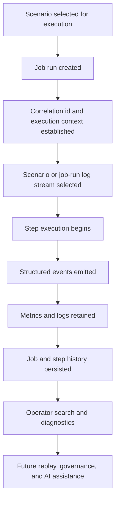

# Job History and Operational Observability

## Purpose

This document defines the future architecture direction for job history, operational visibility, and diagnostic evidence in `spring-etl-engine`.

Its main goal is to preserve the non-AI observability baseline that should exist before the product introduces richer operator tooling, replay analysis, or AI-assisted diagnostics.

This note keeps the roadmap grounded in a practical rule:

- first make ETL execution observable and explainable
- then make that observability searchable and operator-friendly
- only later build AI-assisted retrieval and summarization on top of it

## Current implemented slice

The current codebase already implements a meaningful first observability slice:

- scenario/job-run MDC fields in operational logging
- daily scenario log files in the form `logs/<yyyy-MM-dd>/<scenario>.log`
- machine-readable lifecycle events such as `RUN_EVENT`, `RUN_SUMMARY`, `STEP_PLAN`, `STEP_READY`, and `STEP_EVENT`
- step-finished evidence with `readCount`, `writeCount`, `filterCount`, `skipCount`, and `rollbackCount`
- local verification-report generation that keeps build/release validation logs distinct from runtime scenario logs

This document still describes future observability direction, but it should now be read as **current baseline plus future evolution**, not as a purely hypothetical design note.

## Scope

This document covers:

- persistent job and step execution history
- scenario and job-run oriented logging strategy
- correlation-friendly operational logging
- structured runtime events and error taxonomy
- operator-facing search and filtering expectations
- security, retention, and redaction requirements for observability data
- how this baseline supports future replay, governance, and AI-assisted operations

This document does not lock in:

- a final storage engine for logs or events
- a specific dashboard technology
- a final search product such as OpenSearch or PostgreSQL full-text
- any vector database or AI provider choice

## Context

The current product is a config-driven ETL engine built around:

- scenario-driven job configuration
- Spring Batch orchestration
- factory-based reader, processor, and writer selection
- generated models for connector-specific contracts
- growing support for multiple source and target types

As connector count increases, the product needs more than basic application logs. Operators will need to answer questions such as:

- which scenario ran?
- which step failed?
- which source and target were involved?
- what was read, transformed, skipped, and written?
- what exception category occurred?
- can the run be retried or replayed safely?
- has the same failure happened before?

Without a job-history and observability baseline, later enterprise features such as dashboarding, replay, audit, and AI-assisted troubleshooting will be weak or inconsistent.

The product also needs to avoid mixing unrelated log concerns into one undifferentiated stream. Runtime ETL evidence, operator diagnostics, build logs, and release validation logs do not serve the same audience or retention model.

## Flow

## Core observability model

### 1. Job history
Each job run should eventually preserve at least:

- scenario name
- job execution id
- source/target combination
- start and end time
- overall status
- duration
- execution mode
- config identity or version where relevant
- high-level read/write/skip/error counts

### 2. Step history
Each step should preserve at least:

- step name and sequence
- step status
- start and end time
- records read, processed, written, skipped, filtered
- chunk count when chunk-oriented execution is used
- retry and failure summary
- top exception category for the step

### 3. Structured operational events
In addition to text logs, the runtime should be able to express structured events such as:

- job started
- job completed
- job failed
- step started
- step completed
- step failed
- validation failed
- source read error
- transformation error
- target write error
- restart or replay attempted

Each event should be correlation-friendly and should eventually carry fields such as:

- job execution id
- step execution id or step name
- scenario name
- source type
- target type
- connector identifier where relevant
- timestamp
- severity
- error category
- human-readable message

### 4. Correlation-friendly logging
Plain-text logs are still useful, but they should evolve toward correlation-friendly output.

That means logs should be easy to group by:

- job run
- scenario
- step
- source or target connector
- exception category
- time window

## Log domains and boundaries

Not all logs in the repository or runtime have the same purpose.

### 1. Runtime operational logs
These are the most important product-facing logs.

They should capture ETL execution evidence such as:

- selected scenario
- job run start and completion
- step transitions
- source and target activity
- validation and transformation failures
- retry, skip, and replay-relevant events

These logs should be optimized for operators and future operational tooling.

### 2. Job-run or scenario logs
These are a more specific form of runtime logs and should become the primary operational view as the product matures.

They should answer:

- what happened for this scenario?
- what happened in this exact run?
- which step or connector failed?
- where is the evidence for this incident?

### 3. Build, CI, and release logs
These logs are still useful, but they are engineering artifacts rather than product runtime evidence.

Examples include:

- Maven test logs
- package/build logs
- release hygiene logs
- CI pipeline outputs

They should remain separate from scenario/job-run diagnostics because they serve different users, retention policies, and search expectations.

## Scenario and job-run logging model

The target default logging strategy is scenario-first and job-run-aware, and the first implementation slice is already moving in that direction.

### Logging identity fields
Each operational log record or event should eventually be attributable through fields such as:

- scenario name
- job execution id
- run identifier if different from Spring Batch execution id
- step execution id or step name
- source name and source type
- target name and target type
- processor type where relevant
- connector or transport identifier where relevant
- timestamp
- severity
- error category

### Naming and grouping principle
The preferred operational grouping is:

1. scenario
2. job run
3. step

This is stronger than one shared application log because it reflects how ETL operations are actually investigated.

Future log naming may vary by implementation, but it should preserve scenario and run identity clearly enough to support:

- per-run diagnostics
- targeted retention
- operator UI drill-down
- incident comparison across repeated runs

### Correlation rule
If a run can be selected through `etl.config.job`, then logs and events should preserve enough context to tie:

- the selected scenario bundle
- the concrete job execution
- the step-level evidence
- the source/target connector behavior

together as one retrievable diagnostic story.

## Structured evidence contract

Future observability should not depend on raw text alone.

Operational evidence should become structured enough for both operator search and later AI-assisted retrieval.

### Minimum structured fields
Each retained event or structured log entry should aim to preserve:

- scenario name
- job execution id
- step execution id or step name
- event type
- severity
- timestamp
- source and target identifiers
- connector type or format
- message suitable for operator display
- error category or exception family
- optional evidence pointer such as log segment id, record reference, or retained payload key

### Evidence quality principles
- messages should be operator-readable, not only developer-readable
- error categories should distinguish validation, transformation, source-read, and target-write failures
- structured events should complement stack traces, not replace them entirely
- retained evidence should remain useful even if AI features are disabled or unavailable

## Retention, redaction, and access

The logging strategy must remain safe enough for future enterprise operation.

### Redaction
- credentials and secrets must not be retained in clear text logs
- sensitive payload fields should be masked or excluded where possible
- AI-ready evidence should be redacted before later indexing or embedding stages

### Retention tiers
Different evidence types may later need different retention policies:

- job and step summaries may live longer
- full raw logs may have shorter retention windows
- build and release logs may follow engineering-only retention rules

### Access boundaries
- operators should only see logs and evidence they are allowed to access
- future partner or tenant boundaries must not be broken by shared log retrieval
- AI-assisted retrieval must respect the same access and redaction rules as normal search

## AI-readiness implications

This logging strategy should deliberately support future AI capabilities without optimizing for them too early.

### What AI needs from logging
Future AI-assisted diagnostics will work better when runtime evidence is:

- scenario-aware
- job-run-aware
- consistently categorized
- structured enough to retrieve and cite
- redacted before broad search or semantic indexing

### What should be avoided
- one giant undifferentiated application log as the only evidence source
- mixing build/release logs with runtime operational evidence
- retaining noisy or weakly labeled events that cannot be trusted later
- relying on AI to infer missing operational context that should have been logged explicitly

## Key Components / Classes

Current and likely future anchors for this topic include:

- `src/main/java/com/etl/config/BatchConfig.java`
- `src/main/java/com/etl/config/ConfigLoader.java`
- `src/main/java/com/etl/runner/EtlJobRunner.java`
- `src/main/java/com/etl/job/listener/JobCompletionNotificationListener.java`
- `src/main/java/com/etl/aspect/LoggingAspect.java`
- Spring Batch job and step metadata tables
- future operational history repository and dashboard API
- future logging configuration and sink strategy
- `scripts/verify-recent-changes.ps1`
- `scripts/generate-verification-report.ps1`

## Decisions

- Observability is a product capability, not only a developer convenience.
- Persistent job and step history should exist before advanced operator tooling is introduced.
- Runtime logging should be scenario and job-run oriented rather than treated as one shared undifferentiated application stream.
- Structured events should gradually complement plain-text logs.
- The current runtime already emits an initial machine-readable event vocabulary, and future work should extend that contract rather than replace it with ad hoc formats.
- Correlation identifiers should become stable enough to connect logs, metrics, and run history.
- Build and release logs should remain separate from runtime operational evidence.
- This baseline should stay technology-neutral enough to support later dashboard and search choices.

## Tradeoffs

### Benefits
- makes failures easier to diagnose and compare over time
- supports dashboarding, replay analysis, and operational governance
- provides a clean foundation for future AI-assisted search and summarization
- reduces dependence on ad hoc log reading and tribal knowledge
- creates a stronger evidence model for future scenario/job-run drill-down in the UI

### Costs
- introduces more runtime metadata and retention concerns
- requires stronger discipline around logging and exception classification
- may need storage and indexing decisions as execution volume grows
- requires clearer separation between operator-facing runtime logs and engineering-facing build/release logs

### Alternatives considered

#### Alternative: rely only on plain text application logs
Rejected because raw logs alone do not scale well for operators as the number of scenarios, connectors, and failure modes increases.

#### Alternative: keep one generic application log for all runtime activity
Rejected because enterprise ETL operations are investigated by scenario, job run, and step rather than by one shared undifferentiated log stream.

#### Alternative: jump directly to AI-assisted diagnostics
Rejected because AI without structured observability would be built on weak evidence and would not be reliable enough for enterprise operations.

## Impact on Existing Architecture

This note does not require immediate runtime changes, but it affects how future work should be shaped.

In particular, it should influence:

- how new connectors emit errors and runtime metadata
- how `BatchConfig` and listeners expose step/run context
- how restart, replay, and retry behavior is documented
- how future dashboard and operational APIs are designed
- how logging is treated as an operational asset instead of only console output
- how future logging sinks and file naming/grouping rules are designed

## Testing / Validation Expectations

Future work derived from this note should include:

- tests for job and step history persistence
- tests for correlation identifiers in runtime paths
- tests for error taxonomy and structured event creation
- tests for log redaction where sensitive values may appear
- tests that runtime logs can be attributed to scenario and job-run context consistently
- integration tests for operator-facing history and diagnostics APIs
- documentation updates when storage, retention, or replay behavior changes

## Future Extensions

This note is expected to lead into later design notes for:

- job history storage model and retention strategy
- operational event schema and error taxonomy
- replay and restart diagnostics
- dashboard and operator search flows
- AI-assisted log search and diagnostics
- scenario and job-run logging sink configuration

