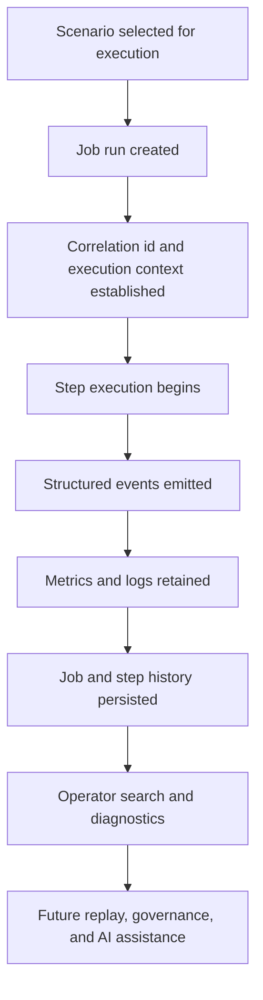

# Job History and Operational Observability

## Purpose

This document defines the future architecture direction for job history, operational visibility, and diagnostic evidence in `spring-etl-engine`.

Its main goal is to preserve the non-AI observability baseline that should exist before the product introduces richer operator tooling, replay analysis, or AI-assisted diagnostics.

This note keeps the roadmap grounded in a practical rule:

- first make ETL execution observable and explainable
- then make that observability searchable and operator-friendly
- only later build AI-assisted retrieval and summarization on top of it

## Scope

This document covers:

- persistent job and step execution history
- correlation-friendly operational logging
- structured runtime events and error taxonomy
- operator-facing search and filtering expectations
- security, retention, and redaction requirements for observability data
- how this baseline supports future replay, governance, and AI-assisted operations

This document does not lock in:

- a final storage engine for logs or events
- a specific dashboard technology
- a final search product such as OpenSearch or PostgreSQL full-text
- any vector database or AI provider choice

## Context

The current product is a config-driven ETL engine built around:

- scenario-driven job configuration
- Spring Batch orchestration
- factory-based reader, processor, and writer selection
- generated models for connector-specific contracts
- growing support for multiple source and target types

As connector count increases, the product needs more than basic application logs. Operators will need to answer questions such as:

- which scenario ran?
- which step failed?
- which source and target were involved?
- what was read, transformed, skipped, and written?
- what exception category occurred?
- can the run be retried or replayed safely?
- has the same failure happened before?

Without a job-history and observability baseline, later enterprise features such as dashboarding, replay, audit, and AI-assisted troubleshooting will be weak or inconsistent.

## Flow

## Core observability model

### 1. Job history
Each job run should eventually preserve at least:

- scenario name
- job execution id
- source/target combination
- start and end time
- overall status
- duration
- execution mode
- config identity or version where relevant
- high-level read/write/skip/error counts

### 2. Step history
Each step should preserve at least:

- step name and sequence
- step status
- start and end time
- records read, processed, written, skipped, filtered
- chunk count when chunk-oriented execution is used
- retry and failure summary
- top exception category for the step

### 3. Structured operational events
In addition to text logs, the runtime should be able to express structured events such as:

- job started
- job completed
- job failed
- step started
- step completed
- step failed
- validation failed
- source read error
- transformation error
- target write error
- restart or replay attempted

Each event should be correlation-friendly and should eventually carry fields such as:

- job execution id
- step execution id or step name
- scenario name
- source type
- target type
- connector identifier where relevant
- timestamp
- severity
- error category
- human-readable message

### 4. Correlation-friendly logging
Plain-text logs are still useful, but they should evolve toward correlation-friendly output.

That means logs should be easy to group by:

- job run
- scenario
- step
- source or target connector
- exception category
- time window

## Key Components / Classes

Current and likely future anchors for this topic include:

- `src/main/java/com/etl/config/BatchConfig.java`
- `src/main/java/com/etl/config/ConfigLoader.java`
- `src/main/java/com/etl/runner/EtlJobRunner.java`
- `src/main/java/com/etl/job/listener/JobCompletionNotificationListener.java`
- `src/main/java/com/etl/aspect/LoggingAspect.java`
- Spring Batch job and step metadata tables
- future operational history repository and dashboard API

## Decisions

- Observability is a product capability, not only a developer convenience.
- Persistent job and step history should exist before advanced operator tooling is introduced.
- Structured events should gradually complement plain-text logs.
- Correlation identifiers should become stable enough to connect logs, metrics, and run history.
- This baseline should stay technology-neutral enough to support later dashboard and search choices.

## Tradeoffs

### Benefits
- makes failures easier to diagnose and compare over time
- supports dashboarding, replay analysis, and operational governance
- provides a clean foundation for future AI-assisted search and summarization
- reduces dependence on ad hoc log reading and tribal knowledge

### Costs
- introduces more runtime metadata and retention concerns
- requires stronger discipline around logging and exception classification
- may need storage and indexing decisions as execution volume grows

### Alternatives considered

#### Alternative: rely only on plain text application logs
Rejected because raw logs alone do not scale well for operators as the number of scenarios, connectors, and failure modes increases.

#### Alternative: jump directly to AI-assisted diagnostics
Rejected because AI without structured observability would be built on weak evidence and would not be reliable enough for enterprise operations.

## Impact on Existing Architecture

This note does not require immediate runtime changes, but it affects how future work should be shaped.

In particular, it should influence:

- how new connectors emit errors and runtime metadata
- how `BatchConfig` and listeners expose step/run context
- how restart, replay, and retry behavior is documented
- how future dashboard and operational APIs are designed
- how logging is treated as an operational asset instead of only console output

## Testing / Validation Expectations

Future work derived from this note should include:

- tests for job and step history persistence
- tests for correlation identifiers in runtime paths
- tests for error taxonomy and structured event creation
- tests for log redaction where sensitive values may appear
- integration tests for operator-facing history and diagnostics APIs
- documentation updates when storage, retention, or replay behavior changes

## Future Extensions

This note is expected to lead into later design notes for:

- job history storage model and retention strategy
- operational event schema and error taxonomy
- replay and restart diagnostics
- dashboard and operator search flows
- AI-assisted log search and diagnostics

