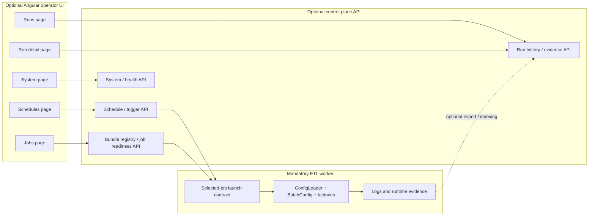

# Angular UI MVP Structure

## Purpose

This document defines a practical Angular-based MVP structure for a future optional operator UI around `spring-etl-engine`.

It exists to turn the broader UI and control-plane direction notes into one concrete implementation starting point without changing the shipped ETL worker runtime contract.

## Status

- Classification: **Future direction**
- This note describes one practical UI implementation shape if the team chooses Angular for the first operator-facing UI slice.
- This note does **not** by itself commit the product to Angular as an irreversible frontend choice.

If the team later decides Angular is the formal long-term UI standard rather than one practical MVP implementation path, capture that separately in an ADR.

## Scope

This document covers:

- a practical Angular application shape for the first operator UI slice
- recommended MVP phases and screen boundaries
- route and component structure for monitoring, launches, schedules, and basic admin views
- API client contracts that project from existing control-plane and runtime evidence concepts
- guardrails that keep the UI optional and aligned with the selected-job runtime contract

This document does **not** define:

- one final design system or component library
- one final authentication, RBAC, or tenancy model
- one final backend API schema
- one final deployment topology for the UI
- a hidden browser-only orchestration model

## Context

The current architecture already preserves three important rules:

1. the ETL worker remains the only mandatory runtime component
2. scheduling, trigger history, and retained run history belong to the optional control plane
3. the UI must remain a consumer of control-plane APIs rather than a replacement for `etl.config.job -> job-config.yaml`

That means Angular can be a good implementation choice for an enterprise-style operator surface, but only if the UI remains thin at the orchestration boundary and projects from the existing runtime and control-plane contracts.

## Why Angular is a reasonable fit

If the team is already comfortable with Angular, it is a strong candidate for the first UI slice because it supports:

- clear route-based admin application structure
- typed API client generation and strongly modeled view state
- reusable feature modules or standalone component organization
- enterprise-friendly forms for schedules, bundle registration, and future authoring
- consistent layout for dashboards, tables, drill-down views, and operator workflows

Angular is especially reasonable here if the intended first product surface is an internal or enterprise operator console rather than a public consumer web application.

## MVP principle

Do not start by implementing every eventual UI concept.

Start by building a thin Angular shell over a narrow set of control-plane and evidence APIs:

1. read-only monitoring first
2. manual launch for already-existing bundles second
3. simple schedule management third
4. guided authoring only later, after the backend contract is stable

That sequencing reduces rework and keeps UI delivery tied to backend maturity instead of imagination.

## Layered MVP view



Read this MVP view in four rules:

1. Angular is an optional client, not the center of execution
2. manual launch still resolves to the same selected-job worker contract
3. schedule screens manage persisted schedule definitions, not browser timers
4. monitoring projects from runtime evidence first and retained history second

## Recommended MVP phases

### Phase 1 - Monitoring-first shell

Start with screens that are mostly read-only:

- jobs list / bundle readiness
- current and recent runs
- run detail with step outcomes and evidence pointers
- system health / worker reachability

This phase is the lowest-risk Angular start because it depends mostly on view models, not final scheduler semantics.

### Phase 2 - Controlled operator actions

Once a thin backend surface exists, add:

- trigger-now for an already-registered job bundle
- schedule create / edit / enable / disable for existing bundles
- next-run preview and basic trigger history

This is the right time to add Angular forms for schedule management.

### Phase 3 - Richer diagnostics

After retained run history and trigger contracts mature, add:

- run-history filtering by job, status, time range, and trigger origin
- schedule-to-run drill-down
- step-level evidence pages
- artifact links for outputs, rejects, and archived sources where available

### Phase 4 - Guided authoring and admin

Only after bundle validation, secrets handling, and governance are clearer, add:

- guided job authoring forms that generate the standard YAML bundle files
- publish / register workflow for those generated bundles
- environment and admin settings
- restart or replay controls if later backend semantics support them

## Recommended route structure

A minimal Angular route map could start like this:

```text
/
/jobs
/jobs/:jobKey
/runs
/runs/:runId
/schedules
/schedules/new
/schedules/:scheduleId
/system
```

### Route intent

- `/jobs` - list registered bundles, readiness state, validation summaries, and trigger-now entry point
- `/jobs/:jobKey` - bundle details, validation issues, recent runs, and linked schedules
- `/runs` - recent and active runs with status, trigger origin, and summary counts
- `/runs/:runId` - step detail, evidence, artifacts, logs, and failure summary
- `/schedules` - list schedules, enable/disable state, next-run preview, and ownership metadata
- `/schedules/new` / `/schedules/:scheduleId` - schedule create/edit forms for existing bundles
- `/system` - control-plane health, worker reachability, version/build info, and later environment/admin views

## Suggested Angular feature structure

A practical Angular application structure could look like this:

```text
src/app/
  core/
    api/
    auth/
    layout/
    state/
  shared/
    components/
    pipes/
    utils/
  features/
    jobs/
    runs/
    schedules/
    system/
  app.routes.ts
```

### Core area

Use `core/` for app-wide concerns:

- HTTP client configuration
- global error handling
- route guards
- shell layout and navigation
- environment configuration
- typed API clients

### Shared area

Use `shared/` for reusable UI pieces:

- status badges
- count summary cards
- step timeline components
- schedule form fragments
- common table filters and empty/error states

### Feature areas

Use one feature folder per screen group:

- `features/jobs/`
- `features/runs/`
- `features/schedules/`
- `features/system/`

That keeps the MVP easy to grow without over-abstracting too early.

## Suggested first component set

### Shell components

- `AppShellComponent`
- `SideNavComponent`
- `TopBarComponent`
- `PageHeaderComponent`

### Jobs feature

- `JobsListPageComponent`
- `JobDetailPageComponent`
- `JobReadinessCardComponent`
- `JobTriggerButtonComponent`

### Runs feature

- `RunsListPageComponent`
- `RunDetailPageComponent`
- `RunSummaryCardComponent`
- `StepTimelineComponent`
- `ArtifactLinksPanelComponent`
- `LogLinksPanelComponent`

### Schedules feature

- `SchedulesListPageComponent`
- `ScheduleEditorPageComponent`
- `ScheduleFormComponent`
- `ScheduleStateBadgeComponent`
- `TriggerHistoryPanelComponent`

### System feature

- `SystemPageComponent`
- `ControlPlaneHealthCardComponent`
- `WorkerReachabilityCardComponent`

## Suggested view-model contracts

The UI should model backend responses using the same conceptual entities already preserved in the architecture docs.

### Jobs / bundles

A jobs page can project from a backend view such as:

```text
JobBundleSummaryView
- jobKey
- displayName
- jobConfigPath
- readinessStatus
- validationMessages[]
- lastRunSummary?
- scheduleCount
```

### Runs

A runs page can project from a view such as:

```text
RunRecordView
- runId
- jobKey
- jobDisplayName
- status
- triggerOrigin
- startedAt
- finishedAt?
- durationMs?
- sourceCount?
- writtenCount?
- rejectedCount?
```

### Run detail

A run detail page can project from:

```text
RunDetailView
- run: RunRecordView
- steps: StepRecordView[]
- artifacts: ArtifactRecordView[]
- failureSummary?
- evidenceLinks[]
```

With nested step and artifact views such as:

```text
StepRecordView
- stepName
- sequence
- status
- readCount?
- writeCount?
- filterCount?
- skipCount?
- rejectedCount?
- startedAt?
- finishedAt?
- failureCategory?
```

```text
ArtifactRecordView
- artifactId
- role
- label
- pathOrUri
- createdAt?
- recordCount?
```

### Schedules

A schedules page can project from:

```text
ScheduleView
- scheduleId
- jobKey
- enabled
- paused
- expression
- timezone
- nextRunAt?
- owner?
- description?
```

### Trigger history

For schedule drill-down and audit:

```text
TriggerEventView
- triggerEventId
- origin
- scheduleId?
- jobKey
- decisionStatus
- triggeredAt
- launchedRunId?
- explanation?
```

## API client guidance

If Angular is used, prefer thin typed client services rather than embedding API logic in components.

A practical first service set would be:

- `JobsApiClient`
- `RunsApiClient`
- `SchedulesApiClient`
- `SystemApiClient`

Example responsibility split:

- `JobsApiClient` - list bundles, get bundle detail, trigger run now
- `RunsApiClient` - list runs, get run detail, fetch evidence and artifact links
- `SchedulesApiClient` - list/create/update/enable/disable schedules, fetch trigger history
- `SystemApiClient` - health, version, worker reachability, control-plane status

The first contract-level endpoint map for those clients is captured in [`../control-plane/operator-ui-mvp-api-surface.md`](../control-plane/operator-ui-mvp-api-surface.md).

## Form guidance

Angular forms are a strong reason to choose Angular here, but use them carefully.

### Good early forms

- schedule create/edit
- bundle metadata filters
- run search filters
- manual trigger confirmation dialogs

### Forms to delay

- full job authoring across all YAML artifacts
- secrets management
- environment promotion and approvals
- restart/replay workflows

Those later forms depend on backend semantics that are not yet fully frozen.

## Guardrails for Angular implementation

Treat these as non-negotiable unless a later ADR changes direction:

- Angular is an optional client over backend contracts, not a second runtime
- no browser-only schedule execution logic
- no direct invocation of ETL runtime internals from the UI
- manual launch from UI must still resolve to the selected-job worker boundary
- authoring, if later added, must generate the normal YAML bundle structure rather than a hidden UI-only job model
- UI state should project from `RunRecord`, `StepRecord`, `ArtifactRecord`, and `TriggerEvent` concepts instead of inventing parallel business terms

## Recommendation on wireframes

Yes, start with wireframes now.

The best immediate next step is:

1. wireframe the first five screens
2. freeze the page-level operator flows
3. define the backend view models those screens need
4. only then build the Angular shell

That gives the team something concrete to align on without prematurely locking every implementation detail.

Those first-screen wireframes are now captured in [`angular-ui-mvp-wireframes.md`](angular-ui-mvp-wireframes.md).

## Practical first five screens

A good first wireframe set is:

1. **Jobs** - bundle list, readiness state, and trigger-now action
2. **Runs** - active/recent runs with status, counts, and filters
3. **Run detail** - step outcomes, evidence, artifacts, and failure context
4. **Schedules** - list/edit/enable/disable schedules for existing bundles
5. **System** - control-plane health and worker reachability

That screen set is enough to validate the Angular information architecture before moving into larger authoring ambitions.

## Relationship to existing backlog and docs

This Angular MVP shape depends on the contracts already preserved in:

- `S1` for schedule identity and trigger contract
- `S3` for overlap and missed-run behavior
- `S4` for retained operational data
- `F1` for restart semantics
- `operator-ui-architecture-direction.md` for UI capability boundaries
- `scheduler-architecture-direction.md` for scheduler/backend placement
- `control-plane-worker-boundary.md` for optionality and launch boundary

## Related documents

- [`operator-ui-architecture-direction.md`](operator-ui-architecture-direction.md)
- [`../control-plane/scheduler-architecture-direction.md`](../control-plane/scheduler-architecture-direction.md)
- [`../control-plane/operator-ui-mvp-api-surface.md`](../control-plane/operator-ui-mvp-api-surface.md)
- [`../control-plane/control-plane-worker-boundary.md`](../control-plane/control-plane-worker-boundary.md)
- [`../control-plane/control-plane-operational-data-model.md`](../control-plane/control-plane-operational-data-model.md)
- [`../control-plane/job-history-and-operational-observability.md`](../control-plane/job-history-and-operational-observability.md)
- [`../../product/backlog-items/scheduler/S1-schedule-model-and-trigger-contract.md`](../../product/backlog-items/scheduler/S1-schedule-model-and-trigger-contract.md)
- [`../../product/backlog-items/scheduler/S3-overlap-policy-missed-run-handling-and-trigger-audit-trail.md`](../../product/backlog-items/scheduler/S3-overlap-policy-missed-run-handling-and-trigger-audit-trail.md)
- [`../../product/backlog-items/scheduler/S4-control-plane-operational-data-model.md`](../../product/backlog-items/scheduler/S4-control-plane-operational-data-model.md)
- [`../../product/backlog-items/etl-core/F1-restart-semantics-per-execution-mode.md`](../../product/backlog-items/etl-core/F1-restart-semantics-per-execution-mode.md)


