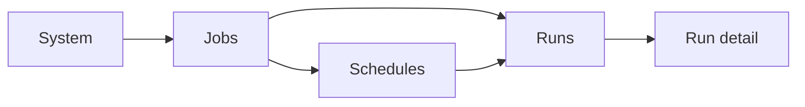

# Angular UI MVP Wireframes

## Purpose

This document defines low-fidelity wireframes for the first five Angular operator UI screens proposed in [`angular-ui-mvp-structure.md`](angular-ui-mvp-structure.md).

It exists to turn the Angular MVP structure into one page-level operator flow set before the team freezes backend APIs or starts building the Angular shell.

## Status

- Classification: **Future direction**
- These wireframes describe a preferred MVP screen set, not a shipped UI.
- The wireframes are intentionally low-fidelity so the team can validate flow and information architecture before visual design.

## Scope

This document covers:

- the first five recommended Angular MVP screens
- page goals, main regions, and key actions
- the minimum data each screen needs from control-plane and runtime evidence APIs
- navigation flows between list, detail, schedule, and system views

This document does **not** define:

- final visual styling
- final component-library choice
- final API payload schemas
- authentication or RBAC UX
- later guided job authoring screens

## Screen set and flow

The first wireframe set should cover:

1. **Jobs**
2. **Runs**
3. **Run detail**
4. **Schedules**
5. **System**



Read this flow in three rules:

1. the MVP starts with operator visibility first
2. screens should drill down from summary to detail rather than hiding detail behind modal-heavy flows
3. schedule management and manual launch should still resolve to the same selected-job runtime contract already used by the worker

## Shared shell wireframe

Every page should sit inside one shared Angular shell.

```text
+----------------------------------------------------------------------------------+
| Top bar: product / environment / user / refresh / global status                  |
+----------------------+-----------------------------------------------------------+
| Side nav             | Page header: title | filters summary | primary action     |
| - Jobs               +-----------------------------------------------------------+
| - Runs               | Main content area                                         |
| - Schedules          |                                                           |
| - System             |                                                           |
|                      |                                                           |
+----------------------+-----------------------------------------------------------+
| Footer / app version / control-plane reachability                                |
+----------------------------------------------------------------------------------+
```

### Shared shell responsibilities

The shell should provide:

- left navigation between the first feature areas
- a page header with title, filter summary, and primary action slot
- global status for control-plane health and worker reachability
- a consistent place for refresh, error, and empty-state handling

## Screen 1 - Jobs

### Goal

Help operators answer:

- which job bundles exist?
- are they ready to run?
- do they have validation issues?
- can one be triggered now?

### Primary data

This screen should primarily project from `JobBundleSummaryView` as defined in [`angular-ui-mvp-structure.md`](angular-ui-mvp-structure.md).

Minimum data needed:

- `jobKey`
- `displayName`
- `jobConfigPath`
- `readinessStatus`
- `validationMessages[]`
- `lastRunSummary?`
- `scheduleCount`

### Wireframe

```text
+----------------------------------------------------------------------------------+
| Jobs                                                       [Refresh] [Trigger now]|
+----------------------------------------------------------------------------------+
| Filters: [search] [status] [has schedule] [validation state]                     |
+----------------------------------------------------------------------------------+
| Summary cards: [Ready] [Warning] [Blocked] [Scheduled]                           |
+----------------------------------------------------------------------------------+
| Jobs table                                                                        |
|----------------------------------------------------------------------------------|
| Name            | Status   | Last run     | Schedules | Validation | Actions     |
| customer-load   | Ready    | Success      | 2         | 0 issues    | View Run    |
| csv-to-sql      | Warning  | Failed       | 0         | 1 issue     | View Detail |
| xml-roundtrip   | Ready    | Running      | 1         | 0 issues    | View Runs   |
+----------------------------------------------------------------------------------+
| Detail side panel / row expansion                                                 |
| - job-config path                                                                 |
| - validation messages                                                             |
| - linked schedules                                                                |
| - recent run counts                                                               |
+----------------------------------------------------------------------------------+
```

### Key actions

- open job detail view
- trigger-now for an already-registered bundle
- jump to recent runs for that bundle
- jump to schedules for that bundle

### Angular component sketch

- `JobsListPageComponent`
- `JobReadinessCardComponent`
- `JobTableComponent`
- `JobTriggerButtonComponent`
- `JobSummaryDrawerComponent`

## Screen 2 - Runs

### Goal

Help operators answer:

- what is running now?
- what ran recently?
- what failed?
- what should I drill into next?

### Primary data

This screen should project from `RunRecordView`.

Minimum data needed:

- `runId`
- `jobKey`
- `jobDisplayName`
- `status`
- `triggerOrigin`
- `startedAt`
- `finishedAt?`
- `durationMs?`
- `sourceCount?`
- `writtenCount?`
- `rejectedCount?`

### Wireframe

```text
+----------------------------------------------------------------------------------+
| Runs                                                            [Refresh] [Export]|
+----------------------------------------------------------------------------------+
| Filters: [job] [status] [trigger origin] [time range] [active only]              |
+----------------------------------------------------------------------------------+
| Summary cards: [Running] [Failed] [Succeeded] [Rejected records]                 |
+----------------------------------------------------------------------------------+
| Runs table                                                                        |
|----------------------------------------------------------------------------------|
| Run ID    | Job             | Status   | Trigger   | Started     | Counts        |
| 10421     | customer-load   | Running  | schedule  | 10:41       | 250/--/0      |
| 10420     | xml-roundtrip   | Success  | manual    | 10:12       | 120/120/0     |
| 10419     | csv-to-sql      | Failed   | manual    | 09:57       | 400/120/18    |
+----------------------------------------------------------------------------------+
| Inline quick detail                                                               |
| - failure summary                                                                 |
| - duration                                                                        |
| - link to run detail                                                              |
+----------------------------------------------------------------------------------+
```

### Key actions

- open run detail
- filter by job, status, or trigger origin
- refresh run status without page reload
- export or copy run identifiers later, if needed

### Angular component sketch

- `RunsListPageComponent`
- `RunSummaryCardComponent`
- `RunsTableComponent`
- `RunQuickSummaryPanelComponent`

## Screen 3 - Run detail

### Goal

Help operators answer:

- which step failed?
- what happened in this run?
- where are the logs and artifacts?
- what evidence do I need to investigate or communicate?

### Primary data

This screen should project from `RunDetailView`, `StepRecordView`, and `ArtifactRecordView`.

Minimum data needed:

- run-level status and failure summary
- ordered step list with counts and timings
- artifact links
- evidence/log links
- trigger origin and launch context

### Wireframe

```text
+----------------------------------------------------------------------------------+
| Run detail: 10419 / csv-to-sql                                    [Refresh]       |
+----------------------------------------------------------------------------------+
| Header chips: [Failed] [Manual] [Started 09:57] [Duration 00:03:14]              |
+----------------------------------------------------------------------------------+
| Run summary cards                                                                 |
| [Source 400] [Written 120] [Rejected 18] [Handoff read/write 0/0]                |
+----------------------------------------------------------------------------------+
| Failure summary                                                                   |
| Category: target_write                                                            |
| Message: connection / constraint / runtime detail                                 |
+----------------------------------------------------------------------------------+
| Step timeline                                                                      |
| 1. read-csv      Success   read 400   write 400   reject 0                        |
| 2. validate-map  Success   read 400   write 382   reject 18                       |
| 3. write-sql     Failed    read 382   write 120   reject 0                        |
+----------------------------------------------------------------------------------+
| Tabs / panels                                                                     |
| [Artifacts] [Evidence] [Logs] [Trigger context]                                  |
| - output files                                                                    |
| - reject files                                                                    |
| - archived source                                                                 |
| - scenario log path                                                               |
+----------------------------------------------------------------------------------+
```

### Key actions

- inspect step-by-step outcomes
- open logs or evidence links
- inspect artifacts and reject outputs
- navigate back to the run list filtered to the same job or status

### Angular component sketch

- `RunDetailPageComponent`
- `StepTimelineComponent`
- `ArtifactLinksPanelComponent`
- `LogLinksPanelComponent`
- `TriggerContextPanelComponent`

## Screen 4 - Schedules

### Goal

Help operators answer:

- what schedules exist?
- which job bundle does each schedule launch?
- is a schedule enabled, paused, or blocked?
- when will it run next?

### Primary data

This screen should project from `ScheduleView` and `TriggerEventView`.

Minimum data needed:

- `scheduleId`
- `jobKey`
- `enabled`
- `paused`
- `expression`
- `timezone`
- `nextRunAt?`
- `owner?`
- recent trigger events for drill-down

### Wireframe

```text
+----------------------------------------------------------------------------------+
| Schedules                                                     [New schedule]      |
+----------------------------------------------------------------------------------+
| Filters: [job] [enabled] [owner] [timezone]                                      |
+----------------------------------------------------------------------------------+
| Schedules table                                                                   |
|----------------------------------------------------------------------------------|
| Name           | Job             | State     | Expression     | Next run          |
| Daily customer | customer-load   | Enabled   | 0 0 * * *      | 2026-05-26 00:00  |
| XML import     | xml-roundtrip   | Paused    | */15 * * * *   | --                |
+----------------------------------------------------------------------------------+
| Editor / detail panel                                                             |
| - expression                                                                      |
| - timezone                                                                        |
| - enable / disable / pause                                                        |
| - description / owner                                                             |
| - recent trigger history                                                          |
+----------------------------------------------------------------------------------+
```

### Key actions

- create schedule for an existing job bundle
- edit schedule metadata and expression
- enable, disable, or pause schedule
- inspect trigger history and navigate to launched runs

### Angular component sketch

- `SchedulesListPageComponent`
- `ScheduleEditorPageComponent`
- `ScheduleFormComponent`
- `ScheduleStateBadgeComponent`
- `TriggerHistoryPanelComponent`

## Screen 5 - System

### Goal

Help operators answer:

- is the control plane healthy?
- is the worker reachable?
- are registry, scheduler, and history services responding?
- what environment or version am I looking at?

### Primary data

This screen should project from a small system-health view returned by `SystemApiClient`.

Minimum data needed:

- control-plane API health
- scheduler service status
- worker reachability
- registry status
- build/version/environment info

### Wireframe

```text
+----------------------------------------------------------------------------------+
| System                                                         [Refresh]          |
+----------------------------------------------------------------------------------+
| Environment: local-dev | Version: 1.x | Build: abc123 | Time: 10:55              |
+----------------------------------------------------------------------------------+
| Health cards                                                                       |
| [Operator API: Healthy] [Scheduler: Healthy] [Worker: Reachable] [History: OK]   |
+----------------------------------------------------------------------------------+
| Diagnostics                                                                        |
| - last heartbeat                                                                   |
| - recent scheduler errors                                                          |
| - recent worker launch failures                                                    |
| - config / registry warnings                                                       |
+----------------------------------------------------------------------------------+
| Later admin region                                                                 |
| - environment settings                                                             |
| - governance / approvals                                                           |
| - secrets references                                                               |
+----------------------------------------------------------------------------------+
```

### Key actions

- refresh health and diagnostics
- confirm worker reachability before troubleshooting UI-level issues
- navigate to jobs or runs when failures originate outside the page itself

### Angular component sketch

- `SystemPageComponent`
- `ControlPlaneHealthCardComponent`
- `WorkerReachabilityCardComponent`
- `SystemDiagnosticsPanelComponent`

## Navigation rules

Use these wireframes to preserve a few simple navigation rules:

- `Jobs` is the bundle-centered entry point
- `Runs` is the incident and monitoring entry point
- `Run detail` is the evidence-centered investigation page
- `Schedules` is the control-plane action page
- `System` is the environment and health page

Avoid making operators bounce between unrelated screens to answer one operational question.

## MVP decisions these wireframes help freeze

Before building Angular screens, use these wireframes to freeze:

- the minimum route set
- the first page-level actions
- the minimum backend views each page requires
- the relationship between list pages and detail pages
- which actions belong now versus later phases

## Relationship to Angular MVP structure

Use this note together with [`angular-ui-mvp-structure.md`](angular-ui-mvp-structure.md):

- `angular-ui-mvp-structure.md` defines phases, routes, components, and view models
- this note defines the page-level wireframes and operator flows those structures should support

## Related documents

- [`angular-ui-mvp-structure.md`](angular-ui-mvp-structure.md)
- [`operator-ui-architecture-direction.md`](operator-ui-architecture-direction.md)
- [`../control-plane/scheduler-architecture-direction.md`](../control-plane/scheduler-architecture-direction.md)
- [`../control-plane/control-plane-worker-boundary.md`](../control-plane/control-plane-worker-boundary.md)
- [`../control-plane/job-history-and-operational-observability.md`](../control-plane/job-history-and-operational-observability.md)

