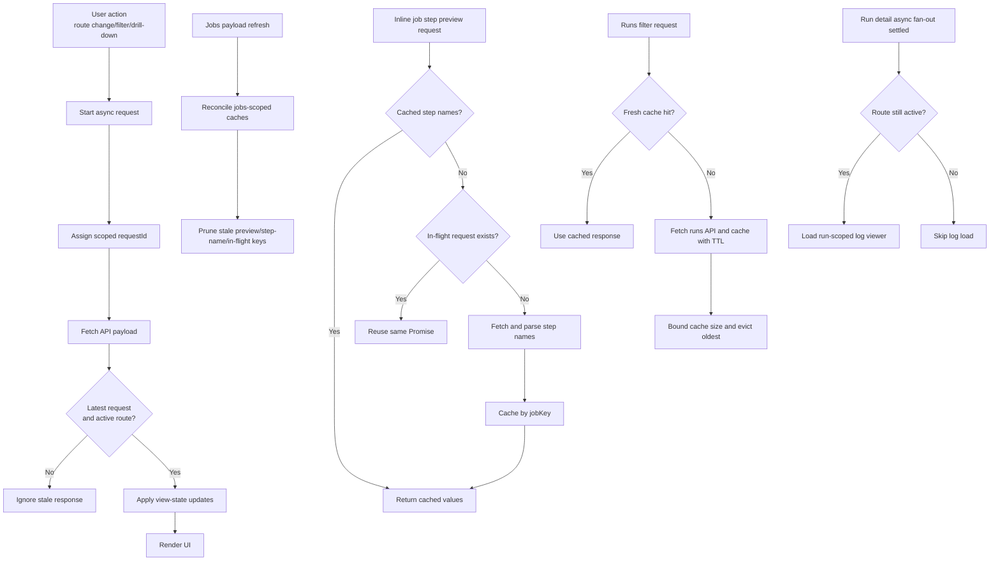

# Operator UI Monitoring Shell Runtime Hardening

## Purpose

This note documents shipped stability hardening for the monitoring-first Operator UI shell (`/operator`) so list/detail pages remain consistent under rapid navigation and repeated inline drill-down actions.

## Scope

This note describes the current client-side hardening applied in `src/main/resources/static/operator/app.js` for:

- route-aware async response guards
- in-flight request deduplication for job step previews
- guarded duplicate-click suppression for ad hoc trigger-now requests
- cache reconciliation for jobs-scoped preview state
- bounded and expiring runs-filter response caching
- route-safe sequencing for run-scoped log loading
- control-plane profile static-resource no-cache defaults for faster local UI iteration

It does not redefine control-plane API contracts or scheduler semantics.

## Runtime hardening flow

## Shipped behavior

- Stale response protection: list/detail loaders now render only when response state still matches the active route and newest request scope.
- Step preview dedup: repeated expansion requests for one job reuse one in-flight call rather than fan-out duplicate `/api/v1/jobs/{jobKey}/config` requests.
- Trigger-now dedup hardening: repeated clicks on the same job-detail trigger button are ignored while one request is already in flight, and a short UI cooldown prevents immediate accidental re-submit after an accepted response.
- Step preview caching: parsed step names are cached per `jobKey` to reduce repeated YAML fetch/parse work.
- Cache reconciliation: when a new jobs payload arrives, stale per-job preview and step-name entries are pruned so removed jobs do not leave stale UI state.
- Runs filter cache hardening: runs responses are now cached with TTL and bounded entry count to reduce repeated fetches while preventing unbounded in-memory growth during long operator sessions.
- Run log sequencing hardening: run-scoped log loading now starts only after other run-detail async updates settle and only when the same run route is still active.
- Static asset refresh hardening: `application-controlplane.properties` disables Spring static-resource cache (`spring.web.resources.cache.period=0`, `spring.web.resources.chain.cache=false`) so Operator UI updates are reflected without stale bundled JS/CSS responses during control-plane sessions.

## Guardrails

- Hardening remains read-model and UI-local only; no ETL worker launch contract changes.
- The selected-job runtime contract remains `etl.config.job -> job-config.yaml` and is not bypassed by UI state logic.
- Trigger-now remains ad hoc convenience, not scheduler governance.

## Related documents

- [`operator-ui-architecture-direction.md`](operator-ui-architecture-direction.md)
- [`angular-ui-mvp-structure.md`](angular-ui-mvp-structure.md)
- [`../control-plane/operator-ui-mvp-api-surface.md`](../control-plane/operator-ui-mvp-api-surface.md)
- [`../control-plane/job-history-and-operational-observability.md`](../control-plane/job-history-and-operational-observability.md)
