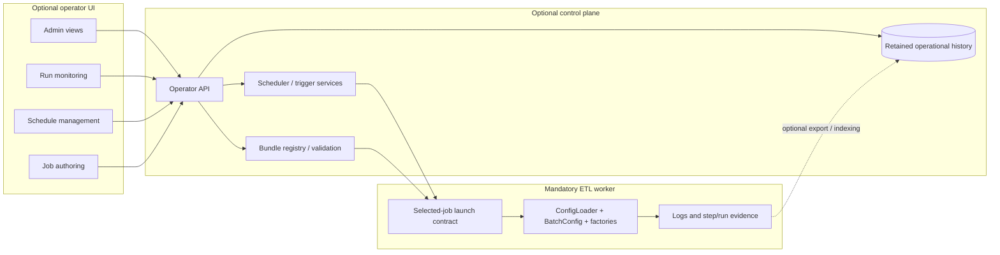

# Operator UI Architecture Direction

## Purpose

This document defines the preferred future direction for an optional operator-facing UI around `spring-etl-engine`.

It exists to give admin, monitoring, scheduling, and job-authoring work one architectural home without changing the shipped ETL worker runtime contract.

## Status

- Classification: **Future direction**
- The Mermaid diagrams in this document describe the preferred future direction, not a shipped runtime path today.

## Scope

This document covers:

- the role of an optional UI in the product layering
- the boundary between operator UI, control-plane backend services, and the ETL worker
- the main UI capability areas for admins and operators
- which UI capabilities fit an early MVP versus later phases
- the guardrail that UI-authored jobs must still resolve to the selected-job bundle contract

This document does **not** define:

- one final frontend framework
- one final authentication or RBAC implementation
- one final API schema
- final restart, replay, or recovery semantics
- a new runtime model that bypasses `job-config.yaml`

## Context

The current shipped runtime is an ETL-first, non-web worker that executes one selected `etl.config.job` bundle per run.

The documented future product layering already separates:

1. the mandatory ETL worker
2. an optional control-plane layer for scheduling, watching, and retained operational history
3. a later optional operator-facing UI

That means the UI should be treated as a consumer of control-plane services and runtime evidence, not as a replacement for the existing ETL runtime contract.

## Layered view

Read this view in three rules:

1. the ETL worker remains the only mandatory runtime component
2. the UI talks to control-plane APIs and retained history rather than invoking runtime internals directly
3. the control plane must still launch the worker through the same selected-job boundary already used today

## Functional areas

### 1. Admin

Admin-facing UI should eventually cover:

- environment-level configuration and validation status
- bundle registration and publish state
- schedule ownership and enable/disable controls
- later secrets reference management and role-based access

### 2. Monitor

Monitoring UI should eventually cover:

- run list and run status
- step-by-step execution detail
- machine-readable evidence summaries
- links to logs, outputs, reject artifacts, and archived-source evidence where available
- filters by scenario/job, status, time window, and trigger origin

### 3. Schedule management

Schedule screens should manage control-plane schedule definitions, for example:

- create, edit, enable, disable, or pause a schedule
- preview next run timing
- show trigger origin and schedule-to-run traceability
- later explain overlap, missed-run, and blocked-run decisions once those semantics are defined

Schedule management belongs in the UI, but schedule execution semantics belong to the control plane.

### 4. Job authoring

Job authoring is possible through UI, but only if it preserves the current runtime contract.

That means a future authoring UI should:

- gather source, target, processor, and step information through guided forms
- generate the normal YAML bundle files (`job-config.yaml`, `source-config.yaml`, `processor-config.yaml`, `target-config.yaml`)
- validate that bundle against the same worker contract
- publish or register the generated bundle for later runs

It should **not** create a hidden database-only job definition that the worker cannot run directly outside the UI.

## MVP versus later phases

### Recommended MVP

The safest first UI slice is:

1. monitoring dashboard over current runtime evidence
2. manual launch of an already-existing selected job bundle
3. bundle registry/list view
4. simple schedule-management screens backed by explicit control-plane schedule records

### Next phase

After the schedule and retained-history contracts are clearer, add:

- richer run-history search and filters
- schedule-to-run drill-down
- trigger audit views
- operator-friendly evidence pages for step failures and artifacts

### Later phase

After secrets, restart semantics, and governance are clearer, add:

- guided job authoring and publish workflows
- environment promotion and approvals
- deeper admin and security views
- restart/replay/recovery operator actions

## Guardrails

Treat the following as non-negotiable unless a later ADR changes direction:

- the UI is optional, not mandatory for normal ETL execution
- the UI must not create a second orchestration contract outside the selected-job bundle
- scheduling behavior must remain a control-plane concern, not browser-only behavior
- monitoring should project from existing runtime evidence first and retained history second
- UI work must not outrun schedule, overlap, and restart semantics already documented elsewhere

## Relationship to current backlog direction

This UI direction depends on the existing control-plane and restartability planning slices:

- `S1` for schedule identity and trigger contract
- `S3` for overlap and missed-run behavior
- `S4` for retained control-plane operational data
- `F1` for restart and recovery semantics

That dependency means now is the right time to design the UI boundary and first slices, but not to over-promise every final operator feature immediately.

## Suggested first screen set

A practical first screen set would be:

- **Jobs** - list registered bundles and validate readiness
- **Runs** - show current and recent runs with status and counts
- **Run detail** - show step outcomes, evidence, artifacts, and logs
- **Schedules** - create/manage schedules for existing bundles
- **System** - show control-plane health, worker reachability, and later environment/admin settings

For one practical implementation-oriented follow-on if the team chooses Angular for the first UI slice, continue in [`angular-ui-mvp-structure.md`](angular-ui-mvp-structure.md).

## Related documents

- [`../control-plane-worker-boundary.md`](../control-plane/control-plane-worker-boundary.md)
- [`../control-plane/scheduler-architecture-direction.md`](../control-plane/scheduler-architecture-direction.md)
- [`../control-plane-operational-data-model.md`](../control-plane/control-plane-operational-data-model.md)
- [`../job-history-and-operational-observability.md`](../control-plane/job-history-and-operational-observability.md)
- [`../scenario-driven-runtime-direction.md`](../etl-core/scenario-driven-runtime-direction.md)
