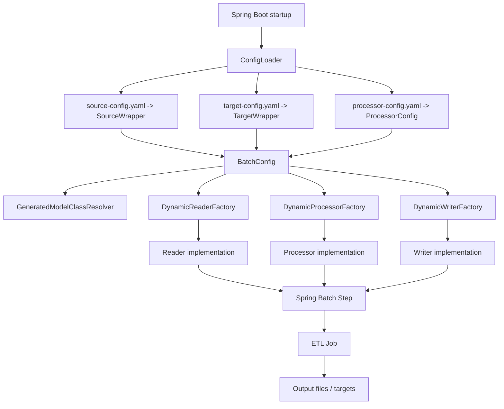

# Architecture Overview

## Purpose

This document captures the current architectural baseline of `spring-etl-engine` so new features can evolve from a shared understanding.

## Current architectural style

The engine is a **config-driven Spring Batch ETL runtime** with these core ideas:

- source, target, and processor behavior is loaded from YAML
- supported formats are represented as config subtypes
- readers, processors, and writers are selected through factories
- model classes are generated and resolved dynamically at runtime
- the batch layer chooses between chunk and tasklet execution based on source size

## High-level view

## Main runtime components

### Application bootstrap
- `src/main/java/com/etl/ETLEngineApplication.java`
- `src/main/java/com/etl/runner/EtlJobRunner.java`

Spring Boot starts the app, builds the context, and launches the ETL job through `EtlJobRunner`.

### Config loading
- `src/main/java/com/etl/config/ConfigLoader.java`

`ConfigLoader` reads source, target, and processor YAML from external paths first, then falls back to classpath resources.

### Batch orchestration
- `src/main/java/com/etl/config/BatchConfig.java`

`BatchConfig` constructs the job and dynamically builds steps by pairing sources and targets. It also chooses chunk or tasklet execution depending on the record count threshold.

### Dynamic extension points
- `src/main/java/com/etl/reader/DynamicReaderFactory.java`
- `src/main/java/com/etl/processor/DynamicProcessorFactory.java`
- `src/main/java/com/etl/writer/DynamicWriterFactory.java`

These factories isolate format-specific behavior and make the runtime extensible.

### Dynamic model contract
- `src/main/java/com/etl/common/util/GeneratedModelClassResolver.java`

This is the central contract between configuration, generated model classes, processors, and writers.

## Current strengths

- clear separation between config loading and runtime execution
- pluggable reader/processor/writer model
- dynamic support for multiple source and target formats
- adaptive execution model for smaller vs larger workloads
- good base for future relational, API, or procedure-based extensions

## Current architectural constraints

- `BatchConfig` currently pairs sources and targets by index
- orchestration is step-based but still centered on `source -> processor -> target`
- stored procedures and richer multi-job flows will require a higher-level step operation model
- generated models currently remain an important runtime dependency and contract surface

## Near-term evolution points

The next architecture topics that should extend this baseline rather than bypass it are:

- relational source and target configuration
- stored procedure execution as a first-class step type
- multi-step and multi-job orchestration
- vendor/dialect abstraction for relational platforms

