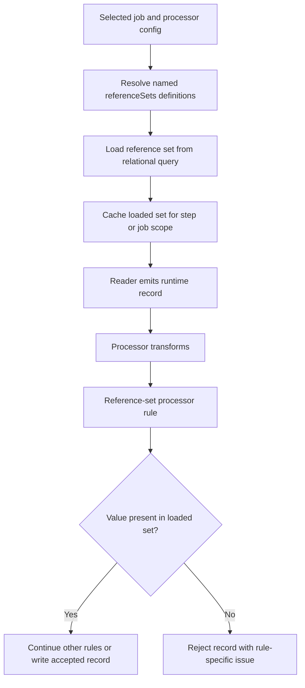

# Reference-Set Validation and Enrichment

## Purpose

This note defines the preferred future direction for validating mapped record values against runtime-loaded reference data, starting with reject-only reference-set checks such as agency code validation backed by a relational query.

## Status

- Classification: **Future direction**
- The Mermaid diagrams in this document describe the preferred future direction, not a shipped runtime path today.
- This note now also captures the frozen first-slice planning direction for `T5`, but that freeze is planning-only and does not mean the feature is implemented.

## Scope

This note covers:

- processor-side reference-set validation against runtime-loaded data
- named config placeholders such as `referenceSet: agencyCodes`
- load/cache expectations for database-backed reference sets
- the boundary between validation-only reference sets and later enrichment

This note does not cover:

- source-level artifact validation
- full multi-table enrichment joins
- target-side hidden defaulting or hidden validation
- a generic rule engine

## Context

The current shipped runtime already supports:

- processor transforms through the active default processor path
- record rejection through `ProcessorValidationRule`
- relational config and runtime connection support for file-to-database and relational scenarios

That makes runtime-loaded reference validation a natural next step.

For example:

- input field: `agencyCode`
- allowed values live in a database table
- the ETL run should reject records where `agencyCode` is not present in the current allowed set

This should remain a processor accept/reject concern because the source record was read successfully; the question is whether the record is valid for the business contract.

## Flow

Future-only, not shipped today: this diagram shows the intended target shape.



## Draft config direction

Illustrative example only — not a shipped contract yet:

```yaml
type: default
referenceSets:
  agencyCodes:
    sourceType: relationalQuery
    connection:
      vendor: sqlserver
      host: <SQLSERVER_HOST>
      port: 1433
      database: <SQLSERVER_DATABASE>
      username: <SQLSERVER_USERNAME>
      password: <SQLSERVER_PASSWORD>
    query: "SELECT agency_code FROM dbo.ref_agency WHERE is_active = 1"
    valueColumn: agency_code
    cacheScope: job
mappings:
  - source: PartnerOrdersCsv
    target: PartnerOrdersSql
    fields:
      - from: agencyCode
        to: agencyCode
        rules:
          - type: referenceSet
            referenceSet: agencyCodes
            onFailure: rejectRecord
```

### Why the placeholder should be named

The main config placeholder should be the set name, not the SQL itself inside every rule.

Preferred direction:

- define reusable sets once in `referenceSets:`
- reference them from field rules by name
- keep field rules readable and business-focused

That gives config authors a simple mental model:

- `agencyCodes` means “load the allowed agency-code set at runtime”
- the rule only states that the field must exist in that set

## Key components / classes

Current code anchors that should remain central when this feature is implemented:

- `src/main/java/com/etl/config/processor/ProcessorConfig.java`
- `src/main/java/com/etl/processor/validation/ProcessorValidationRule.java`
- `src/main/java/com/etl/processor/validation/ValidationRuleEvaluator.java`
- `src/main/java/com/etl/mapping/ValidationAwareDynamicMapping.java`
- `src/main/java/com/etl/config/relational/RelationalConnectionConfig.java`
- `src/main/java/com/etl/config/relational/RelationalDataSourceFactory.java`

Likely future runtime helpers:

- reference-set config binding class
- reference-set loader for relational-query-backed sets
- cache/registry component for loaded sets in step or job scope
- `ReferenceSetProcessorValidationRule`

## Frozen planning decisions

- keep DB-backed allow-list checks in the processor-rule extension point, not source validation
- start with validation-only reference sets before broader enrichment output behavior
- use a named placeholder such as `referenceSet: agencyCodes` instead of embedding SQL in each field rule
- load each reference set once per configured cache scope rather than querying the database for every record

These decisions are intentionally frozen to keep backlog refinement aligned, but they remain future-only until code, tests, and shipped config docs are added.

## Tradeoffs

### Benefits

- supports live business validation against current database values
- keeps config readable for non-Java authors
- reuses the active processor validation seam
- avoids job-specific validation code paths

### Costs

- introduces a new config surface and runtime cache concerns
- needs clear connection/config ownership for the reference-set query
- must define stale-data and reload expectations explicitly

### Alternative considered

Embedding relational SQL directly in each rule was rejected because it repeats config and makes rule authoring harder to read and validate.

## Impact on Existing Architecture

This direction should affect:

- processor-config binding and validation
- processor rule dispatch
- relational connection reuse for runtime-loaded reference data
- focused tests for load/cache/reject behavior

It should not require:

- a new standalone validation framework
- moving business rejection logic into source validation
- hidden writer-specific validation behavior

## Testing / Validation Expectations

When implementation begins, add:

- config-binding tests for `referenceSets:` and `referenceSet` rule references
- startup validation tests for missing named sets and invalid relational loading config
- rule-evaluator tests for value-in-set vs value-not-in-set outcomes
- cache-scope tests to prove the set is not reloaded for every record
- at least one scenario-level proof against an H2-backed or equivalent relational reference table

## Future Extensions

Build on this design in stages:

1. first slice: reject-only reference-set validation
2. next slice: reusable reference-set loaders and named connection references if needed
3. later slice: enrichment outputs that read additional columns from reference data
4. later slice: richer lookup strategies beyond single-column allow-lists

## Related docs

- [`T5 backlog item`](../product/backlog-items/T5-reference-set-validation-and-enrichment-baseline.md)
- [`Validation extension architecture`](validation-extension-architecture.md)
- [`Extension points`](extension-points.md)
- [`Relational database support`](relational-db-support.md)
- [`Transformation capability roadmap`](transformation-capability-roadmap.md)


