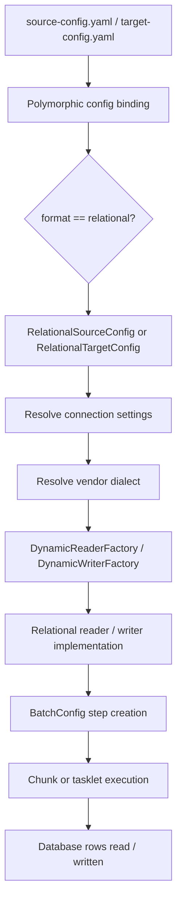
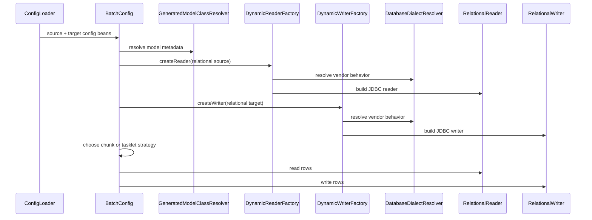

# Relational Database Support

## Purpose

This document defines the relational database (RDBMS) architecture baseline for `spring-etl-engine` and now serves as both a design note and an implementation validation reference.

The goal is to make future implementation deliberate, reviewable, and extensible rather than letting JDBC-specific decisions spread across readers, writers, and orchestration code.

It also serves as a retrospective validation reference: as relational source and target code evolves, it can be compared against the design expectations captured here.

## Current implementation status

The current phase-1 implementation now includes:

- `RelationalConnectionConfig`
- `RelationalTargetConfig`
- `RelationalSourceConfig`
- `RelationalDynamicWriter`
- `RelationalDynamicReader`
- `DatabaseDialect` with `H2` and `SQL Server` implementations
- H2-backed automated tests for relational reader and writer paths
- preserved scenario bundles for `csv-to-sqlserver` and `relational-to-relational`
- H2-backed higher-volume relational source -> relational target validation

Current support remains intentionally narrow:

- source reads: table or query based
- target writes: insert only
- field name == database column name assumption
- SQL Server-oriented live configuration with H2 as the automated test platform

## Scope

This design note covers:

- relational source and target support inside the existing config-driven ETL architecture
- how relational support should fit into `SourceConfig`, `TargetConfig`, factories, and `BatchConfig`
- common vs vendor-specific configuration concerns
- expected runtime flow
- core implementation risks and challenges
- phased rollout guidance
- retrospective validation checkpoints for future changes

This design note does **not** finalize:

- a production-ready stored procedure architecture
- multi-job orchestration redesign
- connection pooling strategy beyond normal Spring/JDBC practices
- vendor-specific SQL syntax for every database platform

Those can build on this baseline later.

## Context

The current product is a config-driven ETL engine with these characteristics:

- source and target behavior are defined by YAML
- source and target config types are polymorphic (`csv`, `xml`, future `relational`)
- readers, processors, and writers are selected through dynamic factories
- `BatchConfig` currently builds steps from paired source and target configurations
- model generation and runtime class resolution are centralized contracts

This works well for file-based ETL, but RDBMS support introduces new concerns:

- connection lifecycle
- query vs table semantics
- chunk-friendly streaming
- transactional writes
- pagination / incremental extraction
- vendor-specific SQL behavior
- future stored procedure integration

Because of that, relational support should be introduced as a first-class architecture extension rather than ad hoc JDBC code.

## Architecture goals

The RDBMS design should preserve the current product strengths while adding relational capability.

### Primary goals

- keep `format: relational` as a single extensible format
- avoid creating separate top-level formats for `oracle`, `mysql`, `sqlserver`, etc.
- keep source concerns separate from target concerns
- isolate vendor-specific behavior behind dialect abstractions
- preserve the factory-based runtime model
- keep the initial implementation compatible with current `source -> processor -> target` orchestration

### Secondary goals

- support large-table streaming safely
- support incremental extraction later
- make stored procedures a future extension, not an accidental side effect of source/target modeling
- make design expectations explicit enough to validate future changes against them

## Proposed configuration model

### Design principle

Use one shared relational connection object, then compose it into:

- a relational source config
- a relational target config

This avoids duplication and keeps common connection details independent from read/write semantics.

## Proposed classes

### Shared
- `RelationalConnectionConfig`
- `DatabaseVendor`
- `DatabaseDialect` (runtime abstraction, not necessarily part of config)

### Source-side
- `RelationalSourceConfig extends SourceConfig`

### Target-side
- `RelationalTargetConfig extends TargetConfig`

## Shared relational connection object

Suggested shape:

- `vendor`
- `jdbcUrl`
- `host`
- `port`
- `database`
- `schema`
- `username`
- `password`
- `driverClassName`
- `properties` / connection options

### Design rules

- prefer `jdbcUrl` if explicitly supplied
- otherwise build it from `vendor`, `host`, `port`, and `database`
- keep credentials externalizable where possible
- do not copy the same connection fields into both source and target config types

## Relational source config

Suggested responsibilities:

- declare where rows come from
- describe how they are fetched
- expose enough metadata for chunk/tasklet decisions or future optimizations

Suggested fields:

- `connection`
- `table`
- `query`
- `countQuery` (optional)
- `fetchSize`
- `maxRows` (optional)
- `incrementalColumn` (future-friendly)
- `incrementalValue` (future-friendly)

### Rules

- a relational source should support either `table` or `query`
- `query` should win when both are supplied, or validation should reject ambiguous input
- count strategy must be explicit for large sources where `getRecordCount()` matters

## Relational target config

Suggested responsibilities:

- declare where transformed rows go
- describe how writes happen
- define batch behavior and future upsert semantics

Suggested fields:

- `connection`
- `table`
- `writeMode`
- `batchSize`
- `keyColumns`
- `preSql` (optional)
- `postSql` (optional)

### Suggested write modes

- `insert`
- `update`
- `upsert`
- `truncate-insert`

Not every mode needs to be supported in phase 1, but the shape should anticipate them.

## Vendor-specific behavior

### Recommendation

Do **not** model Oracle, MySQL, SQL Server, PostgreSQL, etc. as separate ETL formats.

Use:

- `format: relational`
- `vendor: oracle | mysql | sqlserver | postgres | ...`

Then isolate vendor differences in a dialect abstraction.

### Suggested runtime abstraction

- `DatabaseDialect`
- `DatabaseDialectFactory` or `DatabaseDialectResolver`

Dialect responsibilities may include:

- JDBC URL defaults
- identifier quoting behavior
- pagination syntax
- upsert/merge SQL generation
- vendor-specific validation rules
- stored procedure naming and execution support later

## Proposed runtime flow

## Sequence view

## Integration with current architecture

### `ModelFormat`
The enum already contains `RELATIONAL`, which is the correct long-term direction.

### `SourceConfig`
`SourceConfig` will need a new polymorphic subtype:

- `RelationalSourceConfig` with discriminator `relational`

### `TargetConfig`
`TargetConfig` will need a new polymorphic subtype:

- `RelationalTargetConfig` with discriminator `relational`

### Reader factory
`DynamicReaderFactory` should route relational sources to a dedicated relational reader implementation rather than adding JDBC conditionals into unrelated readers.

### Writer factory
`DynamicWriterFactory` should route relational targets to a dedicated relational writer implementation.

### Processor layer
No fundamental processor redesign is required for basic relational support. Processors should continue to transform source model objects into target model objects.

### `BatchConfig`
`BatchConfig` should keep orchestrating steps, but relational support will stress some assumptions:

- how to determine record counts cheaply
- how to stream very large result sets
- how to define transactional chunk sizes for target writes

## Key decisions

- Use a single `relational` format, not vendor-per-format modeling.
- Separate shared connection details from source/target behavior.
- Use dialect abstraction for vendor-specific SQL behavior.
- Keep stored procedures out of phase 1 scope unless the runtime model expands beyond simple source-target pairing.
- Preserve factory-based extension patterns instead of embedding JDBC logic directly into `BatchConfig`.

## Main challenges and risks

## 1. Record counting
The current architecture uses `getRecordCount()` to decide chunk vs tasklet execution.

For RDBMS sources, counting rows can be:

- expensive
- semantically different from the extraction query
- vendor-dependent for complex queries

### Risk
A naive count strategy may make large-source decisions slow or wrong.

### Mitigation
Allow:
- explicit `countQuery`
- fallback to chunk mode when count is unknown or expensive

## 2. Streaming large result sets
Database reads must avoid loading entire tables into memory.

### Risk
Incorrect JDBC reader configuration can cause:
- high memory usage
- cursor exhaustion
- driver-specific buffering behavior

### Mitigation
Design relational readers for:
- fetch size tuning
- forward-only streaming where possible
- dialect-aware behavior if drivers need special handling

## 3. Transaction boundaries
Relational targets introduce transactional concerns that files do not.

### Risk
Large writes may fail partway, or transaction scope may be too large or too small.

### Mitigation
Keep chunk-oriented transactional writing as the default path and make write batch size explicit in config.

## 4. Vendor-specific SQL behavior
Upsert, pagination, quoting, and some metadata behavior differ across vendors.

### Risk
Vendor checks may leak across many classes and become hard to maintain.

### Mitigation
Push those differences into `DatabaseDialect` implementations.

## 5. Restartability and idempotency
A failed RDBMS load may partially write data.

### Risk
Restarting a job may duplicate or corrupt data if semantics are unclear.

### Mitigation
Document write modes clearly, and make restart semantics part of validation and test strategy.

## 6. Connection configuration sprawl
If each source and target embeds JDBC details differently, configuration becomes repetitive and fragile.

### Mitigation
Use one shared connection object consistently.

## Tradeoffs

### Benefits
- clean extension of the existing architecture
- clear path for multi-vendor relational support
- future-ready for stored procedures and richer orchestration
- easier retrospective review because contracts are centralized

### Costs
- more up-front design than adding quick JDBC utilities
- dialect layer adds extra abstraction
- record counting and restart semantics need explicit design rather than implicit assumptions

### Alternatives considered

#### Alternative: vendor-specific formats
Examples: `mysql`, `oracle`, `sqlserver`

Rejected because it duplicates config structure and makes extension harder.

#### Alternative: put JDBC fields directly in source/target classes with no shared object
Rejected because it causes duplication and weakens separation of concerns.

#### Alternative: add stored procedures immediately
Deferred because procedure execution is broader than simple source/target modeling and can distort the first-phase design.

## Impact on existing architecture

This design should affect:

- `SourceConfig` polymorphic registration
- `TargetConfig` polymorphic registration
- `DynamicReaderFactory`
- `DynamicWriterFactory`
- configuration validation
- future tests around record counting, batch size, and vendor dialect behavior

It should **not** require an immediate redesign of:

- `DynamicProcessorFactory`
- general processor contracts
- existing CSV/XML flow

## Phased rollout

## Phase 1
Introduce foundational relational read/write support:

- `RelationalConnectionConfig`
- `RelationalSourceConfig`
- `RelationalTargetConfig`
- one relational reader
- one relational writer
- basic dialect abstraction
- full architecture and test coverage

### Suggested scope for phase 1
- table or query reads
- insert-oriented writes
- explicit count handling
- no stored procedures yet

### Current phase-1 completion state

This phase is now implemented at the foundational level:

- CSV -> relational target is supported
- relational source -> existing file targets is now supported through the reader path and shared processor layer
- relational source -> relational target can now build on the same source/processor/target pattern

The remaining work should focus on hardening, scenarios, large-volume behavior, and operational semantics rather than introducing a second relational design path.

That hardening now includes:

- preserved job-config-driven relational scenario bundles
- sanitized committed scenario YAMLs that use placeholders instead of live connection secrets
- automated validation of a 20k-row relational source -> relational target flow using H2

### Phase 1 implementation start

The first delivered implementation slice should start with **cross-connector validation** rather than relational-to-relational flow immediately.

Recommended delivery order:

1. existing file source (for example CSV) -> relational target
2. relational source -> existing file target
3. relational source -> relational target

This keeps the first change isolated to the relational writer path, proves that the current source/processor pipeline can target a database cleanly, and reduces debugging ambiguity.

For the first live vendor implementation, start with:

- `format: relational`
- `vendor: sqlserver`
- `writeMode: insert`

The phase-1 relational target implementation should therefore:

- keep SQL Server as the first production-oriented vendor
- keep the relational target writer insert-only
- use H2-based automated tests for CI validation where practical
- externalize credentials rather than committing live connection secrets into repository YAML

## Phase 2
Add richer target semantics:

- update / upsert modes
- vendor-specific merge support
- pre/post SQL hooks if needed
- improved restart and idempotency guarantees

## Phase 3
Add procedural and orchestration extensions:

- stored procedure tasklets
- procedure-backed reader/writer modes
- multi-step job flow metadata
- possible operation-level config beyond current source/target pairing

## Testing / validation expectations

Future implementation should include:

- config binding tests for relational source and target types
- reader factory tests for `format: relational`
- writer factory tests for `format: relational`
- dialect resolution tests
- integration tests against at least one in-memory or lightweight database path
- chunk vs tasklet behavior tests when count is known vs unknown
- idempotency/restart behavior tests for writes where applicable

## Retrospective verification checklist

When relational implementation work begins or evolves, validate that changes still follow this design:

- Is `format: relational` still the only top-level relational format?
- Are connection settings shared instead of duplicated?
- Are vendor-specific rules centralized behind dialects?
- Are reader/writer changes still routed through the existing factories?
- Has `BatchConfig` remained mostly orchestration-focused rather than accumulating JDBC-specific branching?
- Are stored procedures still explicit future extensions instead of leaking into basic source/target semantics accidentally?
- Are tests covering count strategy, streaming behavior, and write semantics?
- If the design diverges, has the architecture note or a new ADR been updated to explain why?

## Open questions before implementation

- Should connections be defined inline per source/target or support reusable named connection references?
- Should phase 1 include only reads, only writes, or both together?
- Should `getRecordCount()` return `-1` for unknown relational counts and force chunk mode by default?
- What minimum vendor list should phase 1 officially support?
- Should H2 be used only for tests, or also as the first implementation proving ground for relational flow?

## Future extensions

This note should lead into future design notes or ADRs for:

- relational configuration finalization
- dialect abstraction details
- stored procedure support
- multi-job orchestration
- restartability and idempotency guarantees for database targets

