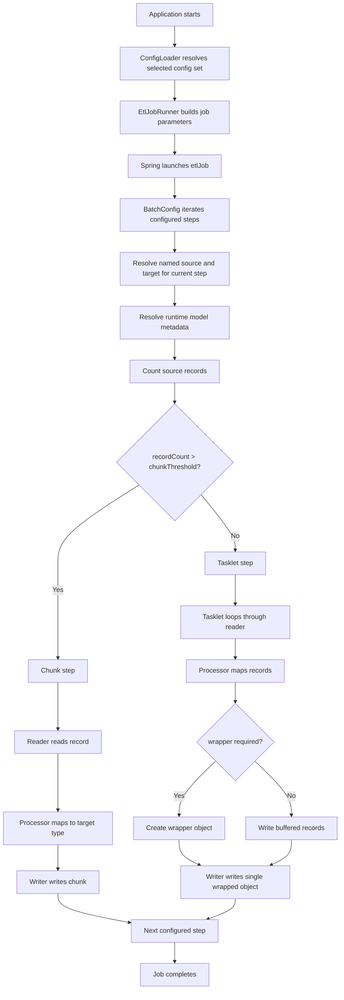
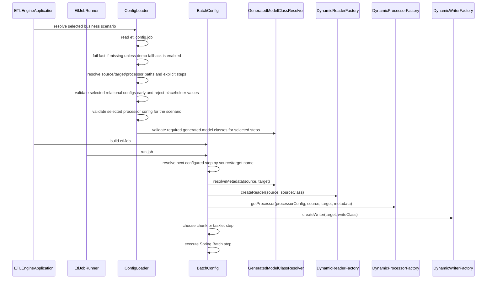
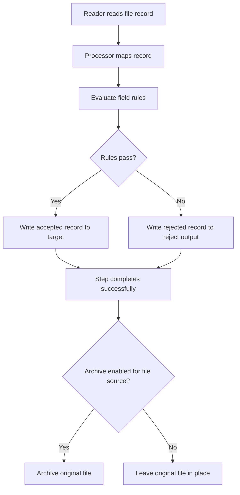

# Runtime Flow

## Purpose

This page explains how one ETL run currently executes from startup to output.

## End-to-end flow

## Sequence view

## Important runtime decisions

### 1. Config resolution
`ConfigLoader` resolves configuration in this order:

1. if `etl.config.job` is set, treat it as the selected business-scenario/job config and use its explicit `sourceConfigPath`, `targetConfigPath`, `processorConfigPath`, and `steps`
2. if `etl.config.job` is missing and `etl.config.allow-demo-fallback=false`, fail startup immediately
3. if `etl.config.allow-demo-fallback=true`, use `etl.config.source`, `etl.config.target`, and `etl.config.processor` for local/demo runs
4. in demo fallback mode only, continue into bundled classpath YAML when the configured direct files are missing

`ConfigLoader` does not auto-discover scenario folders. Exactly one config set is selected for a run.

When the selected source or target uses relational configuration, `ConfigLoader` now validates those chosen configs before job execution starts. Placeholder values such as `<SQLSERVER_HOST>` are rejected early with scenario-aware error messages instead of surfacing later as JDBC runtime failures.

For explicit `etl.config.job` runs, `ConfigLoader` also validates the selected processor config before it checks generated-model class availability for the selected steps. That ordering keeps malformed processor mappings or rule settings from being masked by unrelated missing generated classes and produces scenario-aware configuration failures earlier in startup.

### 2. Model resolution
`GeneratedModelClassResolver` translates config into concrete runtime class names and wrapper metadata.

For XML sources, explicit startup always requires the generated record class. Non-`NestedXml` XML sources also require the generated root class, while `NestedXml` source validation skips that root-class requirement because the active runtime path flattens from the generated record model.

### 3. Step strategy
`BatchConfig` walks the explicit step list from `job-config.yaml`. For each step, it resolves the named source and target, verifies that a matching processor mapping exists, emits machine-readable step-planning logs such as `STEP_PLAN` and `STEP_READY`, and then calls `getRecordCount()` on the selected source to compare it to `etl.chunk.threshold`.

- large source => chunk step
- small source => tasklet step

### 4. XML wrapper handling
For XML targets, processing and writing may use different model classes:

- processing class = record element type
- write class = wrapper/root element type

That contract is centralized in `GeneratedModelClassResolver`.

## Why this matters for future features

This flow shows where future enhancements should plug in:

- relational readers/writers should enter through the same factories
- stored procedures may fit as reader, writer, or tasklet-style step operations
- multi-job orchestration will likely require a higher-level flow model than the current selected job-config plus explicit step list

## Future insertion point: file-ingestion hardening

The next planned file-ingestion slice should plug into the current runtime without replacing the explicit step model.

That future behavior is proposed in [`file-ingestion-hardening.md`](file-ingestion-hardening.md). The current runtime does not yet implement this contract.

