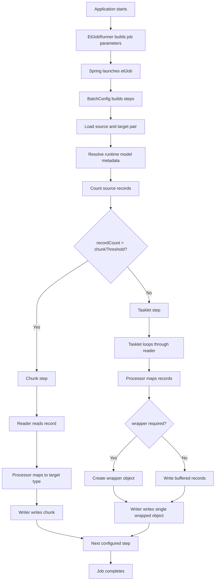
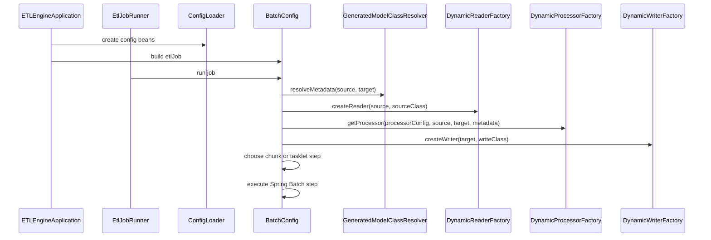

# Runtime Flow

## Purpose

This page explains how one ETL run currently executes from startup to output.

## End-to-end flow

## Sequence view

## Important runtime decisions

### 1. Config resolution
`ConfigLoader` chooses external YAML when present, otherwise bundled classpath YAML.

### 2. Model resolution
`GeneratedModelClassResolver` translates config into concrete runtime class names and wrapper metadata.

### 3. Step strategy
`BatchConfig` calls `getRecordCount()` on the source and compares it to `etl.chunk.threshold`.

- large source => chunk step
- small source => tasklet step

### 4. XML wrapper handling
For XML targets, processing and writing may use different model classes:

- processing class = record element type
- write class = wrapper/root element type

That contract is centralized in `GeneratedModelClassResolver`.

## Why this matters for future features

This flow shows where future enhancements should plug in:

- relational readers/writers should enter through the same factories
- stored procedures may fit as reader, writer, or tasklet-style step operations
- multi-job orchestration will likely require a higher-level flow model than the current source-target index pairing

