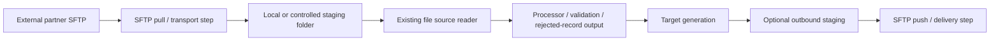

# SFTP Transport Capability

## Purpose

This document defines the near-term architecture direction for SFTP-based file transport in `spring-etl-engine`.

It keeps SFTP work aligned with the current ETL-first phase while acknowledging a practical reality: many real scenarios begin with daily file pickup from external parties and end with controlled file delivery to downstream locations.

The goal is not to build a full managed file transfer platform immediately. The goal is to standardize repeated SFTP-related integration work without mixing transport and security concerns into the core transformation runtime.

## Why this matters now

Many day-to-day integration scenarios depend on repeatable inbound or outbound SFTP behavior such as:

- pulling files from external partners every day
- staging them safely for ETL processing
- pushing generated files to downstream locations
- isolating partner maintenance windows from unrelated product capabilities
- producing operator-visible evidence for what was transferred, skipped, retried, or failed

In some environments, teams already use a dedicated transfer product or managed file transfer (MFT) platform. In others, they still write one-off Java SFTP code. The runtime should reduce unnecessary custom transport code while remaining compatible with external MFT edge patterns where required.

## Scope

This note covers:

- where SFTP belongs in the current product architecture
- the preferred near-term deployment boundary
- when an external MFT/security layer should remain in front of the ETL product
- what the first in-product SFTP slice should support
- logging, observability, and security expectations for SFTP work

This note does **not** define:

- a full enterprise MFT replacement
- partner onboarding workflows
- a broad routing/control plane
- final outbound reconciliation behavior for every transport scenario
- all future transport protocols beyond the SFTP baseline

## Design position

### Primary recommendation

Treat SFTP as a **transport-oriented file acquisition and delivery capability** around the ETL core.

That means SFTP should usually sit at the deployment edge:

- before the ETL reader path for inbound file pickup
- after target generation for outbound delivery

It should not become the center of transformation logic.

### Preferred operational model

The preferred default runtime shape is:

This keeps transport concerns separate from business mapping and lets existing file-processing paths continue to operate on local or controlled staged files.

## Fit with current architecture

The current runtime is centered on:

- config-driven source / target / processor selection
- factory-based reader / processor / writer extension
- explicit `steps`-based orchestration
- batch-oriented execution

That architecture already fits a staged SFTP model well:

- SFTP can be introduced as an explicit transport capability around the existing file processing path
- existing CSV/XML readers can continue to read staged local files
- the current run/step logging model can emit transfer-oriented lifecycle evidence
- the current runtime mission already includes repeated file-in / file-out concerns

## Deployment boundary and service isolation

### Recommended boundary

Keep the ETL orchestration core centralized, but make partner-facing transport concerns isolatable.

Examples of isolatable transport capabilities:

- inbound SFTP pull
- outbound SFTP push
- image or binary file acquisition from external locations

### Why isolation matters

External-party systems may be:

- under maintenance
- temporarily unavailable
- subject to credential rotation or certificate issues
- subject to different security controls and support ownership

If those partner-facing transport concerns are tightly coupled to the core ETL runtime, unrelated internal ETL scenarios may become unnecessarily dependent on external system health.

### Practical deployment stance

The preferred maturity path is:

1. **optional transport module/jar first**
2. **separate worker/deployable when operationally justified**
3. **full service boundary only if later product scale truly requires it**

This avoids premature microservice complexity while still preserving on/off scope and deployment flexibility.

## Security-layer guidance

### Separate security boundary when needed

For external-party integrations, a separate security or transfer layer may still be appropriate.

Examples:

- client-mandated MFT products
- DMZ-oriented transfer controls
- central credential or certificate governance
- enterprise audit requirements that are broader than ETL logging alone

### Supported operational modes

The architecture should support both of these modes:

#### Mode A — external MFT-managed edge

Example:

- external party <-> external MFT product
- MFT lands files into a controlled internal location
- `spring-etl-engine` processes staged files
- the runtime may later hand off generated outbound files back to MFT

#### Mode B — native product SFTP mode

Example:

- `spring-etl-engine` performs direct SFTP pull/push itself
- used where external MFT is not required or where teams need a standardized runtime capability instead of one-off Java code

### Security rules

Whether SFTP is externalized through MFT or handled natively, the runtime should preserve these rules:

- externalize credentials and keys consistently
- do not mix transport authentication logic into business mapping logic
- enforce host key trust / validation in native SFTP mode
- avoid logging secrets, tokens, private key material, or sensitive remote connection details
- keep partner-facing transport configuration auditable and environment-specific

## Near-term scope recommendation

### First delivery slice

The first in-product SFTP slice should stay narrow.

Recommended first scope:

- inbound SFTP pull only
- one remote source location per transfer step
- download to configured local staging folder
- optional remote post-success action such as move/rename/archive
- machine-readable step/run evidence for transfer outcomes
- explicit failure categories for connection, authentication, path, and transfer failures

### Why this is the right first slice

It solves a repeated delivery need without introducing too much platform breadth at once.

It also allows the existing file-ingestion runtime to remain the primary transformation path after staging completes.

### Explicit non-goals for the first slice

Do not include all of these in the first delivery:

- full inbound + outbound + multi-party routing in one release
- broad MFT orchestration replacement
- complex partner onboarding workflow
- large-scale reconciliation dashboards before core transfer evidence is stable
- remote protocol abstraction for every future transport at once

## Logging and observability expectations

SFTP transfer work should emit operator-visible evidence at both run and step level.

### Minimum evidence fields

- scenario name
- run correlation id
- step name
- transfer direction (`pull` / future `push`)
- remote host alias or connection identity
- remote path
- local staging path
- attempted file count
- downloaded / transferred file count
- skipped count
- failed count
- retry count where applicable
- duration
- high-level failure category

### Logging guidance

Use:

- `INFO` for transfer start/completion and summary counts
- `WARN` for recoverable issues and skipped files
- `ERROR` for unrecoverable authentication, path, or transfer failures
- `DEBUG` only when deeper file-level diagnostics are intentionally enabled

At large volumes, avoid noisy per-file informational logs by default.

## Folder and file lifecycle expectations

SFTP should integrate cleanly with the existing file-ingestion hardening direction.

Near-term expectations:

- staged inbound files should land in a controlled local directory
- processing should run against staged files, not remote streams
- processed-file archive behavior should remain explicit
- failed transfer artifacts or manifests should be distinguishable from failed transformation outcomes

## Architecture guardrails

When implementing SFTP support:

- do not bypass the existing extension model casually
- keep `BatchConfig` orchestration-focused instead of embedding protocol-specific details widely
- do not mix transport security with transformation rules
- document the chosen deployment boundary clearly
- keep native SFTP optional where external MFT is client-mandated
- prefer staged local file handoff over direct remote-file transformation coupling

## Roadmap fit

### Fits the current ETL-first phase

SFTP belongs in the current product direction when it is treated as:

- repeatable file transport
- staged file acquisition / delivery
- operator-visible file-flow standardization
- reduction of repeated one-off integration code

### Does not yet justify full platform expansion

SFTP should not be used as a reason to immediately introduce:

- broad partner control planes
- full enterprise routing engines
- broad multi-tenant administration
- full MFT replacement scope

Those are future concerns.

## Recommended next steps

1. define the SFTP transport config contract
2. define the deployment boundary between the ETL runtime and partner-facing transfer
3. implement inbound staged pull as the first transport slice
4. add security/credential handling rules before broad rollout
5. add retry/reconciliation/reporting improvements after the first operational slice is stable

## Related architecture notes

Read together with:

- `docs/architecture/etl-product-evolution-roadmap.md`
- `docs/architecture/extension-points.md`
- `docs/architecture/job-history-and-operational-observability.md`
- `docs/architecture/architectural-risks-and-watchpoints.md`
- `docs/architecture/file-ingestion-hardening.md`

