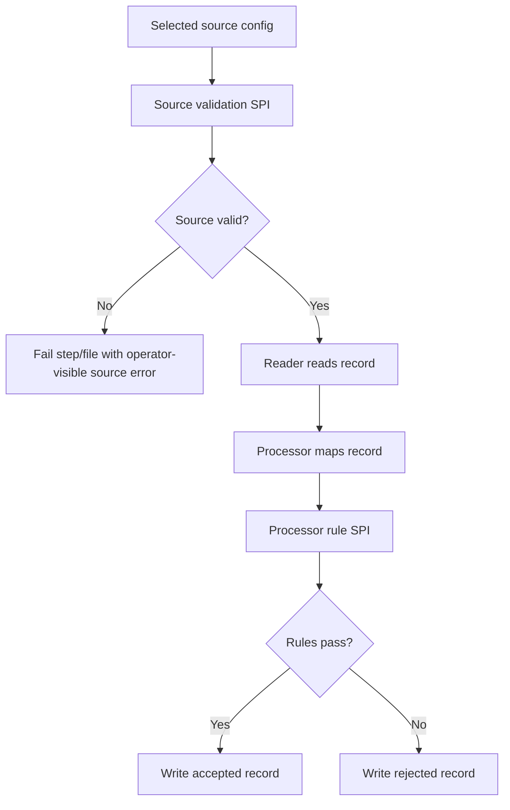

# Validation Extension Architecture

## Purpose

This note defines the target extension architecture for future validation growth in `spring-etl-engine`.

Use it to answer four questions before adding more validations:

1. where source-level validation should plug into the runtime
2. where processor-level rule extensibility should plug into the runtime
3. how deprecated legacy validation concepts should be mapped into the active architecture
4. which responsibilities must stay separated so future validation growth does not create another parallel framework

This is a forward-looking architecture note. It does not change the current shipped config contract by itself.

## Current baseline

Today the active runtime already has two validation-related paths:

- source/config validation in `src/main/java/com/etl/config/ConfigLoader.java`
- record-level validation in `src/main/java/com/etl/processor/validation/ValidationRuleEvaluator.java`

The current shipped first slice supports:

- CSV-focused processor field rules (`notNull`, `timeFormat`)
- rejected-record handling through `processor-config.yaml`
- archive-on-success through CSV source config

The legacy standalone validation framework under `src/main/java/com/etl/validation/` and `src/main/resources/validation-config.yaml` is deprecated and is not part of the active runtime path.

## Why this note exists

Future validation needs will expand in two different directions:

1. **source-level validation**
   - file exists / readable
   - empty file policy
   - header/shape checks
   - XML/XSD validation
   - relational source contract checks

2. **processor-level validation**
   - field rules such as `notNull`, `timeFormat`
   - future `regex`
   - future range and cross-field rules
   - future conditional and enrichment-aware validation

Those are different extension seams.

They should not be forced back into one generic standalone validation framework.

## Architecture decision summary

The product should expose two extension areas:

- a **source validation SPI** for validating source artifacts and source contracts before or at read start
- a **processor rule SPI** for validating individual records during mapping/acceptance decisions

The product should **not** revive `validation-config.yaml` or the deprecated `com.etl.validation.*` package as the primary extensibility model.

## Validation boundary

### Source-level validation

Source-level validation answers:

> Can this selected source be read safely and according to its configured contract?

Examples:

- CSV file exists
- CSV is not empty when empty files are disallowed
- CSV header matches configured fields
- XML file conforms to required structure
- XML file conforms to XSD
- relational source config/query/schema is valid

### Processor-level validation

Processor-level validation answers:

> This record was read successfully. Should it be accepted or rejected?

Examples:

- `notNull`
- `timeFormat`
- future `regex`
- future range / cross-field checks
- future conditional business rules

## Proposed source validation SPI

### Intent

A source validation SPI should validate the selected source before or at the point the source begins reading.

### Proposed responsibilities

- validate source artifact availability and structure
- validate source-type-specific contract details
- raise operator-friendly failures for technical/source-level problems
- avoid making accepted/rejected row decisions

### Proposed code anchors

The future source validation SPI should stay close to the active source/runtime path:

- `src/main/java/com/etl/config/source/SourceConfig.java`
- `src/main/java/com/etl/config/ConfigLoader.java`
- source-specific configs such as `CsvSourceConfig` and later `XmlSourceConfig`
- reader startup paths

### Conceptual shape

```java
interface SourceValidation {
    boolean supports(SourceConfig sourceConfig);
    void validate(SourceConfig sourceConfig) throws Exception;
}
```

This note does not prescribe exact class names yet, but the key point is that source validation should be selected by active source config/runtime concerns, not by deprecated `validation-config.yaml`.

## Proposed processor rule SPI

### Intent

A processor rule SPI should evaluate one configured record-level rule during mapping/acceptance logic.

### Proposed responsibilities

- evaluate one field or rule instance against a record
- produce a validation issue / rejection reason
- stay inside the active processor/reject handling flow
- avoid source artifact checks such as header validation or XSD file loading

### Proposed code anchors

- `src/main/java/com/etl/config/processor/ProcessorConfig.java`
- `src/main/java/com/etl/processor/validation/ValidationRuleEvaluator.java`
- `src/main/java/com/etl/mapping/ValidationAwareDynamicMapping.java`
- `src/main/java/com/etl/runtime/FileIngestionRuntimeSupport.java`

### Conceptual shape

```java
interface ProcessorRuleEvaluator {
    String getRuleType();
    ValidationIssue evaluate(Object input, ProcessorConfig.FieldMapping field, ProcessorConfig.FieldRule rule);
}
```

The first shipped slice still uses a single `ValidationRuleEvaluator` class. This SPI is the intended future refactor point once more rule types are added.

## Legacy mapping

| Legacy type | Future place |
|---|---|
| `com.etl.validation.rules.XsdValidationRule` | Source validation SPI for XML sources |
| `com.etl.validation.rules.RegexRule` | Processor rule SPI as a future record-level rule |
| `com.etl.validation.rules.NotNullRule` | Already replaced conceptually by active processor validation |
| `com.etl.validation.ValidatorFactory` | No direct replacement; use active source/processor wiring instead |
| `validation-config.yaml` | No direct replacement; use source config and processor config |

## Non-goals

This proposal does **not** mean:

- bringing back a fourth top-level runtime config file for validation
- unifying file-level and record-level validation under one generic legacy interface again
- claiming all source types already support the same validation behavior today
- claiming XML/XSD validation is shipped now

## Rollout order

1. keep `com.etl.validation.*` deprecated
2. continue active CSV file-ingestion hardening in the current source/processor paths
3. add a narrow source-validation slice for CSV file-level validation
4. add XML/XSD support through the future source validation SPI
5. refactor processor validation into a rule SPI only when rule growth justifies it

## Runtime view



## Extension rule

Future contributors should follow this rule:

- if the validation is about the **source artifact or source contract**, extend the source validation seam
- if the validation is about **record acceptance/rejection**, extend the processor rule seam
- do not add new functionality to the deprecated `com.etl.validation.*` package

## Related docs

- [`extension-points.md`](extension-points.md)
- [`file-ingestion-hardening.md`](file-ingestion-hardening.md)
- [`runtime-flow.md`](runtime-flow.md)
- [`../config/processor/default-processor.md`](../config/processor/default-processor.md)

