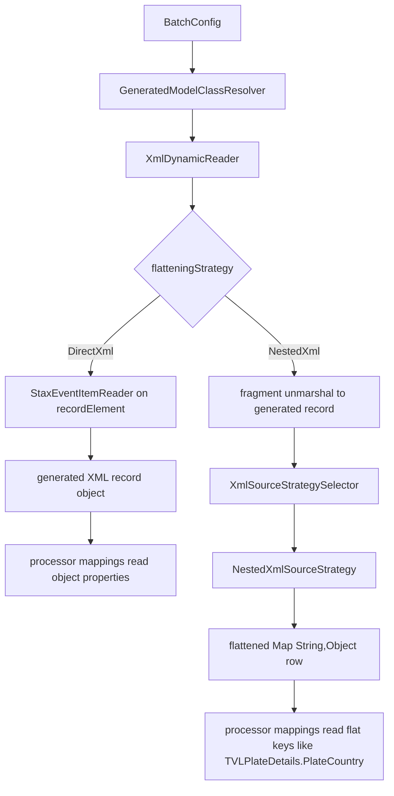

# XML Source Config

## Purpose

`XmlSourceConfig` defines a file-based XML source.

It supports the current XML reader path used for staged XML file ingestion, including record counting for chunk/tasklet decisions and flat record extraction through a configured record element.

## Java contract

Backed by:
- `src/main/java/com/etl/config/source/XmlSourceConfig.java`
- `src/main/java/com/etl/reader/impl/XmlDynamicReader.java`

## Supported fields today

| Field | Required | Type | Description |
|---|---|---|---|
| `format` | yes | string | Must be `xml` |
| `sourceName` | yes | string | Logical source name used in processor mapping lookup |
| `packageName` | no in explicit job mode; otherwise yes | string | Package used for generated source model naming; runtime validates that the generated XML record class exists in this package during startup, and non-`NestedXml` source paths also require the generated XML root class. When omitted for an explicit `job-config.yaml` run, the runtime derives `com.etl.generated.job.<normalized-job-name>.source` |
| `filePath` | yes | string | XML file path |
| `archive` | no | object | Optional archive-on-success behavior for XML file sources |
| `archive.enabled` | yes, when `archive` is present | boolean | Enables processed-file archiving after successful step completion |
| `archive.successPath` | yes, when `archive.enabled=true` | string | Directory where the original XML file is moved after successful processing |
| `archive.namePattern` | no | string | Output file naming pattern supporting `{originalName}` and `{timestamp}` |
| `rootElement` | yes | string | Expected top-level XML container element for the file |
| `recordElement` | yes | string | Repeating XML element name used for record counting and streaming reads |
| `flatteningStrategy` | no | string | XML source flattening strategy. Supported values today: `DirectXml`, `NestedXml`, `JobSpecificXml`. Defaults to `DirectXml`. |
| `jobSpecificStrategyBean` | no | string | Spring bean name used when `flatteningStrategy` is `JobSpecificXml` |
| `modelDefinitionPath` | no | string | External structural XML model definition YAML used by the build-time generator, especially for nested XML contracts |
| `validation` | no | object | Optional XML file-level validation extensions |
| `validation.fileNamePattern` | no | string | Optional regex the source file name must match |
| `validation.onFailure` | no | string | Optional file-level failure behavior: `failStep` or `rejectFile` |
| `validation.rejectPath` | yes, when `validation.onFailure=rejectFile` | string | Directory where an invalid XML source file is moved before the run fails |
| `fields` | no | list | Flat XML field list used when no external `modelDefinitionPath` is provided; for `NestedXml` and other external-model cases, keep the structural source contract in the referenced model definition and omit this block |
| `fields[].name` | yes, when `fields` is present | string | XML-backed property name expected on each record object |
| `fields[].type` | yes, when `fields` is present | string | Logical type used in the generated model contract |

## Recommended standard template

For new XML scenarios in this repo, prefer one shared authoring pattern for both simple and nested XML:

- keep the top-level XML source fields the same: `format`, `sourceName`, `packageName`, `filePath`, `rootElement`, `recordElement`
- use `flatteningStrategy` to describe runtime behavior: `DirectXml` for flat/simple XML and `NestedXml` for nested XML
- prefer `modelDefinitionPath` as the structural source of truth for generated XML source classes
- keep inline `fields` as a compatibility option for older or intentionally simple flat XML configs that do not use an external model definition

Preferred baseline template:

```yaml
sources:
  - format: xml
    sourceName: YourSourceName
    packageName: com.etl.generated.job.yourscenario.source
    filePath: input/your-input.xml
    rootElement: RootElementName
    recordElement: RecordElementName
    flatteningStrategy: DirectXml
    modelDefinitionPath: definitions/your-source-model.yaml
```

Use this `DirectXml` variant for simple repeating-record XML feeds when one XML record maps cleanly to one runtime record:

```yaml
sources:
  - format: xml
    sourceName: Events
    packageName: com.etl.generated.job.events.source
    filePath: input/events.xml
    rootElement: Events
    recordElement: Event
    flatteningStrategy: DirectXml
    modelDefinitionPath: definitions/events-source-model.yaml
```

Use this `NestedXml` variant when the XML record contains nested objects that must be flattened for downstream processor mappings such as `TVLPlateDetails.PlateCountry`:

```yaml
sources:
  - format: xml
    sourceName: TagValidationSource
    packageName: com.etl.generated.job.xmlnestedcsvroundtrip.source
    filePath: input/nested-sample.xml
    rootElement: TagValidationList
    recordElement: TVLTagDetails
    flatteningStrategy: NestedXml
    modelDefinitionPath: definitions/nested-source-model.yaml
```

Compatibility option for flat XML without an external structural definition:

```yaml
sources:
  - format: xml
    sourceName: Events
    packageName: com.etl.generated.job.xmltocsvevents.source
    filePath: input/events.xml
    rootElement: Events
    recordElement: Event
    fields:
      - name: eventCode
        type: String
      - name: eventTime
        type: String
```

Treat that inline-`fields` form as the flat XML fallback, not the preferred pattern for new nested XML scenario bundles.

## Example

This mirrors `src/main/resources/config-scenarios/xml-to-csv-events/source-config.yaml`.

```yaml
sources:
  - format: xml
    sourceName: Events
    packageName: com.etl.generated.job.xmltocsvevents.source
    filePath: src/main/resources/demo-input/Events.xml
    rootElement: Events
    recordElement: Event
    validation:
      fileNamePattern: '^Events-\d{8}\.xml$'
      onFailure: rejectFile
      rejectPath: target/rejected-files/
    flatteningStrategy: DirectXml
    modelDefinitionPath: definitions/events-source-model.yaml
    fields:
      - name: eventCode
        type: String
      - name: eventTime
        type: String
      - name: description
        type: String
      - name: sourceSystem
        type: String
```

## Runtime behavior today

### Runtime sequence: `DirectXml` vs `NestedXml`

Both XML source paths start the same way during step assembly:

- `BatchConfig` resolves source metadata through `GeneratedModelClassResolver`
- `DynamicReaderFactory` selects `XmlDynamicReader`
- `XmlDynamicReader` branches on `flatteningStrategy`

From that split, the runtime behavior differs in an important way:

- `DirectXml` uses a `StaxEventItemReader` over `recordElement` fragments and emits generated JAXB record objects directly into the processor stage
- `NestedXml` also reads `recordElement` fragments first, but then routes each unmarshalled record through `XmlSourceStrategySelector` -> `NestedXmlSourceStrategy`, which flattens the XML object graph into `Map<String, Object>` rows for downstream processor mapping
- `JobSpecificXml` follows the same selector-based flattening path as `NestedXml`, but resolves a custom strategy bean instead of the shared `NestedXmlSourceStrategy`



Runtime implications of that split:

- `DirectXml` is the simpler streaming path for flat repeating-record XML
- `NestedXml` is the flattening path for nested XML shapes that need dotted downstream field access
- non-`NestedXml` startup currently requires both generated source root and record classes, while `NestedXml` requires the generated record class but skips the source root wrapper requirement on the active runtime path

- The source config file root is `sources:`.
- `recordElement` is the key runtime field for XML streaming; the XML reader uses it as the fragment root element name.
- `DirectXml` preserves the current streaming reader path and emits record objects backed by the generated XML record class.
- `NestedXml` and `JobSpecificXml` switch the XML reader to a source-flattening path that unmarshals the XML root, applies the configured XML source strategy, and emits flattened row maps for downstream processor mapping.
- `modelDefinitionPath` is optional and is used by the build-time XML generation slice when the XML structure needs an external structural contract, especially for nested XML.
- When `modelDefinitionPath` is present, that external definition becomes the authoritative structural contract for generated XML source classes; the source-level `fields` block can be omitted.
- For explicit job execution, startup now fails fast if the generated XML record class is missing from the configured `packageName`.
- Non-`NestedXml` XML source paths still require the generated XML root class during startup.
- `NestedXml` source paths do not require the XML source root wrapper class during generated-model validation because the active runtime path flattens from the generated record model.
- `getRecordCount()` counts XML start elements matching `recordElement`.
- `rootElement` is preserved as part of the config contract and should match the real XML envelope even though the current reader path streams individual `recordElement` fragments.
- `validation.fileNamePattern` checks only the file name portion, not the full path.
- If `validation.onFailure=rejectFile`, an XML file that fails file-level validation is moved to `validation.rejectPath` and the run still surfaces a validation error with the rejected-file location in the message/logs.
- If `archive.enabled=true`, the original XML source file is moved to `archive.successPath` after successful step completion and the runtime publishes `archivedSourcePath` in step-finished evidence.
- When `fields` is present, its property names must align with the generated/read XML record model used by the reader and processor.
- For flattened nested XML, the structural shape belongs in `modelDefinitionPath`, and processor mappings may use flattened keys such as `TVLPlateDetails.PlateCountry` even when `fields` is omitted from `source-config.yaml`.

## Validation / usage notes

- `sourceName` must match the selected `processor.mappings[].source` value.
- `packageName`, `rootElement`, and `recordElement` must line up with the generated XML classes that Maven compiled for the selected job.
- In explicit job mode, `packageName` may be omitted and defaults to `com.etl.generated.job.<normalized-job-name>.source`.
- The preserved flat XML baseline `xml-to-csv-events` now uses scenario-scoped generated classes under `com.etl.generated.job.xmltocsvevents.source`, so prepare it with the build-time generation profile before running the explicit scenario.
- If `modelDefinitionPath` is omitted, provide `fields` so flat XML source classes can still be derived directly from `source-config.yaml`.
- If `modelDefinitionPath` is present, keep nested structural fields in that referenced definition instead of duplicating a partial nested shape in `source-config.yaml`.
- For `NestedXml`, the generated record class is still required even when the XML source root wrapper class is not.
- Keep `rootElement` and `recordElement` aligned with the actual XML structure; mismatches typically surface as empty reads, count mismatches, or unmarshalling failures.
- Duplicate handling for XML should currently be configured through the shared processor-level `duplicate` rule after XML records are read into flat runtime objects; there is no separate XML-source duplicate block in the shipped config contract.
- Use `DirectXml` for flat repeating-record XML feeds first. Use `NestedXml` only when a shared nested flattening rule is sufficient; otherwise use `JobSpecificXml` with an explicit strategy bean.
- Relative file paths are resolved by the surrounding runtime/config selection path, just like other source config files.

## Current limitations

- XML file-level validation is lighter than CSV today: the shipped XML `validation` block supports `fileNamePattern`, `onFailure`, and `rejectPath`, but it does not currently expose CSV-specific options such as `allowEmpty` or `requireHeaderMatch`
- Archive-on-success now uses the shared file-source contract; non-file sources such as relational remain not applicable
- No first-class nested field alias block yet; nested flattening currently relies on the external model definition plus processor mappings against emitted flat keys or strategy-provided field mappings
- No XML-native duplicate config yet for XPath selectors, namespace-aware key extraction, or source-level duplicate checks before record mapping
- No alternate XPath-based record selection or namespace-aware config fields yet
- Current XML support still defaults to flat repeated record elements; nested support is opt-in through the XML source flattening strategy seam

## Build-time generation command

The first job-scoped build-time XML generation slice can be invoked through the opt-in Maven profile:

```powershell
mvn --no-transfer-progress -Pxml-generation -Detl.xml.generation.jobConfig=src/test/resources/config-scenarios/xml-build-generation-it/job-config.yaml clean test
```

When that profile is enabled:

- Maven adds `target/generated-sources/etl/source` and `target/generated-sources/etl/target` as source roots
- the build-time XML generation entrypoint runs after main classes compile
- generated XML source classes plus selected flat CSV/relational source and target model classes are written into those generated roots for the chosen job
- Maven compiles those generated classes before test execution and packaging

## Preserved examples

- `src/main/resources/config-scenarios/xml-to-csv-events/source-config.yaml`
- `src/main/resources/config-scenarios/xml-nested-to-csv-tag-validation/source-config.yaml`
- `src/main/resources/config-scenarios/xml-nested-tag-validation/source-config.yaml`
- `src/main/resources/config-scenarios/xml-nested-to-csv-to-nested-xml-archive-e2e/source-config.yaml`

## Related docs

- [`csv-source.md`](csv-source.md)
- [`../processor/default-processor.md`](../processor/default-processor.md)
- [`../../architecture/file-ingestion-hardening.md`](../../architecture/file-ingestion-hardening.md)


